# AKS-Wizard — User Manual

> **⚠️ Educational Disclaimer**: This wizard is provided for educational and learning purposes only. All generated configurations, templates, and scripts should be validated and tailored for your own production environment before use.

This manual provides a step-by-step walkthrough of every screen in the AKS-Wizard UI. For each screen you will find:
- **Purpose** – what the screen is for
- **Questions / fields** – what each option means
- **Impact** – how your choice affects the resulting cluster
- **Official references** – Microsoft Docs and community links for deeper reading

---

## Table of Contents

1. [Welcome](#step-1-welcome)
2. [Team Readiness Assessment](#step-2-team-readiness-assessment)
3. [Cluster Basics](#step-3-cluster-basics)
4. [Node Pools](#step-4-node-pools)
5. [Workload Requirements](#step-5-workload-requirements)
6. [Networking](#step-6-networking)
7. [Security & Identity](#step-7-security--identity)
8. [Monitoring](#step-8-monitoring)
9. [Add-ons](#step-9-add-ons)
10. [Review & Validate](#step-10-review--validate)
11. [Generated Templates](#step-11-generated-templates)
12. [Deploy to Azure](#step-12-deploy-to-azure)
13. [Save to GitHub](#step-13-save-to-github)

---

## Step 1: Welcome

### Purpose

The Welcome screen introduces the AKS-Wizard and sets expectations for the overall experience. It highlights three core capabilities of the tool and provides an estimated time to complete the wizard.

### What you see

```
☸️

AKS Configuration Wizard
Build your Azure Kubernetes Service cluster step-by-step

┌─────────────────────┐ ┌─────────────────────┐ ┌─────────────────────┐
│ 🎯 Interview-Style  │ │ 📚 Educational       │ │ ⚡ Generate & Deploy │
│                     │ │                     │ │                     │
│ Answer simple       │ │ Every option        │ │ Export Terraform or │
│ questions and we'll │ │ includes            │ │ Bicep templates, or │
│ build your config   │ │ explanations so     │ │ deploy directly     │
│ automatically.      │ │ you understand      │ │ from the browser.   │
│                     │ │ what you're         │ │                     │
│                     │ │ configuring.        │ │                     │
└─────────────────────┘ └─────────────────────┘ └─────────────────────┘

⏱️ Estimated time: ~15 minutes

[ Let's get started → ]
```

### Screenshot

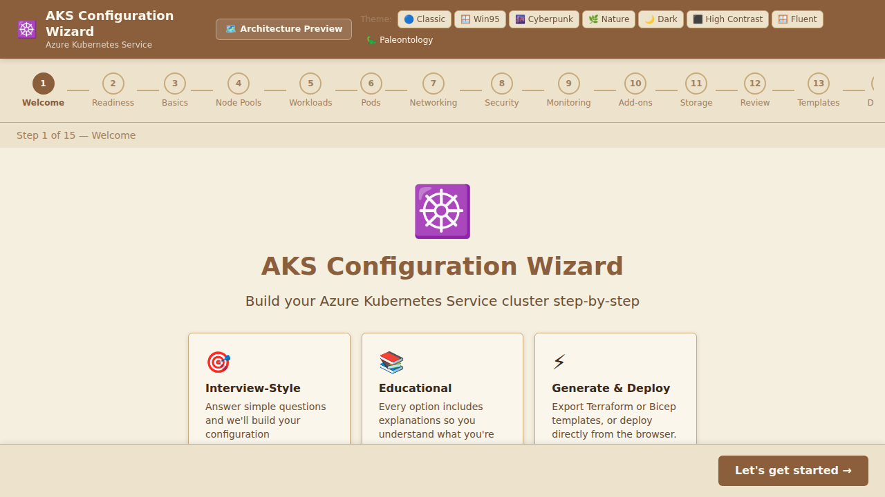

### Impact

No configuration choices are made on this screen. Clicking **Let's get started →** advances you to the Cluster Basics step.

### Tips

- The wizard estimates approximately **15 minutes** to complete. You can pause and resume at any time because the state is held in memory for the current browser session.
- You can switch **themes** at any time using the theme switcher in the top-right corner. Eight themes are available: Classic, Win95, Cyberpunk, Nature, Dark, High Contrast, Microsoft Fluent, and Paleontology (default).

---

## Step 2: Team Readiness Assessment

### Purpose

The Team Readiness Assessment screen presents six yes/no questions to help the wizard recommend the most appropriate AKS mode for your team: **AKS Automatic** (fully managed, accelerated onboarding) or **AKS Standard** (full control, recommended for platform teams).

### What you see

```
Team Readiness Assessment
Answer these questions to help the wizard recommend the right AKS mode for your team:
AKS Automatic (fully managed, accelerated onboarding) or AKS Standard (full control, recommended for platform teams).

ℹ️ AKS Automatic vs Standard
AKS Automatic reduces operational overhead by managing node provisioning, upgrades, and security
configurations automatically — ideal for teams new to Kubernetes. AKS Standard gives your platform
team full control over every cluster parameter.

1. Does your team include dedicated platform / infrastructure engineers?  [ ✅ Yes ] [ ❌ No ]
2. Can your team commit to reviewing Kubernetes upgrades within 30 days?  [ ✅ Yes ] [ ❌ No ]
3. Do you require advanced networking customisation?                       [ ✅ Yes ] [ ❌ No ]
4. Does your team already operate a GitOps or CI/CD pipeline?             [ ✅ Yes ] [ ❌ No ]
5. Do your workloads require custom OS, GPU, or specialised node pools?   [ ✅ Yes ] [ ❌ No ]
6. Are you deploying across multiple environments?                         [ ✅ Yes ] [ ❌ No ]

6 / 6 questions answered

🔧 Recommended: AKS Standard
Your team has the maturity to leverage AKS Standard's full control over cluster configuration.
You can override this recommendation on the Basics step.
```

### Screenshot

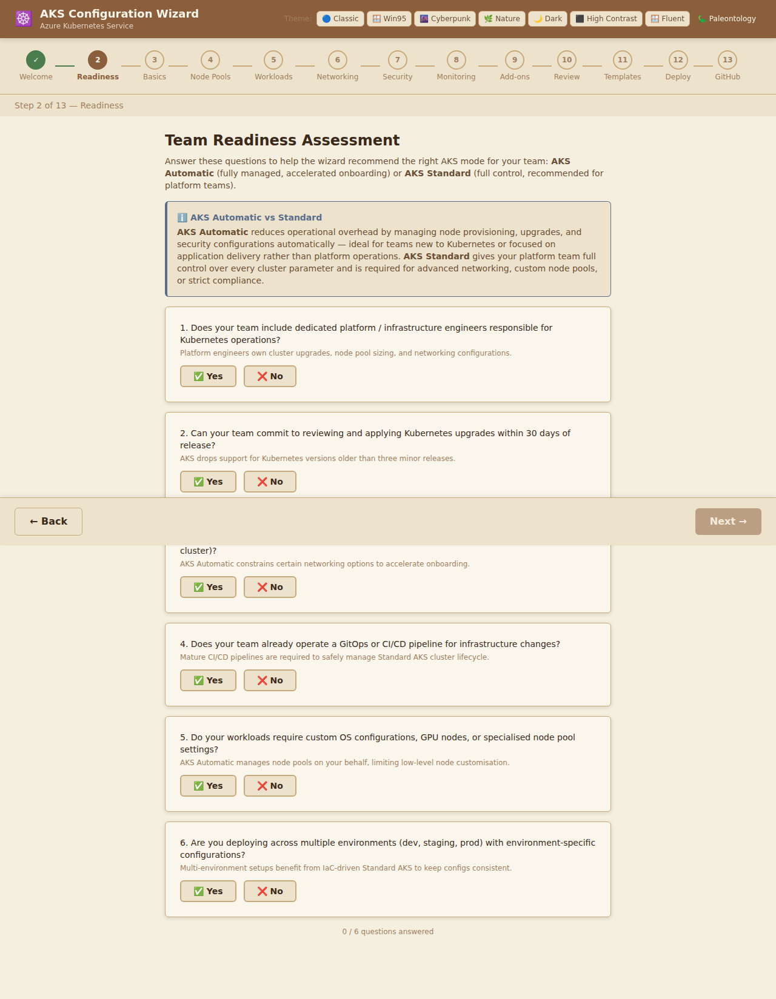

### Questions & Impact

| # | Question | Signals AKS Standard when… |
|---|----------|-----------------------------|
| 1 | Dedicated platform engineers? | **Yes** — platform team can handle full cluster lifecycle. |
| 2 | Commit to upgrade reviews within 30 days? | **Yes** — team can follow AKS version support windows. |
| 3 | Advanced networking customisation required? | **Yes** — AKS Automatic constrains certain networking options. |
| 4 | GitOps / CI/CD pipeline in place? | **Yes** — IaC pipelines unlock full Standard AKS benefits. |
| 5 | Custom OS, GPU, or specialised node pools? | **Yes** — AKS Automatic manages node pools on your behalf. |
| 6 | Multi-environment deployment? | **Yes** — environment-specific configs benefit from Standard. |

### Recommendation Logic

- **4 or more "Yes" answers** → recommends **AKS Standard**
- **Fewer than 4 "Yes" answers** → recommends **AKS Automatic**

The recommendation is displayed at the bottom of the page after all questions are answered. You can always override it on the next step (Cluster Basics).

### Official References

- [AKS Automatic overview](https://learn.microsoft.com/azure/aks/intro-aks-automatic)
- [AKS Standard overview](https://learn.microsoft.com/azure/aks/intro-kubernetes)
- [Choose the right AKS tier](https://learn.microsoft.com/azure/aks/free-standard-pricing-tiers)

---

## Step 3: Cluster Basics

### Purpose

This screen collects the fundamental identity information for your AKS cluster: where it lives in Azure (subscription, resource group, and region) and what version of Kubernetes it runs.

### What you see

```
Cluster Basics
Let's start with the fundamental details of your AKS cluster.

ℹ️ What is AKS?
Azure Kubernetes Service (AKS) is a managed container orchestration service.
Azure handles the control plane — you only manage the worker nodes.

Azure Subscription ID  ⓘ  [ xxxxxxxx-xxxx-xxxx-xxxx-xxxxxxxxxxxx ]
Resource Group Name    ⓘ  [ my-aks-rg                              ]
Cluster Name           ⓘ  [ my-aks-cluster                         ]
Azure Region           ⓘ  [ East US                          ▼     ]
Kubernetes Version     ⓘ  [ 1.29.x                           ▼     ]
```

### Screenshot

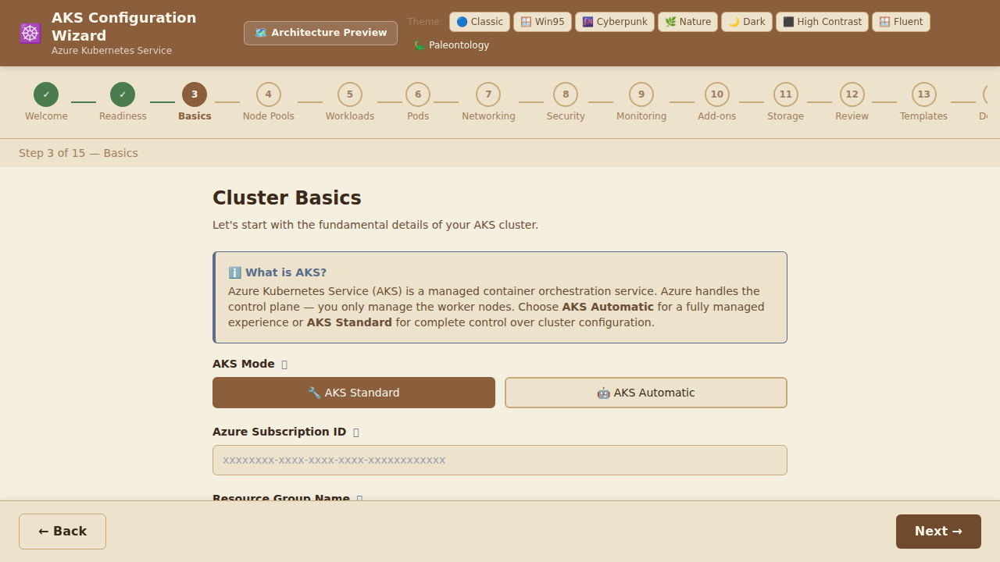

### Fields & Impact

| Field | Description | Impact |
|-------|-------------|--------|
| **Azure Subscription ID** | The GUID of the Azure subscription that will own and be billed for this cluster. | All Azure resources (cluster, load balancers, disks) are created under this subscription and billed to it. Locate it under **Subscriptions** in the Azure portal. |
| **Resource Group Name** | A logical container that groups all Azure resources for this cluster. | Use a dedicated resource group per cluster to simplify cost tracking, access control, and deletion. If the group does not exist, the deployment script creates it automatically. |
| **Cluster Name** | A unique name for the AKS cluster within the resource group. | Must be 1–63 characters, alphanumeric characters and hyphens only. The name is used in Azure Portal URLs, the DNS FQDN, and the cluster's API server endpoint. |
| **Azure Region** | The Azure datacenter region where the cluster control plane and node VMs are created. | Choose a region **closest to your users or dependent services** to minimise latency. Feature availability (e.g., Availability Zones, certain VM sizes) varies by region. |
| **Kubernetes Version** | The Kubernetes minor version to run on the cluster. | AKS supports the **latest three minor versions**. Newer versions include security patches and new features but may require workload compatibility testing. Using 1.29.x is recommended at the time of writing. |

### Official References

- [What is Azure Kubernetes Service (AKS)?](https://learn.microsoft.com/azure/aks/intro-kubernetes)
- [Supported Kubernetes versions in AKS](https://learn.microsoft.com/azure/aks/supported-kubernetes-versions)
- [Azure regions](https://azure.microsoft.com/global-infrastructure/geographies/)
- [Manage Azure Resource Groups](https://learn.microsoft.com/azure/azure-resource-manager/management/manage-resource-groups-portal)

---

## Step 4: Node Pools

### Purpose

Node pools define the virtual machine fleets that run your containerised workloads. AKS separates infrastructure concerns (system pods) from application workloads by supporting multiple node pools.

### What you see

```
Node Pools
Node pools are groups of VMs that run your workloads.

ℹ️ System vs User Node Pools
System pools run critical AKS system pods (CoreDNS, metrics server).
User pools are for your application workloads. You need at least one system pool.

┌─────────────────────────────────────┐
│ System Node Pool                    │
│                                     │
│ Pool Name         [ system        ] │
│ VM Size       ⓘ  [ Standard_D2s_v3 ▼] │
│ Enable Auto-scaling  [ OFF ]    ⓘ  │
│ Node Count: 3  [────●──────────]   │
│                 1              10   │
└─────────────────────────────────────┘

[ + Add User Node Pool ]
```

### Screenshot

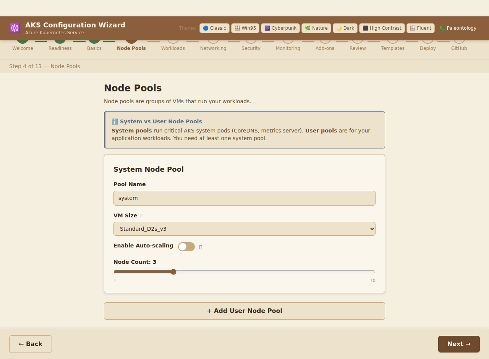

### Fields & Impact

#### System Node Pool (required)

| Field | Description | Impact |
|-------|-------------|--------|
| **Pool Name** | Identifier for the node pool. | Must be lowercase alphanumeric, starting with a letter. Used in Kubernetes node labels and Azure resource names. |
| **VM Size** | Azure Virtual Machine size for each node in the pool. | Larger SKUs support more pods per node and workloads with higher CPU/memory requirements, but cost proportionally more. **D-series** are general-purpose; **E-series** are memory-optimised; **F-series** are compute-optimised. |
| **Enable Auto-scaling** | Toggles the Kubernetes Cluster Autoscaler. | When **ON**, the cluster automatically adds or removes nodes within the min/max bounds in response to pending pods or underutilisation. When **OFF**, a fixed node count is used. |
| **Node Count** (fixed) | Exact number of nodes when auto-scaling is disabled. | Determines cost and capacity. A minimum of **3 nodes** across 3 availability zones is recommended for production to ensure high availability. |
| **Min Nodes** (auto-scale) | Minimum number of nodes the autoscaler may scale down to. | Setting too low may cause workloads to remain unscheduled during bursts while nodes are provisioning. |
| **Max Nodes** (auto-scale) | Maximum number of nodes the autoscaler may scale up to. | Limits maximum spend. Set this based on peak expected load with a safety margin. Azure subscription vCPU quotas also apply. |

#### User Node Pools (optional, multiple allowed)

User pools follow the same fields as the system pool. They are intended to isolate application workloads from system infrastructure:

- **Dedicated workload pools** allow you to use different VM sizes for different application types (e.g., GPU nodes for ML, high-memory for databases).
- **Taints and tolerations** (not exposed in the wizard but settable via CLI) can ensure that only specific workloads are scheduled on specific pools.

Click **+ Add User Node Pool** to add additional pools. Each added pool appears with a **Remove** button.

### VM Size Reference

| SKU | vCPUs | Memory | Best For |
|-----|-------|--------|----------|
| Standard_D2s_v3 | 2 | 8 GB | Development, small workloads |
| Standard_D4s_v3 | 4 | 16 GB | General purpose |
| Standard_D8s_v3 | 8 | 32 GB | Medium workloads |
| Standard_D16s_v3 | 16 | 64 GB | Large workloads |
| Standard_E4s_v3 | 4 | 32 GB | Memory-intensive apps |
| Standard_E8s_v3 | 8 | 64 GB | Memory-intensive apps |
| Standard_F4s_v2 | 4 | 8 GB | Compute-intensive apps |
| Standard_F8s_v2 | 8 | 16 GB | Compute-intensive apps |
| Standard_B2ms | 2 | 8 GB | Dev/test burstable |
| Standard_B4ms | 4 | 16 GB | Dev/test burstable |

### Official References

- [Node pools in AKS](https://learn.microsoft.com/azure/aks/use-multiple-node-pools)
- [Cluster Autoscaler in AKS](https://learn.microsoft.com/azure/aks/cluster-autoscaler)
- [Azure VM sizes](https://learn.microsoft.com/azure/virtual-machines/sizes)
- [System and user node pools](https://learn.microsoft.com/azure/aks/use-system-pools)

---

## Step 5: Workload Requirements

### Purpose

The Workload Requirements screen collects information about the applications you plan to run on the cluster. The wizard uses your answers to recommend appropriate VM SKUs for user node pools and surfaces relevant autoscaling and monitoring options.

### What you see

```
Workload Requirements
Tell us about your workloads so we can recommend optimized VM sizes and resource configurations.

💡 Why does this matter?
Choosing the right VM family and resource requests ensures cost-effectiveness,
prevents out-of-memory kills, and enables effective autoscaling.

Workload Type ⓘ
  [ ⚙️ General Purpose     ]  Web servers, APIs, microservices         ✓
  [ 🧠 Memory-Intensive    ]  Caches, in-memory databases, analytics
  [ 🔢 Compute-Intensive   ]  Batch processing, simulations, encoding
  [ 🎮 GPU-Heavy           ]  ML training/inference, graphics rendering
  [ 💾 I/O-Intensive       ]  Streaming, high-throughput data pipelines

Expected Traffic Level ⓘ
  [ Low   ]  Occasional traffic, dev/test environments
  [ Medium]  Steady traffic with occasional spikes     ✓ Selected
  [ High  ]  Sustained heavy load, production services
  [ Burst ]  Extreme spikes, event-driven or seasonal traffic

Autoscaling
  Horizontal Pod Autoscaler (HPA)  ⓘ  [ OFF ]
  Vertical Pod Autoscaler (VPA)    ⓘ  [ OFF ]

Monitoring Integration
  Add Prometheus scraping annotations  ⓘ  [ OFF ]

💡 Recommended VM SKUs for User Node Pools
  Standard_D4s_v3  4 vCPU, 16 GiB RAM  — Balanced compute/memory for most workloads
  Standard_D8s_v3  8 vCPU, 32 GiB RAM  — Scale-up option for heavier general workloads
```

### Screenshot

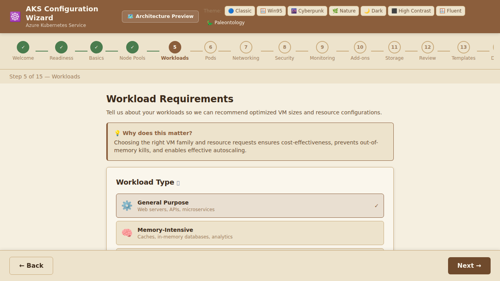

### Fields & Impact

#### Workload Type

| Type | Best For | Recommended VM Family |
|------|----------|-----------------------|
| **General Purpose** | Web servers, APIs, microservices | D-series (balanced CPU/RAM) |
| **Memory-Intensive** | Caches, in-memory databases, analytics | E-series (high RAM) |
| **Compute-Intensive** | Batch processing, simulations, encoding | F-series (high CPU) |
| **GPU-Heavy** | ML training/inference, graphics rendering | NC/ND-series (GPU) |
| **I/O-Intensive** | Streaming, high-throughput data pipelines | L-series (high local storage) |

#### Expected Traffic Level

| Level | Description | Autoscaling Recommendation |
|-------|-------------|---------------------------|
| **Low** | Dev/test, occasional bursts | Fixed node count, no HPA needed |
| **Medium** | Steady with occasional spikes | HPA recommended |
| **High** | Sustained production load | HPA + Cluster Autoscaler |
| **Burst** | Extreme spikes | HPA + KEDA for event-driven scaling |

#### Autoscaling Options

| Option | Description | Impact |
|--------|-------------|--------|
| **HPA** (Horizontal Pod Autoscaler) | Automatically scales the number of pod replicas based on CPU/memory metrics. | Requires resource requests/limits to be set on your deployments. |
| **VPA** (Vertical Pod Autoscaler) | Automatically adjusts CPU/memory requests for pods based on actual usage. | Cannot be used simultaneously with HPA on the same resource. |
| **Prometheus scraping** | Adds Prometheus annotations to generated resource manifests. | Enables custom metric scraping for KEDA and advanced HPA. |

### Official References

- [Horizontal Pod Autoscaler](https://kubernetes.io/docs/tasks/run-application/horizontal-pod-autoscale/)
- [Vertical Pod Autoscaler in AKS](https://learn.microsoft.com/azure/aks/vertical-pod-autoscaler)
- [KEDA — Kubernetes Event-Driven Autoscaling](https://keda.sh/)
- [Azure VM sizes overview](https://learn.microsoft.com/azure/virtual-machines/sizes)

---

## Step 6: Networking

### Purpose

The Networking screen controls how pods, services, and the cluster API server communicate — both internally and with external resources. These choices are largely **irreversible** after cluster creation without significant effort, so choose carefully.

### What you see

```
Networking
Configure how pods and services communicate within your cluster.

ℹ️ Network Plugin
Azure CNI assigns VNet IPs to pods — better for enterprise environments needing
pod-level network policies. Kubenet uses NAT and is simpler but limited.

Network Plugin
[ 🔷 Azure CNI ]  [ 🔶 Kubenet ]

DNS Prefix        ⓘ  [ my-aks                         ]
Service CIDR      ⓘ  [ 10.0.0.0/16                    ]
Docker Bridge CIDR ⓘ [ 172.17.0.1/16                  ]

Load Balancer SKU  ⓘ
[ ⭐ Standard (Recommended) ]  [ 🔹 Basic ]
```

### Screenshot

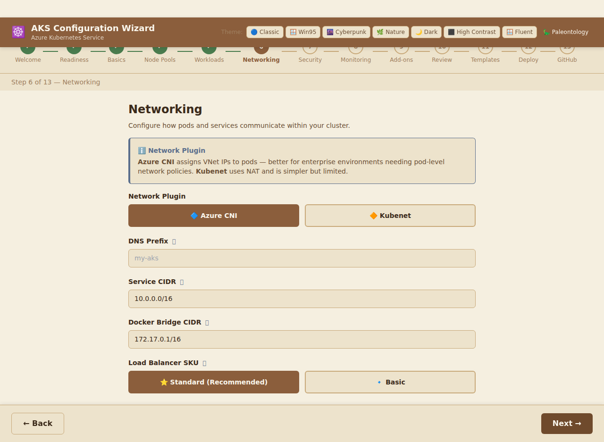

### Fields & Impact

| Field | Options | Description | Impact |
|-------|---------|-------------|--------|
| **Network Plugin** | **Azure CNI** (default), Kubenet | Determines how pods receive IP addresses. | **Azure CNI**: Pods receive IPs directly from the VNet subnet. Required for Azure Network Policies. Better integration with other Azure services. Requires more IP address planning. **Kubenet**: Pods use a private IP range with NAT. Simpler to set up but does not support Azure Network Policies, and pod-to-pod communication from outside the cluster is more complex. |
| **DNS Prefix** | String (alphanumeric + hyphens) | Unique prefix used to form the cluster's API server FQDN: `<dns-prefix>.<region>.azmk8s.io`. | Choosing a descriptive, unique prefix makes it easier to identify the cluster API server endpoint in scripts, kubeconfig files, and monitoring dashboards. |
| **Service CIDR** | CIDR notation (default: `10.0.0.0/16`) | IP address range reserved for Kubernetes internal **Service** objects (ClusterIP). | Must not overlap with any VNet subnet or Pod CIDR. A `/16` provides up to 65,536 service IPs, which is more than sufficient for virtually all clusters. |
| **Docker Bridge CIDR** | CIDR notation (default: `172.17.0.1/16`) | IP range for the legacy Docker bridge network on each node, used for container-to-container communication within a node. | Rarely needs changing. Ensure it does not conflict with your VNet or on-premises networks if using VPN/ExpressRoute. |
| **Load Balancer SKU** | **Standard** (default), Basic | The Azure Load Balancer tier provisioned for external-facing services. | **Standard** supports Availability Zones, up to 1,000 backend pool members, health probe diagnostics, and is required for production. **Basic** is limited and Microsoft is deprecating it; avoid for new deployments. |

### IP Address Planning Checklist

When using **Azure CNI**, ensure the following IP ranges **do not overlap**:

1. VNet subnet address space
2. Service CIDR (`10.0.0.0/16` default)
3. Docker bridge CIDR (`172.17.0.1/16` default)
4. Any on-premises networks connected via VPN or ExpressRoute

### Official References

- [Network concepts for AKS](https://learn.microsoft.com/azure/aks/concepts-network)
- [Azure CNI networking in AKS](https://learn.microsoft.com/azure/aks/configure-azure-cni)
- [Kubenet networking in AKS](https://learn.microsoft.com/azure/aks/configure-kubenet)
- [Azure Standard Load Balancer overview](https://learn.microsoft.com/azure/load-balancer/load-balancer-overview)
- [Plan IP addressing for AKS](https://learn.microsoft.com/azure/aks/configure-azure-cni#plan-ip-addressing-for-your-cluster)

---

## Step 7: Security & Identity

### Purpose

This screen controls who can access the cluster and what they can do, how pods authenticate with Azure services, and which network traffic is permitted between pods. Security settings here directly determine the security posture of your production cluster.

### What you see

```
Security & Identity
Configure authentication, authorization, and network security policies.

⚠️ Security Best Practices
RBAC and Azure AD integration are highly recommended for production clusters.
They ensure only authorized users and services can access your cluster.

┌─────────────────────────────────────────────────────────┐
│ Enable RBAC                           ⓘ  [ ON  ]       │
│ Azure AD Integration                  ⓘ  [ OFF ]       │
│   Azure AD Tenant ID  ⓘ  [ (shown when AD enabled)   ] │
│ Enable Pod Identity                   ⓘ  [ OFF ]       │
│ Enable Cluster Auto-Upgrade           ⓘ  [ OFF ]       │
└─────────────────────────────────────────────────────────┘

Network Policy  ⓘ
[ 🚫 None ]  [ 🔷 Azure ]  [ 🐱 Calico ]
```

### Screenshot

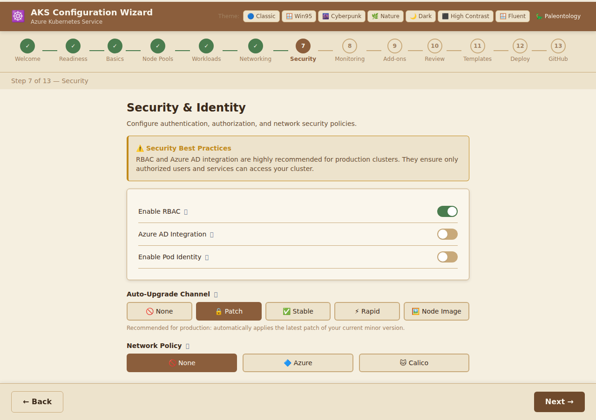

### Fields & Impact

| Field | Default | Description | Impact |
|-------|---------|-------------|--------|
| **Enable RBAC** | ✅ ON | Kubernetes Role-Based Access Control restricts what each user, service account, or group can do within the cluster. | **Strongly recommended for all clusters.** Without RBAC, any authenticated user has full cluster access. With RBAC, you define fine-grained permissions via `Role`, `ClusterRole`, `RoleBinding`, and `ClusterRoleBinding` objects. |
| **Azure AD Integration** | ❌ OFF | Integrates the cluster with Microsoft Entra ID (formerly Azure Active Directory) for user authentication. | Enables enterprise single sign-on (SSO), group-based access control, and Conditional Access policies. Users authenticate with their corporate credentials; group membership drives cluster permissions. Requires an Azure AD Tenant ID. |
| **Azure AD Tenant ID** | — | The GUID of your Azure AD tenant (only visible when Azure AD Integration is enabled). | Find this in **Microsoft Entra ID → Overview** in the Azure Portal. Without the correct Tenant ID, the Azure AD integration will fail. |
| **Enable Pod Identity** | ❌ OFF | Allows pods to use Azure Managed Identities to authenticate with Azure services (Storage, Key Vault, SQL, etc.) without embedding credentials in code or environment variables. | Eliminates the need for storing secrets in Kubernetes. Each pod assumes a managed identity and receives short-lived tokens. Note: The legacy `aad-pod-identity` add-on is being superseded by the **Azure Workload Identity** add-on. |
| **Enable Cluster Auto-Upgrade** | ❌ OFF | Automatically upgrades the cluster to the latest supported Kubernetes patch or minor version. | Keeps the cluster patched and secure with minimal manual intervention. However, unexpected upgrades can disrupt workloads. Configure a **maintenance window** (via Azure CLI) to control when upgrades occur. |
| **Network Policy** | None | Kubernetes `NetworkPolicy` enforcement engine. Controls which pods can communicate with each other at the L4 level. | **None**: All pod-to-pod traffic is permitted. **Azure**: Uses Azure's built-in network policy engine (only supported with Azure CNI). **Calico**: Open-source policy engine that works with both Azure CNI and Kubenet, and supports more granular L7 policies. |

### Security Recommendations for Production

1. **Always enable RBAC** — it is the first line of defence against accidental or malicious actions.
2. **Enable Azure AD integration** to avoid managing separate Kubernetes users and credentials.
3. **Use Managed Identities (Pod Identity / Workload Identity)** instead of storing service principal secrets in the cluster.
4. **Choose Calico or Azure network policies** to segment workloads and limit blast radius in case of a compromise.
5. **Enable Auto-Upgrade** with a maintenance window to stay current on security patches.

### Official References

- [AKS RBAC](https://learn.microsoft.com/azure/aks/manage-azure-rbac)
- [AKS and Microsoft Entra ID integration](https://learn.microsoft.com/azure/aks/enable-authentication-microsoft-entra-id)
- [Azure Workload Identity (recommended over Pod Identity)](https://learn.microsoft.com/azure/aks/workload-identity-overview)
- [Network policies in AKS](https://learn.microsoft.com/azure/aks/use-network-policies)
- [Calico network policy](https://docs.tigera.io/calico/latest/about/)
- [AKS cluster auto-upgrade](https://learn.microsoft.com/azure/aks/auto-upgrade-cluster)
- [AKS security best practices](https://learn.microsoft.com/azure/aks/operator-best-practices-cluster-security)

---

## Step 8: Monitoring

### Purpose

The Monitoring screen enables observability tools so you can understand cluster health, diagnose issues, and respond to incidents. Without monitoring, you have no visibility into what your cluster and applications are doing.

### What you see

```
Monitoring
Set up observability for your cluster — logs, metrics, and alerts.

💡 Why Monitor?
Without monitoring you're flying blind. Container Insights provides CPU, memory,
and log visibility. Prometheus enables custom metric scraping.

┌────────────────────────────────────────────────────────────────┐
│ Enable Container Insights          ⓘ  [ ON  ]                 │
│   Log Analytics Workspace ID  ⓘ  [ (shown when Insights on) ] │
│ Enable Managed Prometheus          ⓘ  [ OFF ]                 │
│ Enable Azure Monitor Metrics       ⓘ  [ OFF ]                 │
└────────────────────────────────────────────────────────────────┘
```

### Screenshot

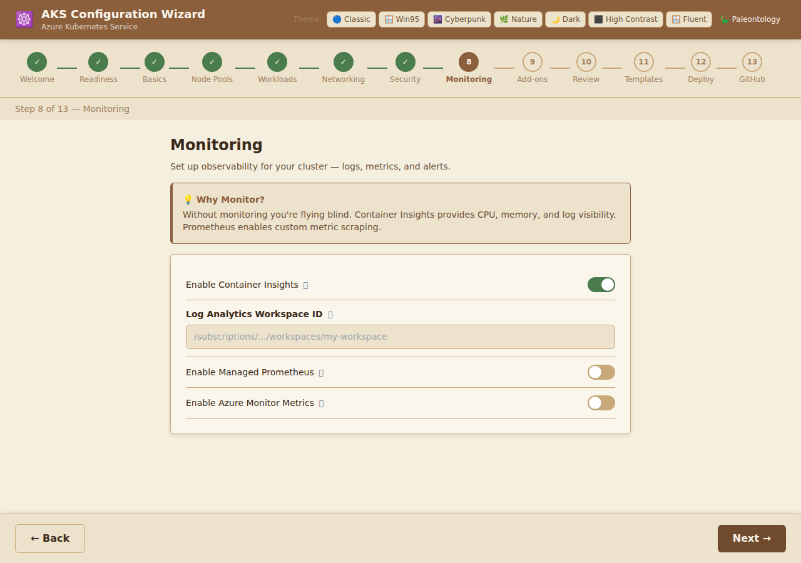

### Fields & Impact

| Field | Default | Description | Impact |
|-------|---------|-------------|--------|
| **Enable Container Insights** | ✅ ON | Azure Monitor Container Insights collects container-level CPU, memory, disk, and network metrics, as well as stdout/stderr logs, and stores them in a Log Analytics workspace. | Provides pre-built dashboards in the Azure Portal for cluster, node, and pod health. Enables log querying via Kusto Query Language (KQL). **Recommended for all clusters.** Incurs Log Analytics ingestion and retention costs. |
| **Log Analytics Workspace ID** | — | The Azure Resource Manager ID of an existing Log Analytics workspace (`/subscriptions/.../workspaces/my-workspace`). | Leave blank to have AKS create a **new workspace automatically**. Provide an existing workspace ID to centralise logs from multiple clusters or share a workspace with other Azure services. |
| **Enable Managed Prometheus** | ❌ OFF | Azure Managed Prometheus is a fully managed, Prometheus-compatible metrics service hosted in Azure Monitor. It scrapes metrics from your cluster using a managed agent. | Enables PromQL queries and Grafana dashboards in Azure. Eliminates the need to run and maintain your own Prometheus server. Works alongside Container Insights. Incurs Azure Monitor costs based on metric samples. |
| **Enable Azure Monitor Metrics** | ❌ OFF | Sends Kubernetes and node-level metrics to the Azure Monitor Metrics store for near-real-time dashboards, alerts, and autoscaling triggers. | Enables metric-based alerts (e.g., alert when CPU > 80%) via Azure Monitor Alert rules. Useful for operational dashboards in Azure Workbooks. |

### Monitoring Architecture Overview

```
Cluster Nodes & Pods
        │
   ┌────▼──────┐
   │ OMS Agent │  (installed by Container Insights)
   └────┬──────┘
        │  logs & metrics
   ┌────▼──────────────┐
   │ Log Analytics WS  │──── KQL Queries, Alerts
   └───────────────────┘

        │
   ┌────▼────────────────┐
   │ Managed Prometheus  │──── PromQL, Grafana
   └─────────────────────┘
```

### Cost Considerations

Monitoring adds cost proportional to the volume of logs and metrics ingested:
- **Container Insights**: charged per GB of data ingested into Log Analytics
- **Managed Prometheus**: charged per million metric samples
- **Azure Monitor Metrics**: charged per custom metric series

Use [Azure Pricing Calculator](https://azure.microsoft.com/pricing/calculator/) to estimate costs.

### Official References

- [Container Insights overview](https://learn.microsoft.com/azure/azure-monitor/containers/container-insights-overview)
- [Enable Container Insights](https://learn.microsoft.com/azure/azure-monitor/containers/container-insights-enable-aks)
- [Azure Managed Prometheus](https://learn.microsoft.com/azure/azure-monitor/essentials/prometheus-metrics-overview)
- [Azure Monitor for AKS](https://learn.microsoft.com/azure/azure-monitor/containers/monitor-kubernetes)
- [Log Analytics pricing](https://azure.microsoft.com/pricing/details/monitor/)

---

## Step 9: Add-ons

### Purpose

AKS Add-ons extend the base cluster with additional capabilities. Unlike manual Helm chart installations, Microsoft-managed add-ons are automatically upgraded and integrated with the AKS control plane lifecycle.

### What you see

```
Add-ons
Extend your cluster with optional add-ons and integrations.

💡 Add-ons vs Extensions
AKS Add-ons are officially supported by Microsoft and fully managed. Extensions are
community-supported features. You can always enable add-ons after cluster creation.

┌─────────────────────────────────────────────────────────────────────┐
│ 🌐 HTTP Application Routing  ⓘ  [Dev only]  [ OFF ]               │
│ 📋 Azure Policy Add-on        ⓘ               [ OFF ]               │
│ 🔑 Azure Key Vault Provider   ⓘ               [ OFF ]               │
│ ⚡ KEDA (Event-Driven Autoscaling) ⓘ          [ OFF ]               │
│ 🔧 Dapr (Distributed Application Runtime) ⓘ  [ OFF ]               │
└─────────────────────────────────────────────────────────────────────┘
```

### Screenshot

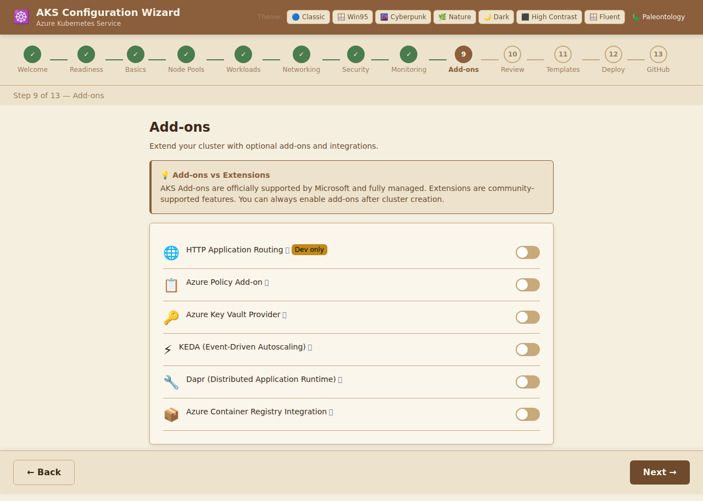

### Add-ons & Impact

| Add-on | Emoji | Dev/Prod | Description | Impact |
|--------|-------|----------|-------------|--------|
| **HTTP Application Routing** | 🌐 | ⚠️ Dev only | Automatically creates a public DNS zone and Nginx Ingress Controller. Makes it trivial to expose services via HTTP/HTTPS in development. | **Not recommended for production**: it creates a publicly accessible DNS zone and Ingress controller with default settings. For production, use a properly configured Ingress controller (NGINX, Application Gateway Ingress Controller) instead. |
| **Azure Policy Add-on** | 📋 | ✅ Prod | Deploys an Open Policy Agent (OPA) Gatekeeper controller that enforces Azure Policy definitions on your cluster. | Enables you to apply organisational governance policies (e.g., require specific image registries, limit privileged containers) using familiar Azure Policy tooling. |
| **Azure Key Vault Provider** | 🔑 | ✅ Prod | Installs the Secrets Store CSI Driver integration for Azure Key Vault. Allows you to mount Key Vault secrets, certificates, and keys as volumes in pods. | Eliminates the need to store secrets in Kubernetes `Secret` objects or environment variables. Secrets are fetched from Key Vault at pod start-up and automatically rotated. |
| **KEDA** | ⚡ | ✅ Prod | Kubernetes Event-Driven Autoscaling. Scales pod replicas based on events from external sources such as Azure Service Bus queues, Kafka topics, HTTP load, and more. | Enables demand-driven horizontal scaling beyond CPU/memory metrics. Ideal for event-driven or batch workloads. Supports 50+ scalers including Azure Storage Queues, Event Hubs, and RabbitMQ. |
| **Dapr** | 🔧 | ✅ Prod | Distributed Application Runtime. Provides building blocks for microservices: service-to-service invocation, pub/sub messaging, state management, secret access, and observability. | Reduces microservice boilerplate code. Applications use the Dapr sidecar via a simple API, letting developers focus on business logic. Particularly useful for polyglot microservice architectures. |

### When to enable each add-on

```
Are you developing locally or testing?
  └─ Yes → Consider HTTP Application Routing for quick ingress setup
  └─ No (Production) → Use a production Ingress controller instead

Do you need to enforce security or compliance policies?
  └─ Yes → Enable Azure Policy Add-on

Do your pods need secrets from Azure Key Vault?
  └─ Yes → Enable Azure Key Vault Provider

Do you have event-driven or queue-based workloads?
  └─ Yes → Enable KEDA

Are you building microservices that need pub/sub, state, or service invocation?
  └─ Yes → Enable Dapr
```

### Official References

- [AKS add-ons overview](https://learn.microsoft.com/azure/aks/integrations)
- [HTTP Application Routing add-on](https://learn.microsoft.com/azure/aks/http-application-routing)
- [Azure Policy for AKS](https://learn.microsoft.com/azure/aks/use-azure-policy)
- [Azure Key Vault Provider for Secrets Store CSI Driver](https://learn.microsoft.com/azure/aks/csi-secrets-store-driver)
- [KEDA on AKS](https://learn.microsoft.com/azure/aks/keda-about)
- [Dapr on AKS](https://learn.microsoft.com/azure/aks/dapr)

---

## Step 10: Review & Validate

### Purpose

The Review screen provides a pre-flight checklist and a complete summary of all configuration choices made in the previous steps. The **Next** button to generate templates is disabled until all validation checks pass.

### What you see

```
Review & Validate
Review your configuration and fix any issues before generating templates.

Validation Checks
────────────────────────────────────────────────
✅  Subscription ID
✅  Resource Group Name
✅  Cluster Name
✅  Cluster name format
✅  RBAC enabled
✅  Azure AD integration
❌  Standard Load Balancer   → Basic SKU is not recommended for production
✅  Container Insights

Configuration Summary
────────────────────────
CLUSTER BASICS
  Subscription ID     xxxxxxxx-xxxx-xxxx-xxxx-xxxxxxxxxxxx
  Resource Group      my-aks-rg
  Cluster Name        my-aks-cluster
  Region              eastus
  Kubernetes Version  1.29.x

SYSTEM NODE POOL
  VM Size     Standard_D2s_v3
  Node Count  3

NETWORKING
  Network Plugin    azure
  Load Balancer SKU Standard
  Service CIDR      10.0.0.0/16
  Network Policy    None

SECURITY
  RBAC         ✅ Enabled
  Azure AD     Disabled
  Pod Identity Disabled
  Auto-Upgrade Disabled

MONITORING & ADD-ONS
  Container Insights  ✅ Enabled
  Prometheus          Disabled
  Key Vault Provider  Disabled
  KEDA                Disabled
  Dapr                Disabled

[ ← Back ]  [ Looks good! Generate Templates → ]   ← disabled if checks fail
```

### Screenshot

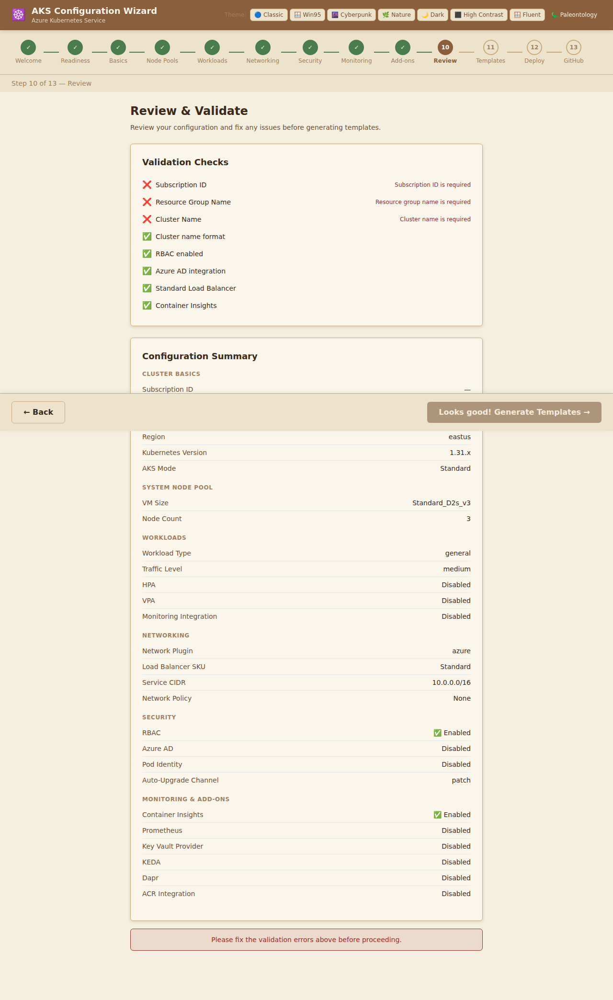

### Validation Checks

The wizard performs the following automated checks before allowing you to proceed:

| Check | Condition | Why It Matters |
|-------|-----------|----------------|
| **Subscription ID** | Must not be empty | Required to target the correct Azure subscription for deployment. |
| **Resource Group Name** | Must not be empty | Required to create or reference the resource group. |
| **Cluster Name** | Must not be empty | Required identifier for the cluster resource. |
| **Cluster name format** | 1–63 chars, alphanumeric + hyphens | AKS enforces this naming constraint. Invalid names cause deployment failures. |
| **RBAC enabled** | Should be `true` | RBAC is a security best practice; the check warns if you have disabled it. |
| **Azure AD integration** | If enabled, Tenant ID must be provided | An empty Tenant ID with Azure AD enabled will cause authentication failures. |
| **Standard Load Balancer** | Should be `Standard` | Basic SKU is deprecated and not suitable for production. |
| **Container Insights** | Should be enabled | Monitoring is strongly recommended for production clusters. |

> **Note:** Checks marked with ❌ must be resolved before proceeding. Navigate back to the relevant step using the **Back** button to correct them.

### Official References

- [AKS best practices for cluster operators](https://learn.microsoft.com/azure/aks/operator-best-practices-cluster-security)
- [AKS production baseline](https://learn.microsoft.com/azure/architecture/reference-architectures/containers/aks/baseline-aks)

---

## Step 11: Generated Templates

### Purpose

The Templates screen converts your wizard configuration into Infrastructure-as-Code (IaC) files. You can switch between **Terraform (HCL)** and **Bicep** tabs and copy or download the generated code.

### What you see

```
Generated Templates
Your AKS configuration has been converted into Infrastructure-as-Code templates.

[ 🔷 Terraform (HCL) ]  [ 💠 Bicep ]

┌─ main.tf ─────────────────────────────────────────────┐  📋 Copy  ⬇️ Download
│                                                        │
│ terraform {                                            │
│   required_providers {                                 │
│     azurerm = {                                        │
│       source  = "hashicorp/azurerm"                    │
│       version = "~> 3.0"                               │
│     }                                                  │
│   }                                                    │
│ }                                                      │
│                                                        │
│ resource "azurerm_kubernetes_cluster" "aks" {          │
│   name                = "my-aks-cluster"               │
│   ...                                                  │
│ }                                                      │
└────────────────────────────────────────────────────────┘

💡 Tip: Review the generated templates before deploying.
   You can further customize them for your specific environment.
```

### Screenshot

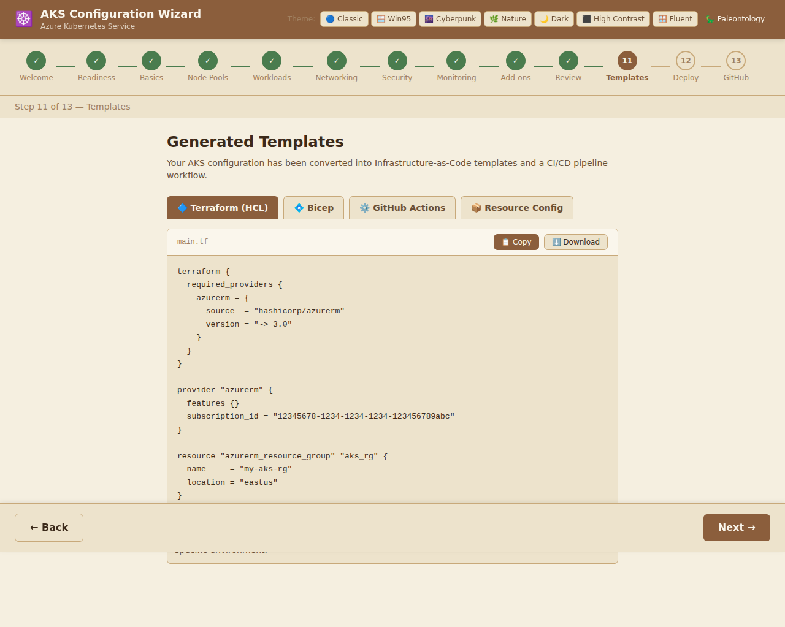

### Terraform Template

The **Terraform** tab generates a `main.tf` file that uses the [AzureRM Terraform provider](https://registry.terraform.io/providers/hashicorp/azurerm/latest). It includes:

- `terraform` block with provider version constraints
- `provider "azurerm"` configuration with feature flags
- `azurerm_resource_group` resource for the cluster's resource group
- `azurerm_kubernetes_cluster` resource with all your wizard settings

**To deploy with Terraform:**

```bash
# 1. Initialise the working directory
terraform init

# 2. Preview the execution plan
terraform plan

# 3. Apply the configuration
terraform apply
```

### Bicep Template

The **Bicep** tab generates a `main.bicep` file using Azure's native IaC language. It includes:

- `param` declarations for subscription-specific values
- `resource` declarations for the resource group and AKS cluster
- All configuration options mapped to ARM resource properties

**To deploy with Bicep:**

```bash
# Using Azure CLI
az deployment sub create \
  --location eastus \
  --template-file main.bicep \
  --parameters clusterName=my-aks-cluster
```

### Choosing Between Terraform and Bicep

| | Terraform | Bicep |
|-|-----------|-------|
| **Language** | HCL (HashiCorp Configuration Language) | Bicep (Azure-native DSL) |
| **Multi-cloud** | ✅ Yes | ❌ Azure only |
| **State management** | Requires state backend (Azure Blob, S3, etc.) | No state file needed (ARM handles it) |
| **Provider ecosystem** | Very large (Terraform Registry) | Azure-specific |
| **Azure integration** | Good | Excellent (first-class) |
| **Learning curve** | Moderate | Lower for Azure users |

### Official References

- [Terraform AzureRM provider – AKS](https://registry.terraform.io/providers/hashicorp/azurerm/latest/docs/resources/kubernetes_cluster)
- [Bicep documentation](https://learn.microsoft.com/azure/azure-resource-manager/bicep/overview)
- [Deploy AKS with Bicep](https://learn.microsoft.com/azure/aks/learn/quick-kubernetes-deploy-bicep)
- [Deploy AKS with Terraform](https://learn.microsoft.com/azure/aks/learn/quick-kubernetes-deploy-terraform)

---

## Step 12: Deploy to Azure

### Purpose

The Deploy screen generates a ready-to-run **PowerShell deployment script** (`deploy-aks.ps1`) that uses the Azure CLI (`az`) to provision your cluster. You can copy the script to the clipboard or download it as a `.ps1` file for local execution.

### What you see

```
Deploy to Azure
Your AKS cluster configuration has been translated into a PowerShell deployment
script using the Azure CLI. Copy or download the script and run it in your local terminal.

ℹ️ Prerequisites: Azure CLI and kubectl must be installed.
   Run `az login` before executing the script, or use the -SubscriptionId parameter
   to target a specific subscription.

⚠️ Educational Disclaimer: This script is provided for educational and learning purposes
   only. Validate and tailor it for your own production environment before use.

[ 📋 Copy Script ]  [ ⬇️ Download deploy-aks.ps1 ]

┌─────────────────────────────────────────────────────────────┐
│ # AKS Deployment Script — generated by AKS-Wizard           │
│ param(                                                       │
│     [string]$SubscriptionId = "..."                         │
│ )                                                            │
│ az account set --subscription $SubscriptionId               │
│ az group create --name my-aks-rg --location eastus          │
│ az aks create \                                              │
│     --resource-group my-aks-rg \                            │
│     --name my-aks-cluster \                                  │
│     --kubernetes-version 1.29.x \                            │
│     ...                                                      │
└─────────────────────────────────────────────────────────────┘
```

### Screenshot

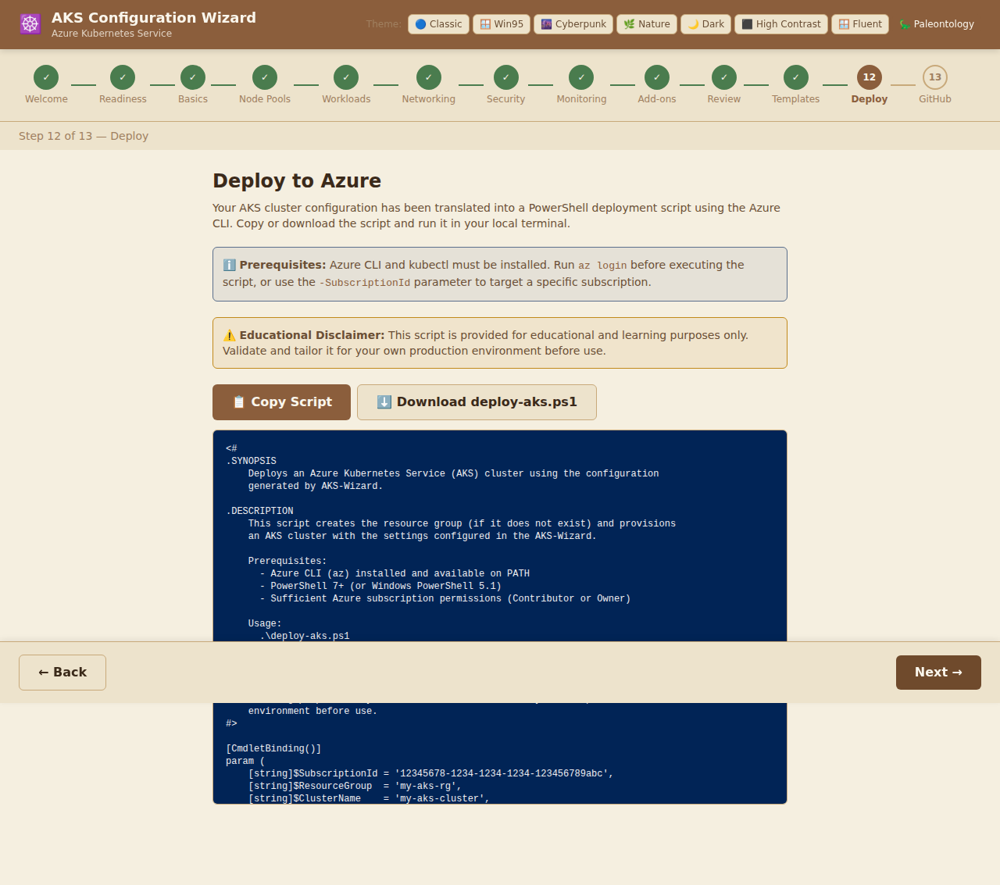

### Using the Generated Script

#### Prerequisites

Before running the script, ensure you have:

1. **Azure CLI v2.40+** — [Install guide](https://learn.microsoft.com/cli/azure/install-azure-cli)
2. **kubectl** — [Install guide](https://kubernetes.io/docs/tasks/tools/)
3. **PowerShell 7+** (or Windows PowerShell 5.1) — [Install guide](https://learn.microsoft.com/powershell/scripting/install/installing-powershell)

#### Execution Steps

```powershell
# 1. Login to Azure
az login

# 2. (Optional) Set the subscription
az account set --subscription "<your-subscription-id>"

# 3. Run the script
.\deploy-aks.ps1 -SubscriptionId '<your-subscription-id>'

# 4. Get cluster credentials
az aks get-credentials --resource-group my-aks-rg --name my-aks-cluster

# 5. Verify the cluster is running
kubectl get nodes
```

### What the Script Does

The generated script performs these operations in sequence:

| Step | Command | Description |
|------|---------|-------------|
| 1 | `az account set` | Targets the specified subscription |
| 2 | `az group create` | Creates the resource group if it does not exist |
| 3 | `az aks create` | Provisions the AKS cluster with all your wizard settings |
| 4 | `az aks get-credentials` | Downloads the kubeconfig to authenticate `kubectl` |

### Script Customisation

The generated script includes your selected options as flags to `az aks create`. Common additions you may want to make manually:

- **`--vnet-subnet-id`** — deploy into an existing VNet subnet (required for Azure CNI + pre-existing VNets)
- **`--service-principal` / `--client-secret`** — use a service principal instead of a system-assigned identity
- **`--node-osdisk-size`** — customise OS disk size
- **`--zones 1 2 3`** — spread nodes across Availability Zones

### Official References

- [az aks create reference](https://learn.microsoft.com/cli/azure/aks#az-aks-create)
- [AKS quickstart with Azure CLI](https://learn.microsoft.com/azure/aks/learn/quick-kubernetes-deploy-cli)
- [Azure CLI installation](https://learn.microsoft.com/cli/azure/install-azure-cli)
- [kubectl installation](https://kubernetes.io/docs/tasks/tools/)

---

## Step 13: Save to GitHub

### Purpose

The final screen allows you to commit the generated IaC files (`main.tf` and `main.bicep`) directly to a GitHub repository using the GitHub REST API. This enables you to store your cluster configuration under version control and integrate it into a GitOps workflow.

### What you see

```
Save to GitHub
Save your generated templates directly to a GitHub repository using the GitHub REST API.

Files to Save
─────────────
📄 aks-configs/main.tf
📄 aks-configs/main.bicep

GitHub Settings
────────────────────────────────────────────
Personal Access Token  [ ghp_xxxxxxxxxxxx ] (password field)
  Needs `repo` scope. Create one at github.com/settings/tokens

Owner       [ your-username ]   Repository  [ my-infra ]
Branch      [ main            ]   Folder Path [ aks-configs/ ]

                                   [ 💾 Save to GitHub ]

─── After saving ────────────────────────────────────────
✅ Files saved successfully!
🔗 https://github.com/your-username/my-infra/blob/main/aks-configs/main.tf
🔗 https://github.com/your-username/my-infra/blob/main/aks-configs/main.bicep

🎉 Congratulations!
You've completed the AKS Configuration Wizard.
Your cluster configuration is ready to go!
```

### Screenshot


### Fields & Impact

| Field | Description | Impact |
|-------|-------------|--------|
| **Personal Access Token** | A GitHub [Personal Access Token (PAT)](https://github.com/settings/tokens) with `repo` scope. The token is used to authenticate the GitHub API call. | The token is **never stored** — it is only used in-memory for the current session. Use a **fine-grained token** scoped to the specific repository and limited to `Contents: Read and Write` for minimum privilege. |
| **Owner** | Your GitHub username or organisation name that owns the target repository. | Must match exactly. Used to construct the API URL: `https://api.github.com/repos/{owner}/{repo}/contents/...` |
| **Repository** | The name of the GitHub repository where files will be saved. | The repository must already exist. If the branch and path do not exist, the API creates them automatically. |
| **Branch** | The Git branch to commit the files to (default: `main`). | If the branch does not exist, the API will return an error. Create the branch first, or use the default branch. |
| **Folder Path** | The directory path within the repository where files are written (default: `aks-configs/`). | The trailing slash indicates a directory. The wizard creates `{folder-path}main.tf` and `{folder-path}main.bicep`. If files already exist, they are updated (overwritten). |

### Security Best Practices for the PAT

1. **Use fine-grained tokens** scoped to a single repository.
2. **Set an expiration date** on the token (30, 60, or 90 days).
3. **Grant only `Contents: Read & Write`** — avoid `repo` full-scope tokens if possible.
4. **Revoke the token** immediately after use if created specifically for this task.
5. **Never commit your PAT** to source control.

### GitOps Integration

Once the templates are committed to your repository, you can integrate them into a CI/CD pipeline:

```yaml
# Example GitHub Actions workflow (simplified)
on:
  push:
    paths:
      - 'aks-configs/**'

jobs:
  deploy:
    runs-on: ubuntu-latest
    steps:
      - uses: actions/checkout@v4
      - uses: azure/login@v1
        with:
          creds: ${{ secrets.AZURE_CREDENTIALS }}
      - run: |
          terraform init
          terraform apply -auto-approve
        working-directory: aks-configs/
```

### Official References

- [GitHub REST API – Create or update file contents](https://docs.github.com/en/rest/repos/contents#create-or-update-file-contents)
- [Creating a fine-grained personal access token](https://docs.github.com/en/authentication/keeping-your-account-and-data-secure/managing-your-personal-access-tokens#creating-a-fine-grained-personal-access-token)
- [GitHub Actions for Azure](https://learn.microsoft.com/azure/developer/github/connect-from-azure)
- [GitOps for AKS with Flux](https://learn.microsoft.com/azure/aks/gitops-flux2-quickstart)

---

## Appendix A: Complete Configuration Reference

The table below summarises every configurable field in the wizard, its default value, and the configuration section it belongs to.

| Field | Default | Section |
|-------|---------|---------|
| `subscriptionId` | *(empty)* | Cluster Basics |
| `resourceGroupName` | *(empty)* | Cluster Basics |
| `clusterName` | *(empty)* | Cluster Basics |
| `region` | `eastus` | Cluster Basics |
| `kubernetesVersion` | `1.29.x` | Cluster Basics |
| `systemNodePool.name` | `system` | Node Pools |
| `systemNodePool.vmSize` | `Standard_D2s_v3` | Node Pools |
| `systemNodePool.nodeCount` | `3` | Node Pools |
| `systemNodePool.enableAutoScaling` | `false` | Node Pools |
| `systemNodePool.minNodes` | `1` | Node Pools |
| `systemNodePool.maxNodes` | `5` | Node Pools |
| `networkPlugin` | `azure` | Networking |
| `dnsPrefix` | *(empty)* | Networking |
| `serviceCidr` | `10.0.0.0/16` | Networking |
| `dockerBridgeCidr` | `172.17.0.1/16` | Networking |
| `loadBalancerSku` | `Standard` | Networking |
| `enableRbac` | `true` | Security |
| `enableAzureAd` | `false` | Security |
| `azureAdTenantId` | *(empty)* | Security |
| `enablePodIdentity` | `false` | Security |
| `networkPolicy` | `None` | Security |
| `enableAutoUpgrade` | `false` | Security |
| `enableContainerInsights` | `true` | Monitoring |
| `logAnalyticsWorkspaceId` | *(empty)* | Monitoring |
| `enablePrometheus` | `false` | Monitoring |
| `enableAzureMonitor` | `false` | Monitoring |
| `enableHttpApplicationRouting` | `false` | Add-ons |
| `enableAzurePolicy` | `false` | Add-ons |
| `enableKeyVaultProvider` | `false` | Add-ons |
| `enableKeda` | `false` | Add-ons |
| `enableDapr` | `false` | Add-ons |

---

## Appendix B: Supported Azure Regions

| Value | Display Name |
|-------|-------------|
| `eastus` | East US |
| `eastus2` | East US 2 |
| `westus2` | West US 2 |
| `westus3` | West US 3 |
| `centralus` | Central US |
| `northeurope` | North Europe |
| `westeurope` | West Europe |
| `uksouth` | UK South |
| `southeastasia` | Southeast Asia |
| `australiaeast` | Australia East |
| `japaneast` | Japan East |
| `brazilsouth` | Brazil South |

> AKS is available in many more regions. Visit [Azure Products by Region](https://azure.microsoft.com/global-infrastructure/services/?products=kubernetes-service) for a full list.

---

## Appendix C: Glossary

| Term | Definition |
|------|-----------|
| **AKS** | Azure Kubernetes Service — Microsoft's managed Kubernetes offering. |
| **Bicep** | Azure's domain-specific language for deploying resources declaratively, compiles to ARM JSON. |
| **CIDR** | Classless Inter-Domain Routing — notation for specifying IP address ranges, e.g. `10.0.0.0/16`. |
| **CNI** | Container Network Interface — a standard for Kubernetes network plugins. |
| **CoreDNS** | The DNS server deployed into every Kubernetes cluster for service discovery. |
| **Dapr** | Distributed Application Runtime — a set of APIs for building microservices. |
| **FQDN** | Fully Qualified Domain Name — the complete domain name of the cluster API server. |
| **HCL** | HashiCorp Configuration Language — the language used to write Terraform configs. |
| **IaC** | Infrastructure as Code — managing infrastructure using declarative configuration files. |
| **KEDA** | Kubernetes Event-Driven Autoscaling — scales pods based on event-source metrics. |
| **KQL** | Kusto Query Language — used to query Log Analytics workspaces. |
| **Kubenet** | A simpler Kubernetes network plugin that uses NAT for pod networking. |
| **kubectl** | The Kubernetes command-line tool for interacting with clusters. |
| **Managed Identity** | An Azure identity managed by the platform, eliminating the need for credentials. |
| **NAT** | Network Address Translation — maps private IPs to a public IP for outbound traffic. |
| **OPA** | Open Policy Agent — a general-purpose policy engine used by Azure Policy add-on. |
| **PAT** | Personal Access Token — a token used to authenticate to GitHub's API. |
| **RBAC** | Role-Based Access Control — a security model that assigns permissions to roles. |
| **SKU** | Stock Keeping Unit — Azure's term for a pricing/capability tier. |
| **Terraform** | An open-source IaC tool by HashiCorp that supports multiple cloud providers. |
| **VNet** | Azure Virtual Network — the fundamental building block for Azure networking. |

---

## Appendix D: Further Learning Resources

### Microsoft Learn

- [AKS learning path](https://learn.microsoft.com/training/paths/intro-to-kubernetes-on-azure/)
- [Kubernetes core concepts for AKS](https://learn.microsoft.com/azure/aks/concepts-clusters-workloads)
- [AKS baseline architecture](https://learn.microsoft.com/azure/architecture/reference-architectures/containers/aks/baseline-aks)
- [AKS security best practices](https://learn.microsoft.com/azure/aks/operator-best-practices-cluster-security)

### Kubernetes Official Documentation

- [Kubernetes Concepts](https://kubernetes.io/docs/concepts/)
- [kubectl reference](https://kubernetes.io/docs/reference/kubectl/)
- [Network policies](https://kubernetes.io/docs/concepts/services-networking/network-policies/)

### Tools Referenced in this Wizard

- [Azure CLI](https://learn.microsoft.com/cli/azure/)
- [Terraform Azure Provider](https://registry.terraform.io/providers/hashicorp/azurerm/latest/docs)
- [Bicep Language](https://learn.microsoft.com/azure/azure-resource-manager/bicep/)
- [Calico](https://docs.tigera.io/calico/latest/about/)
- [KEDA scalers](https://keda.sh/docs/latest/scalers/)
- [Dapr documentation](https://docs.dapr.io/)
