# AKS-Wizard — User Manual

> **⚠️ Educational Disclaimer**: This wizard is provided for educational and learning purposes only. All generated configurations, templates, and scripts should be validated and tailored for your own production environment before use.

This manual provides a step-by-step walkthrough of every screen in the AKS-Wizard UI. For each screen you will find:
- **Purpose** – what the screen is for
- **Questions / fields** – what each option means
- **Impact** – how your choice affects the resulting cluster
- **Official references** – Microsoft Docs and community links for deeper reading

---

## Table of Contents

1. [Welcome](#step-1-welcome)
2. [Team Readiness Assessment](#step-2-team-readiness-assessment)
3. [Cluster Basics](#step-3-cluster-basics)
4. [Node Pools](#step-4-node-pools)
5. [Workload Requirements](#step-5-workload-requirements)
6. [Pod Configuration](#step-6-pod-configuration)
7. [Networking](#step-7-networking)
8. [Security & Identity](#step-8-security--identity)
9. [Monitoring & Observability](#step-9-monitoring--observability)
10. [Add-ons](#step-10-add-ons)
11. [Hub-Spoke Networking](#step-11-hub-spoke-networking)
12. [Multi-Region & High Availability](#step-12-multi-region--high-availability)
    - [Azure API Management (APIM)](#azure-api-management-apim)
13. [Persistent Storage](#step-13-persistent-storage)
14. [Review & Validate](#step-14-review--validate)
15. [Generated Templates](#step-15-generated-templates)
16. [Deploy to Azure](#step-16-deploy-to-azure)
17. [Save to GitHub](#step-17-save-to-github)

---

## Step 1: Welcome

### Purpose

The Welcome screen introduces the AKS-Wizard and sets expectations for the overall experience. It highlights three core capabilities of the tool and provides an estimated time to complete the wizard.

### What you see

```
☸️

AKS Configuration Wizard
Build your Azure Kubernetes Service cluster step-by-step

┌─────────────────────┐ ┌─────────────────────┐ ┌─────────────────────┐
│ 🎯 Interview-Style  │ │ 📚 Educational       │ │ ⚡ Generate & Deploy │
│                     │ │                     │ │                     │
│ Answer simple       │ │ Every option        │ │ Export Terraform or │
│ questions and we'll │ │ includes            │ │ Bicep templates, or │
│ build your config   │ │ explanations so     │ │ deploy directly     │
│ automatically.      │ │ you understand      │ │ from the browser.   │
│                     │ │ what you're         │ │                     │
│                     │ │ configuring.        │ │                     │
└─────────────────────┘ └─────────────────────┘ └─────────────────────┘

⏱️ Estimated time: ~15 minutes

[ Let's get started → ]
```

### Screenshot

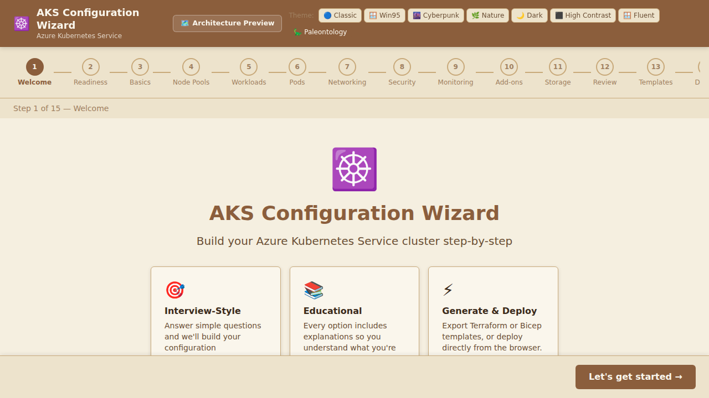

### Impact

No configuration choices are made on this screen. Clicking **Let's get started →** advances you to the Team Readiness Assessment.

### Tips

- The wizard estimates approximately **15 minutes** to complete. You can pause and resume at any time because the state is held in memory for the current browser session.
- You can switch **themes** at any time using the theme switcher in the top-right corner. Eight themes are available: Classic, Win95, Cyberpunk, Nature, Dark, High Contrast, Microsoft Fluent, and Paleontology (default).

---

## Step 2: Team Readiness Assessment

### Purpose

The Team Readiness Assessment screen presents six yes/no questions to help the wizard recommend the most appropriate AKS mode for your team: **AKS Automatic** (fully managed, accelerated onboarding) or **AKS Standard** (full control, recommended for platform teams).

### What you see

```
Team Readiness Assessment
Answer these questions to help the wizard recommend the right AKS mode for your team:
AKS Automatic (fully managed, accelerated onboarding) or AKS Standard (full control, recommended for platform teams).

ℹ️ AKS Automatic vs Standard
AKS Automatic reduces operational overhead by managing node provisioning, upgrades, and security
configurations automatically — ideal for teams new to Kubernetes. AKS Standard gives your platform
team full control over every cluster parameter.

1. Does your team include dedicated platform / infrastructure engineers?  [ ✅ Yes ] [ ❌ No ]
2. Can your team commit to reviewing Kubernetes upgrades within 30 days?  [ ✅ Yes ] [ ❌ No ]
3. Do you require advanced networking customisation?                       [ ✅ Yes ] [ ❌ No ]
4. Does your team already operate a GitOps or CI/CD pipeline?             [ ✅ Yes ] [ ❌ No ]
5. Do your workloads require custom OS, GPU, or specialised node pools?   [ ✅ Yes ] [ ❌ No ]
6. Are you deploying across multiple environments?                         [ ✅ Yes ] [ ❌ No ]

6 / 6 questions answered

🔧 Recommended: AKS Standard
Your team has the maturity to leverage AKS Standard's full control over cluster configuration.
You can override this recommendation on the Basics step.
```

### Screenshot

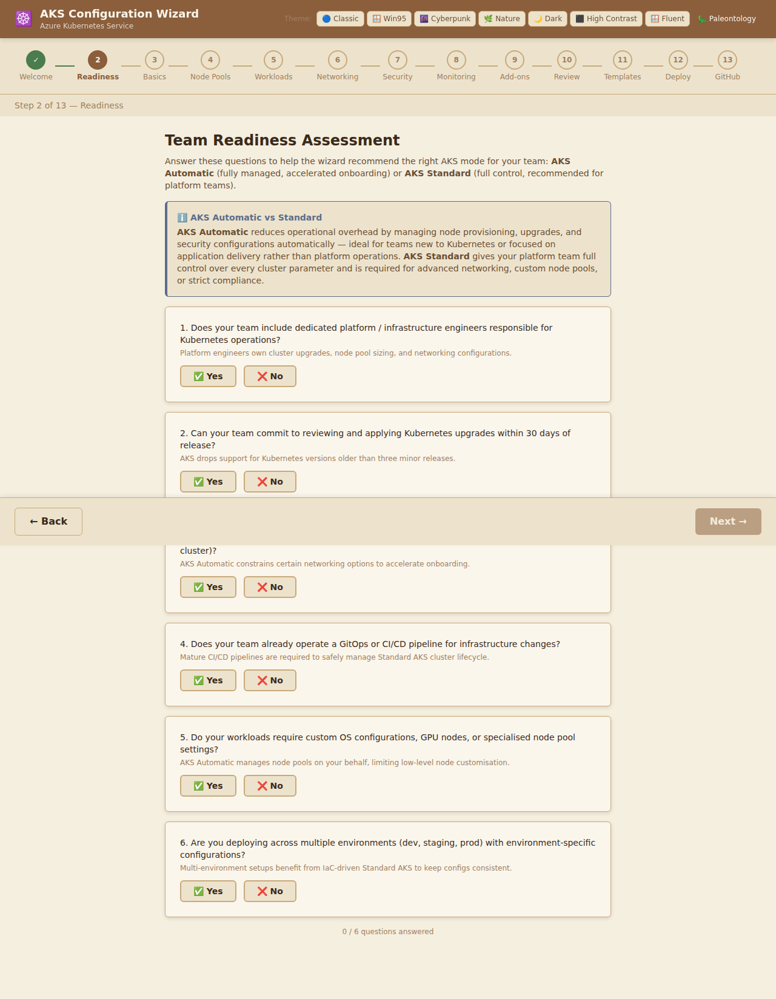

### Questions & Impact

| # | Question | Weight | Signals AKS Standard when… |
|---|----------|--------|----------------------------|
| 1 | Dedicated platform engineers? | 2 | **Yes** — platform team can handle full cluster lifecycle. |
| 2 | Commit to upgrade reviews within 30 days? | 2 | **Yes** — team can follow AKS version support windows. |
| 3 | Advanced networking customisation required? | 3 | **Yes** — AKS Automatic constrains certain networking options. |
| 4 | GitOps / CI/CD pipeline in place? | 2 | **Yes** — IaC pipelines unlock full Standard AKS benefits. |
| 5 | Custom OS, GPU, or specialised node pools? | 3 | **Yes** — AKS Automatic manages node pools on your behalf. |
| 6 | Multi-environment deployment? | 1 | **Yes** — environment-specific configs benefit from Standard. |

### Recommendation Logic

Each "Yes" answer adds its weight to the total score. When the **total weighted score is 5 or above**, the wizard recommends **AKS Standard**; below 5, it recommends **AKS Automatic**.

Examples:
- "Yes" to questions 3 and 5 alone (weight 3+3 = 6) → **AKS Standard**
- "Yes" to questions 1, 2, and 4 (weight 2+2+2 = 6) → **AKS Standard**
- "Yes" to only question 6 (weight 1) → **AKS Automatic**

The recommendation is displayed at the bottom of the page after all questions are answered. You can always override it on the next step (Cluster Basics).

### Official References

- [AKS Automatic overview](https://learn.microsoft.com/azure/aks/intro-aks-automatic)
- [AKS Standard overview](https://learn.microsoft.com/azure/aks/intro-kubernetes)
- [Choose the right AKS tier](https://learn.microsoft.com/azure/aks/free-standard-pricing-tiers)

---

## Step 3: Cluster Basics

### Purpose

This screen collects the fundamental identity information for your AKS cluster: where it lives in Azure (subscription, resource group, and region) and what version of Kubernetes it runs.

### What you see

```
Cluster Basics
Let's start with the fundamental details of your AKS cluster.

ℹ️ What is AKS?
Azure Kubernetes Service (AKS) is a managed container orchestration service.
Azure handles the control plane — you only manage the worker nodes.
Choose AKS Automatic for a fully managed experience or AKS Standard for complete control.

AKS Mode        ⓘ  [ 🔧 AKS Standard ✓ ]  [ 🤖 AKS Automatic ]  (pre-filled from Team Readiness Assessment)
Azure Subscription ID  ⓘ  [ xxxxxxxx-xxxx-xxxx-xxxx-xxxxxxxxxxxx ]
Resource Group Name    ⓘ  [ my-aks-rg                              ]
Cluster Name           ⓘ  [ my-aks-cluster                         ]
Azure Region           ⓘ  [ East US                          ▼     ]
Kubernetes Version     ⓘ  [ 1.31.x                           ▼     ]
```

### Screenshot

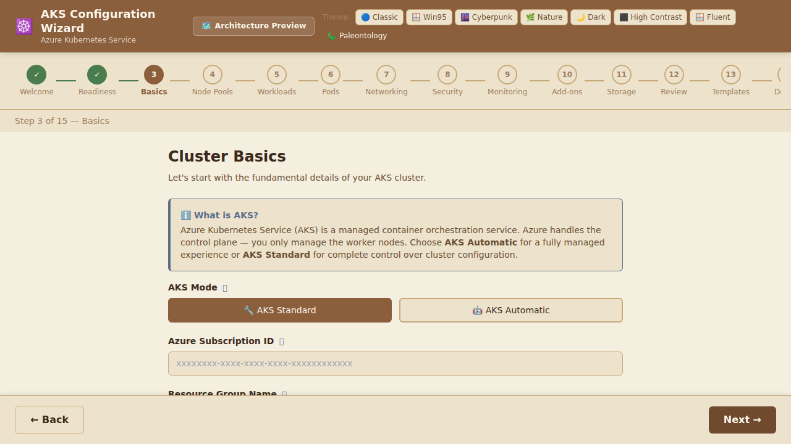

### Fields & Impact

| Field | Description | Impact |
|-------|-------------|--------|
| **AKS Mode** | Choose between **AKS Standard** (full control) or **AKS Automatic** (fully managed). Pre-populated from the Team Readiness Assessment. | **Standard**: full access to all node pool, networking, and security settings. **Automatic**: Azure manages node provisioning, OS patching, and security baselines automatically. Can be overridden here regardless of the readiness recommendation. |
| **Azure Subscription ID** | The GUID of the Azure subscription that will own and be billed for this cluster. | All Azure resources (cluster, load balancers, disks) are created under this subscription and billed to it. Locate it under **Subscriptions** in the Azure portal. |
| **Resource Group Name** | A logical container that groups all Azure resources for this cluster. | Use a dedicated resource group per cluster to simplify cost tracking, access control, and deletion. If the group does not exist, the deployment script creates it automatically. |
| **Cluster Name** | A unique name for the AKS cluster within the resource group. | Must be 1–63 characters, alphanumeric characters and hyphens only. The name is used in Azure Portal URLs, the DNS FQDN, and the cluster's API server endpoint. |
| **Azure Region** | The Azure datacenter region where the cluster control plane and node VMs are created. | Choose a region **closest to your users or dependent services** to minimise latency. Feature availability (e.g., Availability Zones, certain VM sizes) varies by region. |
| **Kubernetes Version** | The Kubernetes minor version to run on the cluster. | AKS supports the **latest three minor versions**. Newer versions include security patches and new features but may require workload compatibility testing. The default is the latest available version (currently **1.31.x**). |

### Official References

- [What is Azure Kubernetes Service (AKS)?](https://learn.microsoft.com/azure/aks/intro-kubernetes)
- [AKS Automatic overview](https://learn.microsoft.com/azure/aks/intro-aks-automatic)
- [Supported Kubernetes versions in AKS](https://learn.microsoft.com/azure/aks/supported-kubernetes-versions)
- [Azure regions](https://azure.microsoft.com/global-infrastructure/geographies/)
- [Manage Azure Resource Groups](https://learn.microsoft.com/azure/azure-resource-manager/management/manage-resource-groups-portal)

---

## Step 4: Node Pools

### Purpose

Node pools define the virtual machine fleets that run your containerised workloads. AKS separates infrastructure concerns (system pods) from application workloads by supporting multiple node pools.

### What you see

```
Node Pools
Node pools are groups of VMs that run your workloads.

ℹ️ System vs User Node Pools
System pools run critical AKS system pods (CoreDNS, metrics server).
User pools are for your application workloads. You need at least one system pool.

┌─────────────────────────────────────┐
│ System Node Pool                    │
│                                     │
│ Pool Name         [ system        ] │
│ VM Size       ⓘ  [ Standard_D2s_v3 ▼] │
│ Enable Auto-scaling  [ OFF ]    ⓘ  │
│ Node Count: 3  [────●──────────]   │
│                 1              10   │
└─────────────────────────────────────┘

[ + Add User Node Pool ]
```

### Screenshot

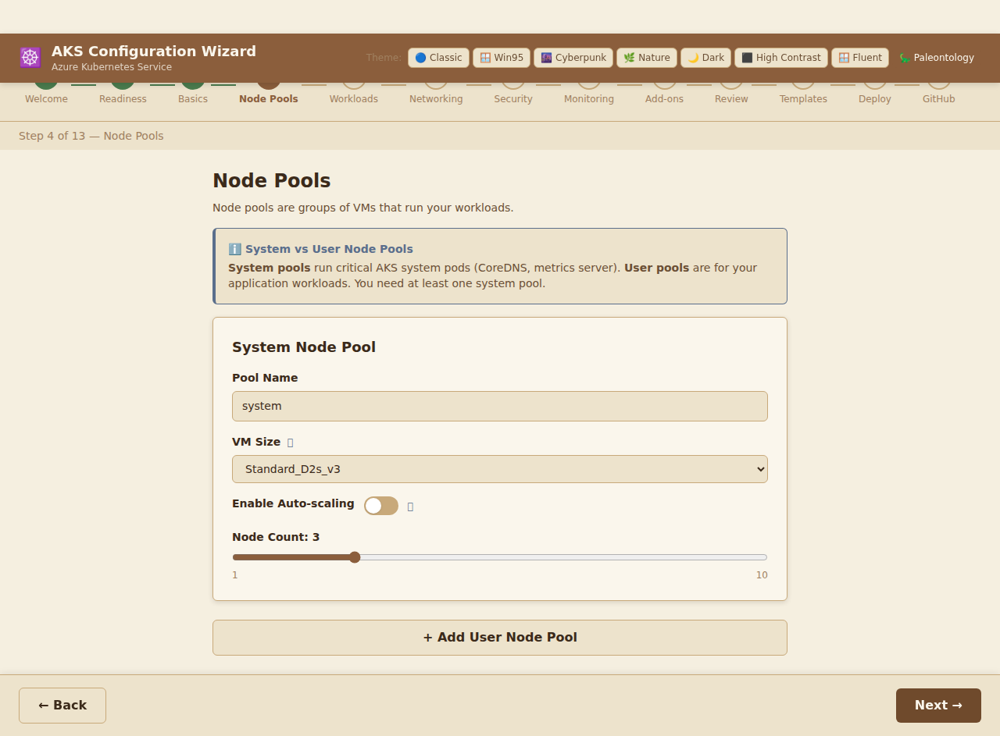

### Fields & Impact

#### System Node Pool (required)

| Field | Description | Impact |
|-------|-------------|--------|
| **Pool Name** | Identifier for the node pool. | Must be lowercase alphanumeric, starting with a letter. Used in Kubernetes node labels and Azure resource names. |
| **VM Size** | Azure Virtual Machine size for each node in the pool. | Larger SKUs support more pods per node and workloads with higher CPU/memory requirements, but cost proportionally more. **D-series** are general-purpose; **E-series** are memory-optimised; **F-series** are compute-optimised. |
| **Enable Auto-scaling** | Toggles the Kubernetes Cluster Autoscaler. | When **ON**, the cluster automatically adds or removes nodes within the min/max bounds in response to pending pods or underutilisation. When **OFF**, a fixed node count is used. |
| **Node Count** (fixed) | Exact number of nodes when auto-scaling is disabled. | Determines cost and capacity. A minimum of **3 nodes** across 3 availability zones is recommended for production to ensure high availability. |
| **Min Nodes** (auto-scale) | Minimum number of nodes the autoscaler may scale down to. | Setting too low may cause workloads to remain unscheduled during bursts while nodes are provisioning. |
| **Max Nodes** (auto-scale) | Maximum number of nodes the autoscaler may scale up to. | Limits maximum spend. Set this based on peak expected load with a safety margin. Azure subscription vCPU quotas also apply. |

#### User Node Pools (optional, multiple allowed)

User pools follow the same fields as the system pool. They are intended to isolate application workloads from system infrastructure:

- **Dedicated workload pools** allow you to use different VM sizes for different application types (e.g., GPU nodes for ML, high-memory for databases).
- **Taints and tolerations** (not exposed in the wizard but settable via CLI) can ensure that only specific workloads are scheduled on specific pools.

Click **+ Add User Node Pool** to add additional pools. Each added pool appears with a **Remove** button.

### VM Size Reference

| SKU | vCPUs | Memory | Best For |
|-----|-------|--------|----------|
| Standard_D2s_v3 | 2 | 8 GB | Development, small workloads |
| Standard_D4s_v3 | 4 | 16 GB | General purpose |
| Standard_D8s_v3 | 8 | 32 GB | Medium workloads |
| Standard_D16s_v3 | 16 | 64 GB | Large workloads |
| Standard_E4s_v3 | 4 | 32 GB | Memory-intensive apps |
| Standard_E8s_v3 | 8 | 64 GB | Memory-intensive apps |
| Standard_F4s_v2 | 4 | 8 GB | Compute-intensive apps |
| Standard_F8s_v2 | 8 | 16 GB | Compute-intensive apps |
| Standard_B2ms | 2 | 8 GB | Dev/test burstable |
| Standard_B4ms | 4 | 16 GB | Dev/test burstable |

### Official References

- [Node pools in AKS](https://learn.microsoft.com/azure/aks/use-multiple-node-pools)
- [Cluster Autoscaler in AKS](https://learn.microsoft.com/azure/aks/cluster-autoscaler)
- [Azure VM sizes](https://learn.microsoft.com/azure/virtual-machines/sizes)
- [System and user node pools](https://learn.microsoft.com/azure/aks/use-system-pools)

---

## Step 5: Workload Requirements

### Purpose

The Workload Requirements screen collects information about the applications you plan to run on the cluster. The wizard uses your answers to recommend appropriate VM SKUs for user node pools and surfaces relevant autoscaling and monitoring options.

### What you see

```
Workload Requirements
Tell us about your workloads so we can recommend optimized VM sizes and resource configurations.

💡 Why does this matter?
Choosing the right VM family and resource requests ensures cost-effectiveness,
prevents out-of-memory kills, and enables effective autoscaling.

Workload Type ⓘ
  [ ⚙️ General Purpose     ]  Web servers, APIs, microservices         ✓
  [ 🧠 Memory-Intensive    ]  Caches, in-memory databases, analytics
  [ 🔢 Compute-Intensive   ]  Batch processing, simulations, encoding
  [ 🎮 GPU-Heavy           ]  ML training/inference, graphics rendering
  [ 💾 I/O-Intensive       ]  Streaming, high-throughput data pipelines

Expected Traffic Level ⓘ
  [ Low   ]  Occasional traffic, dev/test environments
  [ Medium]  Steady traffic with occasional spikes     ✓ Selected
  [ High  ]  Sustained heavy load, production services
  [ Burst ]  Extreme spikes, event-driven or seasonal traffic

Autoscaling
  Horizontal Pod Autoscaler (HPA)  ⓘ  [ OFF ]
  Vertical Pod Autoscaler (VPA)    ⓘ  [ OFF ]

  (When HPA is enabled, sliders appear:)
  Target CPU Utilization:    70%  [───────────●──────]  30% ←——— 70% ———→ 90%  ⓘ
  Target Memory Utilization: 80%  [────────────────●─]  30% ←———— 80% ——→ 90%  ⓘ

Monitoring Integration
  Add Prometheus scraping annotations  ⓘ  [ OFF ]

💡 Recommended VM SKUs for User Node Pools
  Standard_D4s_v3  4 vCPU, 16 GiB RAM  — Balanced compute/memory for most workloads
  Standard_D8s_v3  8 vCPU, 32 GiB RAM  — Scale-up option for heavier general workloads
```

### Screenshot

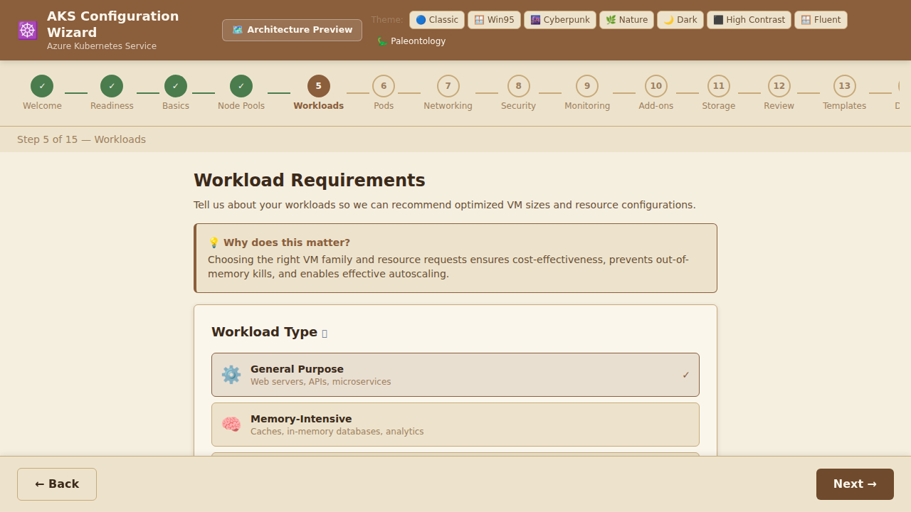

### Fields & Impact

#### Workload Type

| Type | Best For | Recommended VM Family |
|------|----------|-----------------------|
| **General Purpose** | Web servers, APIs, microservices | D-series (balanced CPU/RAM) |
| **Memory-Intensive** | Caches, in-memory databases, analytics | E-series (high RAM) |
| **Compute-Intensive** | Batch processing, simulations, encoding | F-series (high CPU) |
| **GPU-Heavy** | ML training/inference, graphics rendering | NC/ND-series (GPU) |
| **I/O-Intensive** | Streaming, high-throughput data pipelines | L-series (high local storage) |

#### Expected Traffic Level

| Level | Description | Autoscaling Recommendation |
|-------|-------------|---------------------------|
| **Low** | Dev/test, occasional bursts | Fixed node count, no HPA needed |
| **Medium** | Steady with occasional spikes | HPA recommended |
| **High** | Sustained production load | HPA + Cluster Autoscaler |
| **Burst** | Extreme spikes | HPA + KEDA for event-driven scaling |

#### Autoscaling Options

| Option | Description | Impact |
|--------|-------------|--------|
| **HPA** (Horizontal Pod Autoscaler) | Automatically scales the number of pod replicas based on CPU/memory metrics. | Requires resource requests/limits to be set on your deployments. |
| **VPA** (Vertical Pod Autoscaler) | Automatically adjusts CPU/memory requests for pods based on actual usage. | Cannot be used simultaneously with HPA on the same resource. |
| **Target CPU Utilization** | Percentage threshold (30–90%) at which HPA triggers scale-out. Default: **70%**. | Lower values = more aggressive scaling, higher node usage; higher values = leaner scaling, risk of OOM. |
| **Target Memory Utilization** | Percentage threshold (30–90%) at which HPA triggers scale-out based on memory. Default: **80%**. | Only shown when HPA is enabled. Pairs with CPU utilisation for more robust autoscaling. |
| **Prometheus scraping** | Adds Prometheus annotations to generated resource manifests. | Enables custom metric scraping for KEDA and advanced HPA. |

### Official References

- [Horizontal Pod Autoscaler](https://kubernetes.io/docs/tasks/run-application/horizontal-pod-autoscale/)
- [Vertical Pod Autoscaler in AKS](https://learn.microsoft.com/azure/aks/vertical-pod-autoscaler)
- [KEDA — Kubernetes Event-Driven Autoscaling](https://keda.sh/)
- [Azure VM sizes overview](https://learn.microsoft.com/azure/virtual-machines/sizes)

---

## Step 6: Pod Configuration

### Purpose

The Pod Configuration screen lets you define resource requests & limits, affinity rules, and pod networking options that will be reflected in the generated Kubernetes resource manifests. Setting these values correctly is essential for stable scheduling, efficient autoscaling, and preventing out-of-memory crashes.

### What you see

```
Pod Configuration
Define resource requests & limits, affinity rules, and networking options for your pods.

💡 Why configure pods here?
Setting accurate resource requests and limits prevents OOM kills, enables effective scheduling,
and powers HPA/VPA autoscaling. Affinity rules control pod placement across nodes and zones.

Resource Requests & Limits  ⓘ
  CPU Request    ⓘ  [ 100m  ]    CPU Limit    ⓘ  [ 500m  ]
  Memory Request ⓘ  [ 128Mi ]    Memory Limit ⓘ  [ 512Mi ]

Node Affinity    ⓘ
  [ 🚫 None ]  [ 💛 Preferred ]  [ 🔒 Required ]

Pod Anti-Affinity  ⓘ
  [ 🚫 None ]  [ 💛 Preferred ]  [ 🔒 Required ]

Pod Networking
  Host Network  ⓘ  [ OFF ]

  DNS Policy  ⓘ
  [ ClusterFirst (default) ✓ ]  [ ClusterFirstWithHostNet ]  [ Default ]  [ None ]
```

### Screenshot

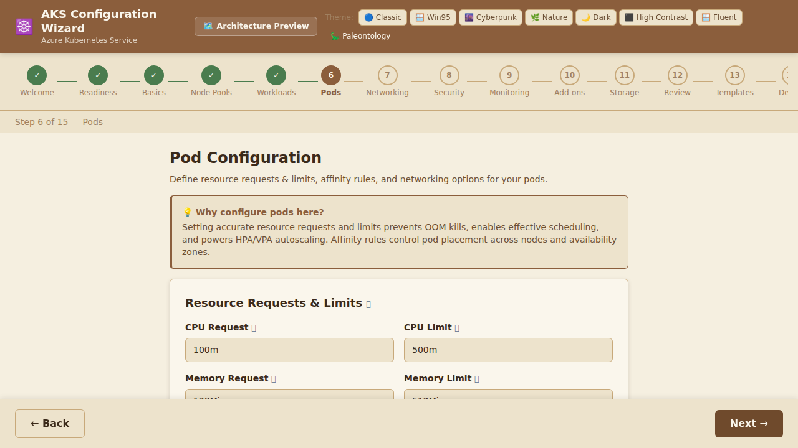

### Fields & Impact

#### Resource Requests & Limits

| Field | Default | Description | Impact |
|-------|---------|-------------|--------|
| **CPU Request** | `100m` | The amount of CPU the container is **guaranteed**. Expressed in millicores (`m`) or cores. | The Kubernetes scheduler uses requests to decide which node to place a pod on. Setting too low can cause CPU throttling; too high wastes capacity and reduces scheduling density. |
| **CPU Limit** | `500m` | The maximum CPU the container may consume. | If a container exceeds its CPU limit, it is throttled — it does not get killed, but it runs slower. Set to 2–5× the request for burst workloads. |
| **Memory Request** | `128Mi` | The amount of memory the container is **guaranteed**. | Used by the scheduler for placement. A container requesting more memory than the node has available will remain `Pending`. |
| **Memory Limit** | `512Mi` | The maximum memory the container may use. | If a container exceeds its memory limit, it is **OOM-killed** and restarted. Set generously enough to handle peak usage without being so high that it prevents other pods from being scheduled. |

#### Node Affinity

| Option | Description | Impact |
|--------|-------------|--------|
| **None** | No node affinity rules. Pods can be scheduled on any node. | Default behaviour; Kubernetes chooses the best-fit node automatically. |
| **Preferred** | Pods prefer certain nodes but can land elsewhere if needed. | Adds a `preferredDuringSchedulingIgnoredDuringExecution` rule to the generated manifest. Useful for zone-awareness without hard requirements. |
| **Required** | Pods **must** land on nodes matching the affinity rule. | Adds a `requiredDuringSchedulingIgnoredDuringExecution` rule. If no matching node exists, the pod stays `Pending`. Use only when hardware/zone placement is mandatory. |

#### Pod Anti-Affinity

| Option | Topology Key | Description | Impact |
|--------|--------------|-------------|--------|
| **None** | — | No anti-affinity rules. Multiple replicas may land on the same node. | Suitable for stateless workloads where co-location is acceptable. |
| **Preferred** | `kubernetes.io/hostname` | Pods prefer to spread across different nodes. | Best-effort distribution; replicas may still co-locate if no other nodes are available. |
| **Required** | `kubernetes.io/hostname` | Pods **must** land on different nodes. | Guarantees HA at the node level. If the cluster has fewer nodes than replicas, pods stay `Pending`. |

#### Pod Networking

| Field | Default | Description | Impact |
|-------|---------|-------------|--------|
| **Host Network** | ❌ OFF | Shares the node's network namespace with the pod. | Required for some low-level network tools (e.g., CNI plugins, network monitors). **Not recommended for application workloads** — exposes all node ports to the pod and reduces network isolation. |
| **DNS Policy** | `ClusterFirst` | Controls how DNS lookups are resolved for the pod. | **ClusterFirst** (default): cluster DNS first, falls back to upstream. **ClusterFirstWithHostNet**: use when `hostNetwork: true`. **Default**: inherits node DNS, bypasses cluster DNS. **None**: fully custom — requires a `dnsConfig` in the manifest. |

### Official References

- [Resource requests and limits](https://kubernetes.io/docs/concepts/configuration/manage-resources-containers/)
- [Node affinity](https://kubernetes.io/docs/concepts/scheduling-eviction/assign-pod-node/#affinity-and-anti-affinity)
- [Pod topology spread constraints](https://kubernetes.io/docs/concepts/scheduling-eviction/topology-spread-constraints/)
- [Pod DNS policy](https://kubernetes.io/docs/concepts/services-networking/dns-pod-service/#pod-s-dns-policy)
- [Configure pod security context](https://kubernetes.io/docs/tasks/configure-pod-container/security-context/)

---

## Step 7: Networking

### Purpose

The Networking screen controls how pods, services, and the cluster API server communicate — both internally and with external resources. These choices are largely **irreversible** after cluster creation without significant effort, so choose carefully.

### What you see

```
Networking
Configure how pods and services communicate within and outside your cluster.

ℹ️ Network Plugin
Azure CNI assigns VNet IPs to pods — better for enterprise environments needing
pod-level network policies. Kubenet uses NAT and is simpler but limited.

Network Plugin
[ 🔷 Azure CNI ]  [ 🔶 Kubenet ]

DNS Prefix         ⓘ  [ my-aks-cluster                 ]
Service CIDR       ⓘ  [ 10.0.0.0/16                    ]
Docker Bridge CIDR ⓘ  [ 172.17.0.1/16                  ]

Load Balancer SKU  ⓘ
[ ⭐ Standard (Recommended) ]  [ 🔹 Basic ]

Ingress Controller  ⓘ
[ 🚫 None ]  [ 🔷 NGINX ]  [ 🌐 Application Gateway ]  [ 🔶 Traefik ]

Enable Service Mesh (Open Service Mesh / Istio)  ⓘ  [ OFF ]
```

### Screenshot

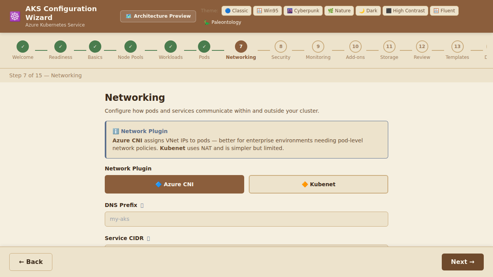

### Fields & Impact

| Field | Options | Description | Impact |
|-------|---------|-------------|--------|
| **Network Plugin** | **Azure CNI** (default), Kubenet | Determines how pods receive IP addresses. | **Azure CNI**: Pods receive IPs directly from the VNet subnet. Required for Azure Network Policies. Better integration with other Azure services. Requires more IP address planning. **Kubenet**: Pods use a private IP range with NAT. Simpler to set up but does not support Azure Network Policies, and pod-to-pod communication from outside the cluster is more complex. |
| **DNS Prefix** | String (alphanumeric + hyphens) | Unique prefix used to form the cluster's API server FQDN: `<dns-prefix>.<region>.azmk8s.io`. | Defaults to the cluster name. Choosing a descriptive, unique prefix makes it easier to identify the cluster API server endpoint in scripts, kubeconfig files, and monitoring dashboards. |
| **Service CIDR** | CIDR notation (default: `10.0.0.0/16`) | IP address range reserved for Kubernetes internal **Service** objects (ClusterIP). | Must not overlap with any VNet subnet or Pod CIDR. A `/16` provides up to 65,536 service IPs, which is more than sufficient for virtually all clusters. |
| **Docker Bridge CIDR** | CIDR notation (default: `172.17.0.1/16`) | IP range for the legacy Docker bridge network on each node, used for container-to-container communication within a node. | Rarely needs changing. Ensure it does not conflict with your VNet or on-premises networks if using VPN/ExpressRoute. |
| **Load Balancer SKU** | **Standard** (default), Basic | The Azure Load Balancer tier provisioned for external-facing services. | **Standard** supports Availability Zones, up to 1,000 backend pool members, health probe diagnostics, and is required for production. **Basic** is limited and Microsoft is deprecating it; avoid for new deployments. |
| **Ingress Controller** | **None** (default), NGINX ⚠️, Application Gateway, Traefik | Deploys and configures an ingress controller to route HTTP/HTTPS traffic into the cluster. | **None**: no managed ingress; configure manually after deployment. **NGINX** ⚠️ **(deprecated — retiring March 2026)**: community-maintained ingress-nginx controller; no longer recommended for new deployments. Migrate to the [Kubernetes Gateway API](https://gateway-api.sigs.k8s.io/) or the [F5/NGINX Inc. Ingress Controller](https://docs.nginx.com/nginx-ingress-controller/). **Application Gateway**: Azure-native Layer 7 load balancer with WAF support (AGIC). **Traefik**: cloud-native with automatic Let's Encrypt support. |
| **Enable Service Mesh** | ❌ OFF | Deploys a service mesh (Open Service Mesh or Istio) to the cluster. | Adds mutual TLS (mTLS) between services, fine-grained traffic policies, and enhanced observability. Adds operational complexity and resource overhead. |

### IP Address Planning Checklist

When using **Azure CNI**, ensure the following IP ranges **do not overlap**:

1. VNet subnet address space
2. Service CIDR (`10.0.0.0/16` default)
3. Docker bridge CIDR (`172.17.0.1/16` default)
4. Any on-premises networks connected via VPN or ExpressRoute

### Official References

- [Network concepts for AKS](https://learn.microsoft.com/azure/aks/concepts-network)
- [Azure CNI networking in AKS](https://learn.microsoft.com/azure/aks/configure-azure-cni)
- [Kubenet networking in AKS](https://learn.microsoft.com/azure/aks/configure-kubenet)
- [Azure Standard Load Balancer overview](https://learn.microsoft.com/azure/load-balancer/load-balancer-overview)
- [Plan IP addressing for AKS](https://learn.microsoft.com/azure/aks/configure-azure-cni#plan-ip-addressing-for-your-cluster)
- [Ingress controllers in AKS](https://learn.microsoft.com/azure/aks/concepts-network#ingress-controllers)
- [ingress-nginx end-of-life announcement (Kubernetes blog)](https://kubernetes.io/blog/2025/01/23/ingress-nginx-gateway-api-migration/)
- [Kubernetes Gateway API](https://gateway-api.sigs.k8s.io/)
- [NGINX Ingress Controller by F5/NGINX Inc.](https://docs.nginx.com/nginx-ingress-controller/)
- [Service mesh with AKS (Istio)](https://learn.microsoft.com/azure/aks/istio-about)

---

## Step 8: Security & Identity

### Purpose

This screen controls who can access the cluster and what they can do, how pods authenticate with Azure services, and which network traffic is permitted between pods. Security settings here directly determine the security posture of your production cluster.

### What you see

```
Security & Identity
Configure authentication, authorization, image scanning, and pod security policies.

⚠️ Security Best Practices
RBAC and Azure AD integration are highly recommended for production clusters.
They ensure only authorized users and services can access your cluster.

┌─────────────────────────────────────────────────────────────────┐
│ Enable RBAC                            ⓘ  [ ON  ]              │
│ Azure AD Integration                   ⓘ  [ OFF ]              │
│   Azure AD Tenant ID  ⓘ  [ (shown when AD enabled)   ]         │
│ Enable Pod Identity                    ⓘ  [ OFF ]              │
│ Enable Container Image Scanning        ⓘ  [ OFF ]              │
└─────────────────────────────────────────────────────────────────┘

Pod Security Admission Level  ⓘ
[ 🔓 Privileged ]  [ 🔒 Baseline ✓ ]  [ 🛡️ Restricted ]

Auto-Upgrade Channel  ⓘ
[ 🚫 None ]  [ 🔒 Patch ✓ ]  [ ✅ Stable ]  [ ⚡ Rapid ]  [ 🖼️ Node Image ]

💡 Safe Upgrade Path Guidance
• Always upgrade one minor version at a time (e.g., 1.28 → 1.29 → 1.30).
• Review deprecated API removals before upgrading.
• Use Planned Maintenance windows to control when upgrades occur.
• Test upgrades in a staging cluster before applying to production.
• Enable node surge during upgrades to minimize workload disruption.

Network Policy  ⓘ
[ 🚫 None ]  [ 🔷 Azure ]  [ 🐱 Calico ]
```

### Screenshot

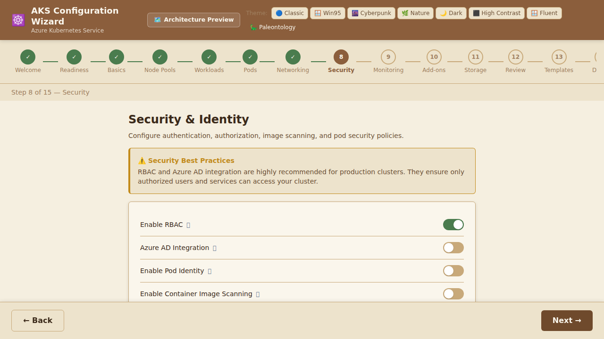

### Fields & Impact

| Field | Default | Description | Impact |
|-------|---------|-------------|--------|
| **Enable RBAC** | ✅ ON | Kubernetes Role-Based Access Control restricts what each user, service account, or group can do within the cluster. | **Strongly recommended for all clusters.** Without RBAC, any authenticated user has full cluster access. With RBAC, you define fine-grained permissions via `Role`, `ClusterRole`, `RoleBinding`, and `ClusterRoleBinding` objects. |
| **Azure AD Integration** | ❌ OFF | Integrates the cluster with Microsoft Entra ID (formerly Azure Active Directory) for user authentication. | Enables enterprise single sign-on (SSO), group-based access control, and Conditional Access policies. Users authenticate with their corporate credentials; group membership drives cluster permissions. Requires an Azure AD Tenant ID. |
| **Azure AD Tenant ID** | — | The GUID of your Azure AD tenant (only visible when Azure AD Integration is enabled). | Find this in **Microsoft Entra ID → Overview** in the Azure Portal. Without the correct Tenant ID, the Azure AD integration will fail. |
| **Enable Pod Identity** | ❌ OFF | Allows pods to use Azure Managed Identities to authenticate with Azure services without embedding credentials in code. | Eliminates the need for storing secrets in Kubernetes. Each pod assumes a managed identity and receives short-lived tokens. Note: superseded by the **Azure Workload Identity** add-on. |
| **Enable Container Image Scanning** | ❌ OFF | Enables vulnerability scanning of container images via Microsoft Defender for Containers. | Detects CVEs in images at runtime and at registry push time. Sends alerts for critical vulnerabilities. Adds cost based on the Defender for Containers pricing tier. |
| **Pod Security Admission Level** | `baseline` | Kubernetes built-in admission controller enforcing security standards on pods in each namespace. | **Privileged**: no restrictions — use only for trusted system namespaces. **Baseline** (default): prevents known privilege escalations; recommended starting point. **Restricted**: heavily hardened; enforces current pod hardening best practices for production workloads. |
| **Auto-Upgrade Channel** | `patch` | Controls the automatic upgrade cadence for the cluster. | **None**: no automatic upgrades. **Patch** (default): automatically applies the latest patch of your current minor version. **Stable**: upgrades to stable minor version releases. **Rapid**: upgrades to the latest minor version quickly. **Node Image**: only updates the node OS image, not the Kubernetes version. |
| **Network Policy** | None | Kubernetes `NetworkPolicy` enforcement engine. Controls which pods can communicate with each other at the L4 level. | **None**: All pod-to-pod traffic is permitted. **Azure**: Uses Azure's built-in network policy engine (only supported with Azure CNI). **Calico**: Open-source policy engine that works with both Azure CNI and Kubenet. |

### Security Recommendations for Production

1. **Always enable RBAC** — it is the first line of defence against accidental or malicious actions.
2. **Enable Azure AD integration** to avoid managing separate Kubernetes users and credentials.
3. **Use Managed Identities (Pod Identity / Workload Identity)** instead of storing service principal secrets in the cluster.
4. **Choose Calico or Azure network policies** to segment workloads and limit blast radius in case of a compromise.
5. **Set Auto-Upgrade Channel to `patch`** (default) to receive security patches automatically.
6. **Enable Image Scanning** for production clusters to detect container vulnerabilities early.
7. **Use Baseline or Restricted Pod Security Admission** to prevent privilege escalations.

### Official References

- [AKS RBAC](https://learn.microsoft.com/azure/aks/manage-azure-rbac)
- [AKS and Microsoft Entra ID integration](https://learn.microsoft.com/azure/aks/enable-authentication-microsoft-entra-id)
- [Azure Workload Identity (recommended over Pod Identity)](https://learn.microsoft.com/azure/aks/workload-identity-overview)
- [Network policies in AKS](https://learn.microsoft.com/azure/aks/use-network-policies)
- [Calico network policy](https://docs.tigera.io/calico/latest/about/)
- [AKS cluster auto-upgrade](https://learn.microsoft.com/azure/aks/auto-upgrade-cluster)
- [Pod Security Admission in Kubernetes](https://kubernetes.io/docs/concepts/security/pod-security-admission/)
- [Microsoft Defender for Containers](https://learn.microsoft.com/azure/defender-for-cloud/defender-for-containers-introduction)
- [AKS security best practices](https://learn.microsoft.com/azure/aks/operator-best-practices-cluster-security)

---

## Step 9: Monitoring & Observability

### Purpose

The Monitoring screen enables observability tools so you can understand cluster health, diagnose issues, and respond to incidents. Without monitoring, you have no visibility into what your cluster and applications are doing.

### What you see

```
Monitoring & Observability
Set up observability for your cluster — logs, metrics, alerts, and diagnostics.

💡 Why Monitor?
Without monitoring you're flying blind. Container Insights provides CPU, memory,
and log visibility. Prometheus enables custom metric scraping. Alerts let you
react proactively before issues escalate.

┌──────────────────────────────────────────────────────────────────────┐
│ Enable Container Insights          ⓘ  [ ON  ]                        │
│   Log Analytics Workspace ID  ⓘ  [ (shown when Insights on)       ]  │
│ Enable Managed Prometheus          ⓘ  [ OFF ]                        │
│ Enable Azure Monitor Metrics       ⓘ  [ OFF ]                        │
│ Enable Proactive Alerts            ⓘ  [ OFF ]                        │
│ Enable Diagnostic Settings         ⓘ  [ OFF ]                        │
└──────────────────────────────────────────────────────────────────────┘
```

### Screenshot

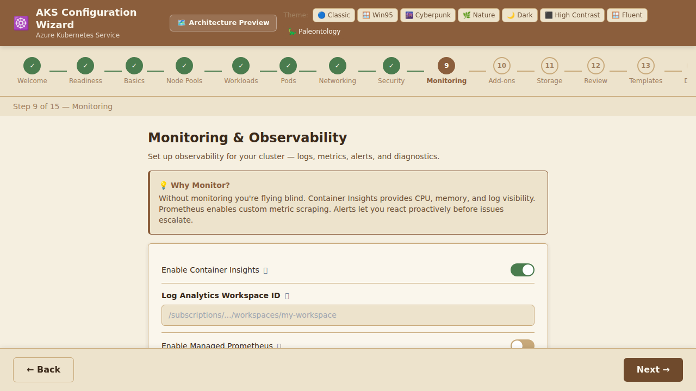

### Fields & Impact

| Field | Default | Description | Impact |
|-------|---------|-------------|--------|
| **Enable Container Insights** | ✅ ON | Azure Monitor Container Insights collects container-level CPU, memory, disk, and network metrics, as well as stdout/stderr logs, and stores them in a Log Analytics workspace. | Provides pre-built dashboards in the Azure Portal for cluster, node, and pod health. Enables log querying via Kusto Query Language (KQL). **Recommended for all clusters.** Incurs Log Analytics ingestion and retention costs. |
| **Log Analytics Workspace ID** | — | The Azure Resource Manager ID of an existing Log Analytics workspace (`/subscriptions/.../workspaces/my-workspace`). | Leave blank to have AKS create a **new workspace automatically**. Provide an existing workspace ID to centralise logs from multiple clusters or share a workspace with other Azure services. |
| **Enable Managed Prometheus** | ❌ OFF | Azure Managed Prometheus is a fully managed, Prometheus-compatible metrics service hosted in Azure Monitor. It scrapes metrics from your cluster using a managed agent. | Enables PromQL queries and Grafana dashboards in Azure. Eliminates the need to run and maintain your own Prometheus server. Incurs Azure Monitor costs based on metric samples. |
| **Enable Azure Monitor Metrics** | ❌ OFF | Sends Kubernetes and node-level metrics to the Azure Monitor Metrics store for near-real-time dashboards, alerts, and autoscaling triggers. | Enables metric-based alerts (e.g., alert when CPU > 80%) via Azure Monitor Alert rules. Useful for operational dashboards in Azure Workbooks. |
| **Enable Proactive Alerts** | ❌ OFF | Activates Azure Monitor recommended alert rules for common AKS health scenarios (node not ready, pod restart rate, OOM kills, etc.). | Pre-configured alerts with sensible thresholds reduce time-to-detection for common failures. Alerts are delivered via Azure Monitor Action Groups (email, SMS, webhook, etc.). |
| **Enable Diagnostic Settings** | ❌ OFF | Streams AKS control-plane logs (API server, controller-manager, scheduler, audit) to a Log Analytics workspace, Storage Account, or Event Hub. | Essential for security auditing and compliance. Required for investigating control-plane issues (e.g., RBAC failures, API errors). Adds Log Analytics ingestion cost based on log volume. |

### Monitoring Architecture Overview

```
Cluster Nodes & Pods
        │
   ┌────▼──────┐
   │ OMS Agent │  (installed by Container Insights)
   └────┬──────┘
        │  logs & metrics
   ┌────▼──────────────┐
   │ Log Analytics WS  │──── KQL Queries, Alerts
   └───────────────────┘

        │
   ┌────▼────────────────┐
   │ Managed Prometheus  │──── PromQL, Grafana
   └─────────────────────┘
```

### Cost Considerations

Monitoring adds cost proportional to the volume of logs and metrics ingested:
- **Container Insights**: charged per GB of data ingested into Log Analytics
- **Managed Prometheus**: charged per million metric samples
- **Azure Monitor Metrics**: charged per custom metric series
- **Diagnostic Settings**: charged per GB ingested to Log Analytics

Use [Azure Pricing Calculator](https://azure.microsoft.com/pricing/calculator/) to estimate costs.

### Official References

- [Container Insights overview](https://learn.microsoft.com/azure/azure-monitor/containers/container-insights-overview)
- [Enable Container Insights](https://learn.microsoft.com/azure/azure-monitor/containers/container-insights-enable-aks)
- [Azure Managed Prometheus](https://learn.microsoft.com/azure/azure-monitor/essentials/prometheus-metrics-overview)
- [Azure Monitor for AKS](https://learn.microsoft.com/azure/azure-monitor/containers/monitor-kubernetes)
- [Recommended alert rules for AKS](https://learn.microsoft.com/azure/azure-monitor/containers/container-insights-metric-alerts)
- [AKS diagnostic settings](https://learn.microsoft.com/azure/aks/monitor-aks#configure-monitoring)
- [Log Analytics pricing](https://azure.microsoft.com/pricing/details/monitor/)

---

## Step 10: Add-ons

### Purpose

AKS Add-ons extend the base cluster with additional capabilities. Unlike manual Helm chart installations, Microsoft-managed add-ons are automatically upgraded and integrated with the AKS control plane lifecycle.

### What you see

```
Add-ons
Extend your cluster with optional add-ons and integrations.

💡 Add-ons vs Extensions
AKS Add-ons are officially supported by Microsoft and fully managed. Extensions are
community-supported features. You can always enable add-ons after cluster creation.

┌──────────────────────────────────────────────────────────────────────────┐
│ 🌐 HTTP Application Routing  ⓘ  [Dev only]  [ OFF ]                     │
│ 📋 Azure Policy Add-on        ⓘ               [ OFF ]                   │
│ 🔑 Azure Key Vault Provider   ⓘ               [ OFF ]                   │
│ ⚡ KEDA (Event-Driven Autoscaling)  ⓘ          [ OFF ]                   │
│ 🔧 Dapr (Distributed Application Runtime)  ⓘ  [ OFF ]                   │
│ 📦 Azure Container Registry Integration  ⓘ    [ OFF ]                   │
└──────────────────────────────────────────────────────────────────────────┘
```

### Screenshot

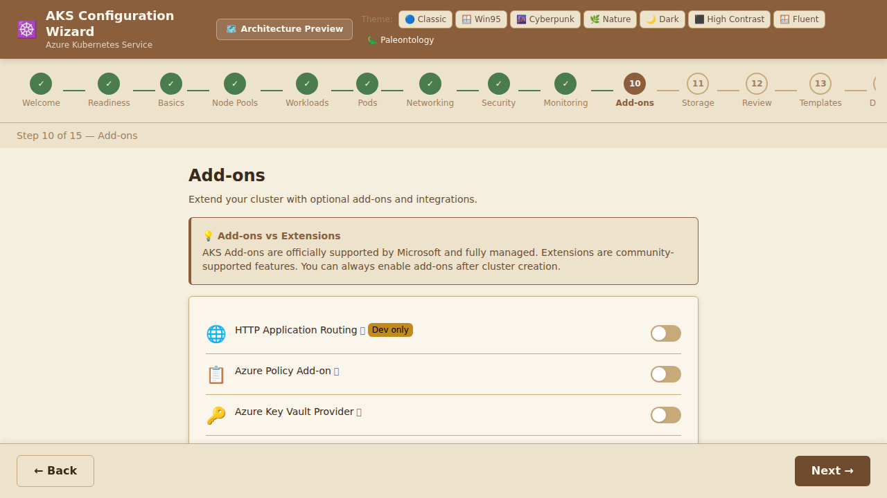

### Add-ons & Impact

| Add-on | Emoji | Dev/Prod | Description | Impact |
|--------|-------|----------|-------------|--------|
| **HTTP Application Routing** | 🌐 | ⚠️ Dev only | Automatically creates a public DNS zone and Nginx Ingress Controller. Makes it trivial to expose services via HTTP/HTTPS in development. | **Not recommended for production**: it creates a publicly accessible DNS zone and Ingress controller with default settings. For production, configure Ingress via the Networking step instead. |
| **Azure Policy Add-on** | 📋 | ✅ Prod | Deploys an Open Policy Agent (OPA) Gatekeeper controller that enforces Azure Policy definitions on your cluster. | Enables you to apply organisational governance policies (e.g., require specific image registries, limit privileged containers) using familiar Azure Policy tooling. |
| **Azure Key Vault Provider** | 🔑 | ✅ Prod | Installs the Secrets Store CSI Driver integration for Azure Key Vault. Allows you to mount Key Vault secrets, certificates, and keys as volumes in pods. | Eliminates the need to store secrets in Kubernetes `Secret` objects or environment variables. Secrets are fetched from Key Vault at pod start-up and automatically rotated. |
| **KEDA** | ⚡ | ✅ Prod | Kubernetes Event-Driven Autoscaling. Scales pod replicas based on events from external sources such as Azure Service Bus queues, Kafka topics, HTTP load, and more. | Enables demand-driven horizontal scaling beyond CPU/memory metrics. Ideal for event-driven or batch workloads. Supports 50+ scalers. |
| **Dapr** | 🔧 | ✅ Prod | Distributed Application Runtime. Provides building blocks for microservices: service-to-service invocation, pub/sub messaging, state management, secret access, and observability. | Reduces microservice boilerplate code. Applications use the Dapr sidecar via a simple API. Particularly useful for polyglot microservice architectures. |
| **Azure Container Registry Integration** | 📦 | ✅ Prod | Attaches an Azure Container Registry (ACR) to the cluster, granting the cluster's managed identity `AcrPull` permission to pull images without additional authentication. | Eliminates the need to create Kubernetes `imagePullSecrets` for ACR images. Requires an existing ACR name. The cluster system-assigned identity is granted `AcrPull` on the registry. |

### When to enable each add-on

```
Are you developing locally or testing?
  └─ Yes → Consider HTTP Application Routing for quick ingress setup
  └─ No (Production) → Use a production Ingress controller instead (Networking step)

Do you need to enforce security or compliance policies?
  └─ Yes → Enable Azure Policy Add-on

Do your pods need secrets from Azure Key Vault?
  └─ Yes → Enable Azure Key Vault Provider

Do you have event-driven or queue-based workloads?
  └─ Yes → Enable KEDA

Are you building microservices that need pub/sub, state, or service invocation?
  └─ Yes → Enable Dapr

Do you pull images from Azure Container Registry?
  └─ Yes → Enable Azure Container Registry Integration
```

### Official References

- [AKS add-ons overview](https://learn.microsoft.com/azure/aks/integrations)
- [HTTP Application Routing add-on](https://learn.microsoft.com/azure/aks/http-application-routing)
- [Azure Policy for AKS](https://learn.microsoft.com/azure/aks/use-azure-policy)
- [Azure Key Vault Provider for Secrets Store CSI Driver](https://learn.microsoft.com/azure/aks/csi-secrets-store-driver)
- [KEDA on AKS](https://learn.microsoft.com/azure/aks/keda-about)
- [Dapr on AKS](https://learn.microsoft.com/azure/aks/dapr)
- [Authenticate with Azure Container Registry from AKS](https://learn.microsoft.com/azure/aks/cluster-container-registry-integration)

---

## Step 12: Multi-Region & High Availability

### Purpose

The Multi-Region screen lets you deploy identical AKS clusters across multiple Azure regions and configure **Azure Front Door** as the global traffic manager. Enabling multi-region gives you geographic redundancy, lower latency for global users, and automatic zero-downtime failover when a regional outage occurs.

### What you see

```
Multi-Region & High Availability
Deploy AKS clusters across multiple Azure regions and configure Azure Front Door for
global traffic management with zero-downtime failover.

ℹ️ Always-On Architecture
A multi-region setup with Azure Front Door ensures high availability by routing traffic
to the nearest healthy region. If one region fails, Front Door automatically redirects
requests to the next available endpoint within seconds.

┌─────────────────────────────────────────────────────────────────┐
│ 🌍 Enable Multi-Region Deployment                  ⓘ  [ OFF ]  │
│ Generates IaC templates for active-active or active-passive     │
│ multi-region AKS                                                │
└─────────────────────────────────────────────────────────────────┘

(When enabled, the Secondary Regions and Azure Front Door sections appear:)

Secondary Regions
Your primary region is East US. Select one or more secondary regions:
[ ⬜ East US 2 ]  [ ⬜ West US ]  [ ⬜ West US 2 ]  [ ⬜ North Europe ]
[ ⬜ West Europe ] [ ⬜ UK South ] [ ⬜ Japan East ]  [ ⬜ Southeast Asia ]
...
⚠️ Select at least one secondary region to enable failover.

Azure Front Door
┌─────────────────────────────────────────────────────────────────┐
│ 🚪 Enable Azure Front Door                         ⓘ  [ ON ]   │
│                                                                  │
│ Front Door SKU  ⓘ                                               │
│ [ ⭐ Standard   CDN, global routing, SSL termination ]          │
│ [ 💎 Premium    Standard + WAF managed rules + Private Link ]   │
│                                                                  │
│ Enable Web Application Firewall (WAF)              ⓘ  [ OFF ]  │
│ Enable Health Probes                               ⓘ  [ ON ]   │
└─────────────────────────────────────────────────────────────────┘

💡 Zero-Downtime Failover
With Azure Front Door health probes enabled, failover happens automatically in under
30 seconds. Pair this with geo-redundant storage and Azure Database for PostgreSQL
Flexible Server with read replicas for a fully resilient multi-region architecture.
```

### Screenshot

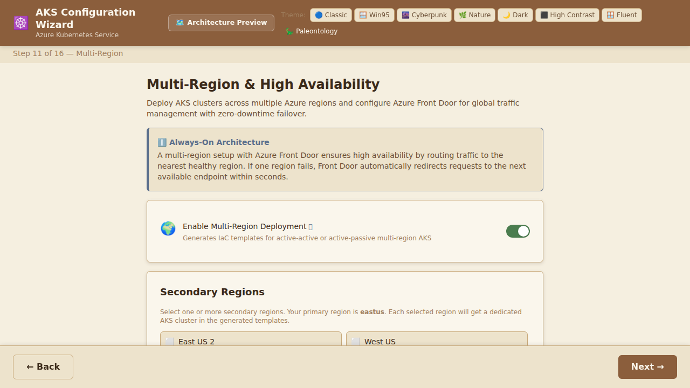

### Fields & Impact

#### Enable Multi-Region Deployment

| Field | Default | Description | Impact |
|-------|---------|-------------|--------|
| **Enable Multi-Region Deployment** | ❌ OFF | Deploys identical AKS clusters in multiple Azure regions. | When enabled, the wizard generates separate IaC templates (Bicep / Terraform) for each selected region. Azure Front Door and secondary region options become available. |

#### Secondary Regions

| Field | Description | Impact |
|-------|-------------|--------|
| **Secondary Regions** | A list of Azure regions that will each receive a dedicated AKS cluster alongside the primary region selected on the Basics step. | Each selected region adds a corresponding `azurerm_kubernetes_cluster` (Terraform) or `Microsoft.ContainerService/managedClusters` (Bicep) resource to the generated templates. Select regions that are geographically spread to maximise fault isolation (e.g., pair `eastus` with `westeurope` or `southeastasia`). |

> **Tip:** Select at least one secondary region. Without a secondary region, failover has nowhere to route traffic.

#### Azure Front Door

| Field | Default | Description | Impact |
|-------|---------|-------------|--------|
| **Enable Azure Front Door** | ✅ ON | Provisions an Azure Front Door profile that load-balances traffic across all regional AKS clusters. | Generates a `Microsoft.Cdn/profiles` (Bicep) or `azurerm_cdn_frontdoor_profile` (Terraform) resource with an origin group pointing to each regional cluster's public load balancer IP. |
| **Front Door SKU** | `Standard_AzureFrontDoor` | Choose between **Standard** (CDN + routing + SSL) and **Premium** (Standard + WAF managed rules + Private Link origins). | Standard is cost-effective for most workloads. Premium is required for WAF managed rule sets (DRS/OWASP) and private link origins. |
| **Enable WAF** | ❌ OFF | Attaches a Web Application Firewall policy to the Front Door profile to protect against OWASP Top 10 threats, bot attacks, and DDoS. | Generates a `Microsoft.Network/FrontDoorWebApplicationFirewallPolicies` resource. Managed rule sets require **Premium SKU**; with Standard SKU only custom rules are available. |
| **Enable Health Probes** | ✅ ON | Configures Front Door to continuously poll a health endpoint (`/`) on each origin. Unhealthy origins are removed from rotation automatically. | Enables zero-downtime automatic failover. If a region becomes unhealthy, Front Door stops sending traffic within seconds. Strongly recommended for production. |

### Architecture Overview

```
                         ┌──────────────────────────────────┐
        Global Users ───▶│       Azure Front Door            │
                         │  (Global CDN + WAF + Health Probe)│
                         └───────────┬──────────┬────────────┘
                                     │          │
                    ┌────────────────▼──┐    ┌──▼────────────────┐
                    │  Primary Region   │    │  Secondary Region  │
                    │  (e.g. East US)   │    │  (e.g. West Europe)│
                    │                   │    │                    │
                    │  ┌─────────────┐  │    │  ┌─────────────┐  │
                    │  │  AKS Cluster│  │    │  │  AKS Cluster│  │
                    │  └─────────────┘  │    │  └─────────────┘  │
                    └───────────────────┘    └────────────────────┘
```

- **Azure Front Door** acts as the single global entry point. It performs SSL termination, caches static content at edge PoPs, and applies WAF rules before forwarding requests.
- **Health probes** monitor each regional cluster endpoint. When a region is unhealthy, Front Door automatically routes all traffic to the remaining healthy regions within seconds — no manual intervention required.
- **Active-active** topology: both regions serve live traffic simultaneously. Front Door distributes load based on latency, ensuring users are routed to the closest healthy region.
- **Active-passive** topology: the secondary region runs at reduced capacity and only receives traffic if the primary fails. Achieved by setting a lower origin weight for the secondary origin group in Front Door.

### Zero-Downtime Failover

Automatic failover with Azure Front Door requires no manual intervention:

1. Front Door sends health probes to all configured origins at a configurable interval (default: every 30 seconds).
2. If an origin fails **two consecutive probes**, it is marked unhealthy and removed from the active rotation.
3. All new requests are forwarded only to healthy origins.
4. When the failed region recovers and passes health probes, it is re-added to the rotation automatically.

> **Best practice:** Expose a `/health` or `/readyz` endpoint in your workload that checks downstream dependencies (database, cache). A 200 response means the origin is healthy; any non-2xx response triggers failover.

### Active-Active vs Active-Passive

Choosing the right topology depends on your availability requirements, budget, and consistency needs.

| | Active-Active | Active-Passive |
|---|---|---|
| **Traffic distribution** | All regions serve live traffic simultaneously | Only primary region serves traffic; secondary is on standby |
| **Failover time** | Near-instant (Front Door stops routing to failed region) | Seconds to minutes (dependent on probe interval + warm-up) |
| **Cost** | Higher — all regions run at full capacity | Lower — secondary region can scale to zero (or minimum) when idle |
| **Consistency complexity** | Higher — writes must be replicated across all regions in near-real-time | Lower — secondary is mostly read-only until failover |
| **Recommended for** | Latency-sensitive, high-traffic global applications | Cost-sensitive applications with less strict latency requirements |

**Configuring origin weights in Azure Front Door:**

- **Active-active:** Assign equal weights (e.g., `1000`) to all origins in the origin group. Front Door balances requests based on latency.
- **Active-passive:** Assign a high weight (e.g., `1000`) to the primary origin and a low weight (e.g., `1`) to the secondary. The secondary only receives traffic when the primary is marked unhealthy by health probes.

### RTO and RPO Targets

Define your recovery objectives before choosing a topology:

| Metric | Definition | Typical target |
|--------|-----------|----------------|
| **RTO** (Recovery Time Objective) | Maximum acceptable downtime before the service must be restored | < 30 seconds with active-active; 1–5 minutes with active-passive |
| **RPO** (Recovery Point Objective) | Maximum acceptable data loss measured in time | < 1 second with synchronous geo-replication; 1–15 minutes with asynchronous |

> **Tip:** Azure Front Door can achieve RTO of under 30 seconds (two failed probes at 15-second intervals). To meet an RPO near zero, pair Front Door with synchronous replication services such as Azure Cosmos DB (multi-region writes) or Azure Cache for Redis with geo-replication.

### Complementary Azure Services for Always-On Architectures

A truly always-on architecture requires more than just AKS clusters behind Front Door. Each stateful component in your stack needs its own geo-redundancy strategy.

#### Azure Cosmos DB

Azure Cosmos DB is the recommended database for multi-region, always-on workloads because it natively supports multi-region writes and configurable consistency levels.

| Feature | Benefit |
|---------|---------|
| **Multi-region writes** | Write to any region; conflicts resolved automatically by the platform |
| **Five consistency levels** | Choose between strong, bounded staleness, session, consistent prefix, and eventual consistency |
| **Automatic failover** | Configure priority-ordered failover regions; Cosmos DB promotes the next region within minutes if the primary is unavailable |
| **99.999% SLA** | With multi-region writes enabled, Cosmos DB provides a five-nines availability SLA ([see Cosmos DB SLA](https://azure.microsoft.com/support/legal/sla/cosmos-db/)) |

**Recommended configuration for always-on:**
1. Enable **multi-region writes** and add all regions where AKS clusters are deployed.
2. Set **consistency level** to `Session` (default) for most workloads; use `BoundedStaleness` when you need a tighter RPO.
3. Configure **automatic failover** with a priority list matching your AKS region order.

#### Azure Cache for Redis

Use Azure Cache for Redis with **geo-replication** to ensure cached state is available in each region:

- **Active geo-replication** (Enterprise tier): Multi-region active-active replication with sub-second synchronisation.
- **Passive geo-replication** (Premium tier): Primary-secondary replication; the secondary becomes primary during failover.

For session state, prefer `geo-replication` + a sticky-session-free application design so that users can be served by any region transparently.

#### Azure Service Bus / Event Hubs

For asynchronous messaging:

| Service | Geo-redundancy option | Notes |
|---------|-----------------------|-------|
| **Azure Service Bus** | Geo-disaster recovery (active-passive) | Metadata (queues, topics) is replicated; in-flight messages are not. Failover is initiated manually or via Azure Health alerts. |
| **Azure Event Hubs** | Geo-disaster recovery or Geo-replication (preview) | Similar to Service Bus for namespace failover. Geo-replication (preview) replicates event data. |

> **Architecture note:** For event-driven workloads requiring RPO near zero, use separate Event Hubs namespaces per region and replicate events with Azure Event Grid or a custom relay function, rather than relying on metadata-only geo-disaster recovery.

#### Azure Key Vault

Azure Key Vault automatically replicates contents to a paired region within the same geography. No additional configuration is required for secrets and certificates — they are available in the secondary region within minutes of a regional outage.

For multi-region deployments spanning non-paired geographies (e.g., East US + Southeast Asia), create a Key Vault instance in each region and use a secrets synchronisation policy (Azure Policy + Logic App or a dedicated secrets operator).

#### Azure Container Registry

Enable **geo-replication** on your ACR instance to push images once and have them available in all regions with low-latency pulls:

```bash
az acr replication create \
  --registry <registry-name> \
  --location westeurope

az acr replication create \
  --registry <registry-name> \
  --location southeastasia
```

Each AKS cluster then pulls images from the nearest ACR replica, reducing pull latency and avoiding cross-region egress charges.

#### Azure DNS and Traffic Manager

Azure Front Door is the recommended global routing layer for HTTP/HTTPS workloads. For non-HTTP workloads (e.g., TCP, gRPC) or as a fallback DNS layer:

| Service | Layer | Use case |
|---------|-------|---------|
| **Azure Front Door** | Layer 7 (HTTP/HTTPS) | Web apps, REST APIs, WebSocket — primary recommendation |
| **Azure Traffic Manager** | DNS (Layer 4) | TCP endpoints, non-HTTP protocols, fallback routing if Front Door is unavailable |
| **Azure DNS** | DNS resolution | Custom domain delegation; pair with Traffic Manager for DNS-based failover |

### Data Replication and Consistency Considerations

Multi-region writes introduce the risk of **write conflicts** when two regions accept writes to the same record simultaneously. Plan your conflict resolution strategy before enabling multi-region writes:

1. **Last-writer wins (LWW):** The write with the latest timestamp is kept. Simple but may silently discard data. Supported by Cosmos DB.
2. **Custom conflict resolution:** A user-defined stored procedure resolves conflicts. Requires application-specific logic. Supported by Cosmos DB.
3. **Optimistic concurrency:** Use ETags (HTTP) or version fields to detect conflicts at the application layer and surface them to the user for manual resolution.
4. **CRDT-based merging:** Conflict-free Replicated Data Types automatically merge concurrent writes without conflicts. Suitable for counters, sets, and append-only structures.

> **Recommended approach for most workloads:** Use **session consistency** in Cosmos DB, route each user session to a consistent region via Front Door session affinity, and accept eventual consistency only for non-critical reads (e.g., analytics, cached dashboards).

### Step-by-Step: Configuring a Full Always-On Architecture

Follow these steps to build a production-grade multi-region, always-on deployment with this wizard:

1. **Cluster Basics** — Set your **primary region** (e.g., `eastus`). Choose **AKS Standard** for full control, or **AKS Automatic** for managed operations.
2. **Node Pools** — Enable **auto-scaling** and spread nodes across **Availability Zones** (`--zones 1 2 3`) within the primary region for intra-region resiliency.
3. **Networking** — Use **Azure CNI** or **Azure CNI Overlay** for pod networking. Reserve a large enough address space to accommodate all regions without CIDR conflicts.
4. **Add-ons** — Enable **Azure Container Registry integration** and enable geo-replication on the ACR instance (outside the wizard, using the Azure CLI or portal).
5. **Multi-Region** (this step):
   a. Enable **Multi-Region Deployment**.
   b. Select at least one secondary region that is geographically distant from the primary (e.g., `westeurope` or `southeastasia`).
   c. Enable **Azure Front Door** (Premium SKU recommended for WAF).
   d. Enable **Health Probes** — configure your workload's `/health` endpoint to check all downstream dependencies.
   e. Enable **WAF** if your workload is internet-facing.
6. **After generating templates**, manually add the following resources to achieve full always-on:
   - Azure Cosmos DB with multi-region writes enabled in all selected regions.
   - Azure Cache for Redis (Enterprise tier) with active geo-replication.
   - Azure Container Registry with geo-replication to each region.
   - Azure Key Vault in each region (or rely on automatic replication within a geography).
7. **Monitoring** — Enable **Container Insights** and **Azure Monitor alerts** (Step 9). Create cross-region dashboards in Azure Monitor Workbooks to track regional health, latency, and failover events.
8. **Test failover** — See the [Failover Testing](#failover-testing) section below before going to production.

### Failover Testing

Never trust a failover until you have tested it. Run the following tests on a staging environment before go-live:

#### Manual Regional Failover Test

1. Identify the primary region's Front Door origin hostname (e.g., `<cluster-lb-ip>.eastus.cloudapp.azure.com`).
2. Temporarily block health probe traffic to the primary origin (e.g., by shutting down the `/health` endpoint or blocking port 443 via a Network Security Group rule).
3. Monitor the Front Door routing metrics in Azure Monitor — within two failed probe intervals, traffic should shift entirely to the secondary region.
4. Verify application availability from at least two geographic locations using an external monitoring tool.
5. Restore the primary region and confirm that Front Door re-adds it to the rotation within one successful probe interval.

#### Database Failover Test (Cosmos DB)

1. In the Azure portal, navigate to your Cosmos DB account → **Replicate data globally** → **Manual failover**.
2. Promote the secondary region to primary.
3. Verify that write requests succeed from the previously secondary AKS cluster.
4. Fail back to the original primary region.

#### Chaos Engineering

For a more rigorous approach, use **Azure Chaos Studio** to inject regional faults:

```bash
# Example: Stop all pods in a namespace to simulate a regional AKS outage
kubectl delete pods --all -n default --context <secondary-cluster-context>
```

Or use the Azure Chaos Studio portal to target AKS, VMs, or networking components directly.

### Cost Considerations

Multi-region deployments multiply your infrastructure costs. Use the following guidance to manage spending:

| Component | Cost driver | Optimisation |
|-----------|------------|--------------|
| **AKS node pools** | VM compute hours per region | Use **spot instances** for non-critical workloads in secondary regions; scale secondary to 1 node when idle (active-passive) |
| **Azure Front Door** | Routing rules + data transfer | The Standard SKU is significantly cheaper than Premium; upgrade to Premium only when WAF managed rules or Private Link are required |
| **Azure Cosmos DB** | Request units (RUs) + storage per region | Share a Cosmos DB account across environments; use **serverless** mode for dev/test replicas |
| **Azure Cache for Redis** | Cache tier per region | Use **Basic** tier in dev/test secondary regions; **Enterprise** for production active-active |
| **Azure Container Registry** | Geo-replication per region | Each geo-replica incurs the same cost as the primary registry tier |
| **Egress** | Cross-region data transfer | Keep data processing within the region where data originates; use Azure Private Link to avoid egress charges for internal traffic |

> **Estimate your costs** using the [Azure Pricing Calculator](https://azure.microsoft.com/pricing/calculator/) before deploying to production. Costs vary significantly based on VM sizes, traffic volumes, and region choices — always use the calculator for current estimates rather than relying on any fixed figures.

### Generated Templates

When multi-region is enabled, the wizard appends the following resources to the generated Bicep and Terraform templates:

**Bicep (excerpt)**

```bicep
resource frontDoorProfile 'Microsoft.Cdn/profiles@2023-05-01' = {
  name: '${clusterName}-afd'
  location: 'global'
  sku: {
    name: 'Standard_AzureFrontDoor'
  }
}

resource originGroup 'Microsoft.Cdn/profiles/originGroups@2023-05-01' = {
  parent: frontDoorProfile
  name: 'aks-origins'
  properties: {
    loadBalancingSettings: { sampleSize: 4, successfulSamplesRequired: 3 }
    healthProbeSettings: {
      probePath: '/'
      probeRequestType: 'HEAD'
      probeProtocol: 'Https'
      probeIntervalInSeconds: 30
    }
  }
}
```

**Terraform (excerpt)**

```hcl
resource "azurerm_cdn_frontdoor_profile" "afd" {
  name                = "${var.cluster_name}-afd"
  resource_group_name = azurerm_resource_group.rg.name
  sku_name            = "Standard_AzureFrontDoor"
}

resource "azurerm_cdn_frontdoor_origin_group" "aks" {
  name             = "aks-origins"
  cdn_frontdoor_profile_id = azurerm_cdn_frontdoor_profile.afd.id

  health_probe {
    path     = "/"
    protocol = "Https"
    interval_in_seconds = 30
  }
}
```

### Azure API Management (APIM)

#### Purpose

Azure API Management (APIM) is a fully managed API gateway service that sits in front of your AKS-hosted APIs. In a multi-region, always-on architecture, APIM acts as the centralised plane for API security, rate limiting, policy enforcement, versioning, and developer onboarding — while Azure Front Door handles global traffic routing to the nearest healthy APIM or AKS endpoint.

The Wizard provisions APIM using the **v2 service tiers** (BasicV2, StandardV2, PremiumV2), which are the current-generation tiers offering faster provisioning (minutes instead of hours), zone redundancy, and improved VNet injection support compared to the legacy Basic/Standard/Premium tiers.

#### What you see

```
Azure API Management (APIM)
┌─────────────────────────────────────────────────────────────────────┐
│ 🔀 Enable Azure API Management              ⓘ  [ OFF ]             │
│ Provision an APIM gateway to manage, secure, and observe APIs       │
│ exposed by AKS                                                       │
└─────────────────────────────────────────────────────────────────────┘

(When enabled, the APIM SKU selector appears:)

APIM SKU  ⓘ
[ 🧪 Developer    No SLA · dev/test only                    ]
[ 📦 Basic v2     SLA · fast provisioning · low-traffic     ]
[ ⭐ Standard v2  SLA · zone redundancy · higher throughput  ]
[ 💎 Premium v2   Multi-region · VNET inject · Private AKS  ]

⚠️ Developer SKU has no SLA
   The Developer SKU is not suitable for production workloads.
   Upgrade to Basic v2, Standard v2, or Premium v2 for an SLA-backed gateway.

Publisher Email  ⓘ  [ admin@contoso.com ]
```

#### Fields & Impact

| Field | Default | Description | Impact |
|-------|---------|-------------|--------|
| **Enable Azure API Management** | ❌ OFF | Provisions an Azure API Management service instance in the primary region. | When enabled, generates a `Microsoft.ApiManagement/service` (Bicep) or `azurerm_api_management` (Terraform) resource pointing to the cluster's services. |
| **APIM SKU** | `Developer` | The pricing and capability tier for the APIM instance. | See the SKU comparison table below. |
| **Publisher Email** | *(empty)* | The contact email address for the APIM instance. Used for administrative notifications and shown in the developer portal. | Falls back to `admin@contoso.com` in generated templates if left empty. Set this to a real address before deploying. |

#### SKU Comparison

The Wizard uses the **APIM v2 service tiers** for all production SKUs. The v2 tiers provision in minutes (vs. up to 45 minutes for legacy tiers), support availability zone redundancy, and provide VNet injection (replacing the legacy VNet integration model).

| SKU | SLA | Multi-region | Zone Redundancy | VNet Support | Recommended for |
|-----|-----|--------------|-----------------|--------------|-----------------|
| **Developer** | ❌ None | ❌ | ❌ | Internal only | Dev/test environments only |
| **BasicV2** | ✅ 99.95% | ❌ | ❌ | VNet injection | Low-traffic production APIs |
| **StandardV2** | ✅ 99.95% | ❌ | ✅ | VNet injection | Mid-traffic production APIs |
| **PremiumV2** | ✅ 99.99% | ✅ | ✅ | VNet injection | High-traffic, multi-region, private AKS |

> **Production recommendation:** Use **PremiumV2** SKU when APIM is combined with a multi-region AKS deployment, as it supports multi-region gateway deployments and VNet injection for private AKS clusters. Use **StandardV2** for single-region production deployments that require zone redundancy.

#### Architecture with APIM

When APIM is enabled alongside Azure Front Door, the traffic path becomes:

```
                         ┌──────────────────────────────────┐
        Global Users ───▶│       Azure Front Door            │
                         │  (Global CDN + WAF + Health Probe)│
                         └───────────┬──────────┬────────────┘
                                     │          │
                    ┌────────────────▼──┐    ┌──▼────────────────┐
                    │    Primary Region  │    │  Secondary Region  │
                    │                   │    │                    │
                    │  ┌─────────────┐  │    │  ┌─────────────┐  │
                    │  │    APIM     │  │    │  │    APIM     │  │
                    │  └──────┬──────┘  │    │  └──────┬──────┘  │
                    │         │         │    │         │          │
                    │  ┌──────▼──────┐  │    │  ┌──────▼──────┐  │
                    │  │ AKS Cluster │  │    │  │ AKS Cluster │  │
                    │  └─────────────┘  │    │  └─────────────┘  │
                    └───────────────────┘    └────────────────────┘
```

APIM provides the following capabilities at the gateway layer:

- **Rate limiting and throttling** — Protect backend AKS services from overload by enforcing per-client or per-subscription request quotas.
- **Authentication and authorisation** — Validate OAuth 2.0 / JWT tokens, API keys, or mutual TLS certificates before requests reach AKS pods.
- **API versioning** — Expose multiple API versions simultaneously, route traffic to the correct AKS service version, and deprecate old versions gracefully.
- **Request/response transformation** — Rewrite headers, strip internal details from responses, and translate protocols (e.g., REST to SOAP).
- **Developer portal** — Automatically generate interactive API documentation and allow external developers to subscribe and test APIs.
- **Observability** — Forward telemetry to Azure Monitor / Application Insights for end-to-end request tracing across Front Door → APIM → AKS.

#### Use Cases in Multi-Region Always-On Architectures

| Use case | How APIM helps |
|----------|---------------|
| **Centralised API security** | Apply authentication, authorisation, and WAF policies once at the gateway rather than in each microservice. |
| **Traffic shaping** | Gradually shift traffic between API versions (canary releases) or between regional backends without changing client URLs. |
| **SLA isolation** | APIM buffers downstream latency spikes from AKS, providing a stable response-time SLA to API consumers. |
| **Developer onboarding** | The built-in developer portal lets internal or external teams discover, subscribe to, and test APIs without direct cluster access. |
| **Protocol bridging** | Expose gRPC or WebSocket services from AKS as REST/OpenAPI endpoints for broader client compatibility. |

#### Step-by-Step: Enabling APIM for Multi-Region AKS

1. **Enable Multi-Region Deployment** (this step) and select at least one secondary region.
2. **Enable Azure API Management** and choose a SKU:
   - Use **PremiumV2** for production multi-region deployments (supports multi-region gateways and VNet injection).
   - Use **StandardV2** for single-region production deployments requiring zone redundancy.
   - Use **Developer** for initial development and testing only.
3. **After generating templates**, complete the following manual steps:
   a. Set `publisherEmail` and `publisherName` in the generated template to your organisation's values.
   b. Import your API definitions (OpenAPI / WSDL / GraphQL) into APIM via the Azure portal or the `az apim api import` CLI command.
   c. Configure **backend** resources in APIM pointing to each AKS ingress controller hostname or internal load balancer IP per region.
   d. If using **PremiumV2** SKU with multi-region: add APIM gateway units in each secondary region via `az apim update --add additionalLocations`.
   e. Configure **named values** or **Key Vault references** in APIM for any secrets (e.g., backend API keys, JWT signing keys).
4. **Point Azure Front Door** origins to the APIM gateway URL(s) instead of directly to AKS ingress IPs to centralise traffic policy enforcement.

#### Generated Templates

When multi-region and APIM are enabled, the wizard appends the following resources to the generated templates:

**Bicep (excerpt)**

```bicep
resource apimService 'Microsoft.ApiManagement/service@2024-05-01' = {
  name: '${clusterName}-apim'
  location: location
  sku: {
    name: 'PremiumV2'
    capacity: 1
  }
  properties: {
    publisherEmail: 'admin@contoso.com'
    publisherName: '${clusterName}'
  }
  tags: {
    Environment: 'Production'
    ManagedBy: 'AKS-Wizard'
  }
}

output apimGatewayUrl string = apimService.properties.gatewayUrl
output apimPortalUrl string = apimService.properties.developerPortalUrl
```

**Terraform (excerpt)**

```hcl
resource "azurerm_api_management" "apim" {
  name                = "${var.cluster_name}-apim"
  location            = azurerm_resource_group.aks_rg.location
  resource_group_name = azurerm_resource_group.aks_rg.name
  publisher_name      = "${var.cluster_name}"
  publisher_email     = "admin@contoso.com"
  sku_name            = "PremiumV2_1"

  tags = {
    Environment = "Production"
    ManagedBy   = "AKS-Wizard"
  }
}

output "apim_gateway_url" {
  value = azurerm_api_management.apim.gateway_url
}
```

> **Note:** The `publisherEmail` and `publisherName` fields are placeholder values. Replace them with your organisation's details before deploying. For the PremiumV2 SKU, increase `capacity` (Bicep) or the numeric suffix in `sku_name` (Terraform, e.g. `"PremiumV2_2"`) to match your throughput requirements.

### Official References

- [Azure Front Door overview](https://learn.microsoft.com/azure/frontdoor/front-door-overview)
- [Azure Front Door SKU comparison](https://learn.microsoft.com/azure/frontdoor/standard-premium/overview)
- [Azure Front Door WAF policies](https://learn.microsoft.com/azure/web-application-firewall/afds/afds-overview)
- [Health probes in Azure Front Door](https://learn.microsoft.com/azure/frontdoor/health-probes)
- [Multi-region AKS architecture](https://learn.microsoft.com/azure/architecture/reference-architectures/containers/aks-multi-region/aks-multi-cluster)
- [Azure Front Door with AKS](https://learn.microsoft.com/azure/aks/load-balancer-standard#azure-front-door)
- [Business continuity and disaster recovery for AKS](https://learn.microsoft.com/azure/aks/operator-best-practices-multi-region)
- [Azure Cosmos DB global distribution](https://learn.microsoft.com/azure/cosmos-db/distribute-data-globally)
- [Azure Cache for Redis geo-replication](https://learn.microsoft.com/azure/azure-cache-for-redis/cache-how-to-geo-replication)
- [Azure Container Registry geo-replication](https://learn.microsoft.com/azure/container-registry/container-registry-geo-replication)
- [Azure Traffic Manager overview](https://learn.microsoft.com/azure/traffic-manager/traffic-manager-overview)
- [Azure Chaos Studio overview](https://learn.microsoft.com/azure/chaos-studio/chaos-studio-overview)
- [Azure API Management overview](https://learn.microsoft.com/azure/api-management/api-management-key-concepts)
- [APIM v2 service tiers overview](https://learn.microsoft.com/azure/api-management/v2-service-tiers-overview)
- [APIM with AKS](https://learn.microsoft.com/azure/api-management/api-management-kubernetes)
- [APIM SKU comparison](https://learn.microsoft.com/azure/api-management/api-management-features)
- [APIM multi-region deployment](https://learn.microsoft.com/azure/api-management/api-management-howto-deploy-multi-region)

---

## Step 11: Hub-Spoke Networking

### Purpose

The Hub-Spoke Networking screen lets you deploy your AKS cluster into an enterprise-grade **hub-spoke topology**. A spoke VNet hosts the cluster, while a central hub VNet provides shared services — Azure Firewall for centralised egress control, Azure Bastion for secure VM access, a VPN Gateway for hybrid connectivity, and a common DNS boundary via Private DNS Zones. This is the recommended networking pattern for Azure enterprise landing zones.

Hub-Spoke is configured **before** Multi-Region so the networking foundation is established first. When both are enabled, each regional AKS cluster resides in its own spoke VNet, with Azure Front Door (Step 12) acting as the global entry point.

### What you see

```
Hub-Spoke Networking
Deploy your AKS cluster into a dedicated spoke VNet connected to a centralised hub VNet.
The hub provides shared services such as Azure Firewall, Bastion, VPN Gateway, and DNS.

ℹ️ Hub-Spoke Architecture
A hub-spoke topology centralises network services in a hub VNet while keeping workloads
isolated in spoke VNets connected via VNet peering. This is the recommended pattern for
enterprise Azure landing zones.

┌─────────────────────────────────────────────────────────────────┐
│ 🔗 Enable Hub-Spoke Topology                       ⓘ  [ OFF ]  │
│ Generates spoke VNet, peering, and optional hub resources in    │
│ IaC templates                                                   │
└─────────────────────────────────────────────────────────────────┘

(When enabled, the Hub VNet, Spoke VNet, and Hub Services sections appear:)

Hub VNet
  Hub VNet Mode  ⓘ
  [ 🔗 Use Existing Hub   Peer to an existing hub VNet in your subscription ]
  [ 🆕 Create New Hub     Provision a new hub VNet alongside the spoke      ]

  (If "Use Existing Hub" is selected:)
  Existing Hub VNet Resource ID  ⓘ
  /subscriptions/.../resourceGroups/.../providers/Microsoft.Network/virtualNetworks/hub-vnet

  (If "Create New Hub" is selected:)
  Hub VNet Address Space  ⓘ   [  10.0.0.0/16  ]

Spoke VNet
  Spoke VNet Address Space  ⓘ  [  10.1.0.0/16  ]
  AKS Node Subnet CIDR      ⓘ  [  10.1.0.0/22  ]

Hub Services
  🔥 Deploy Azure Firewall in Hub   ⓘ  [ OFF ]
     Provisions Azure Firewall Premium with a dedicated subnet in the hub

     (When Azure Firewall is enabled:)
     Route AKS Egress Through Firewall  ⓘ  [ OFF ]

  🏰 Deploy Azure Bastion in Hub   ⓘ  [ OFF ]

  🔌 Deploy VPN Gateway in Hub     ⓘ  [ OFF ]
     Provisions a GatewaySubnet (/27) in the hub for VPN or ExpressRoute connectivity

  🔒 Private AKS Cluster           ⓘ  [ OFF ]
     No public API server endpoint — access via Bastion or a jump box in the hub

💡 Flat VNet Deployment
Hub-Spoke is disabled. The AKS cluster will be deployed without an explicit hub VNet.
Enable the toggle above to adopt the recommended enterprise networking topology.
```

### Architecture Diagram

```
                          ┌─────────────────────────────────────────────────────┐
                          │            Hub VNet (10.0.0.0/16)                   │
                          │                                                     │
                          │  ┌──────────────┐  ┌──────────────┐  ┌──────────┐  │
                          │  │Azure Firewall│  │Azure Bastion │  │VPN Gateway│  │
                          │  │(AzureFirewall│  │(AzureBastion │  │(Gateway   │  │
                          │  │ Subnet /26)  │  │ Subnet /26)  │  │ Subnet/27)│  │
                          │  └──────────────┘  └──────────────┘  └──────────┘  │
                          └────────────────────┬────────────────────────────────┘
                                               │ VNet Peering (bidirectional)
                                               │ allowGatewayTransit / useRemoteGateways
                          ┌────────────────────▼────────────────────────────────┐
                          │             Spoke VNet (10.1.0.0/16)                │
                          │                                                     │
                          │  ┌──────────────────────────────────────────────┐  │
                          │  │  aks-subnet (10.1.0.0/22)                    │  │
                          │  │                                              │  │
                          │  │    ┌──────────────────────────────────┐     │  │
                          │  │    │         AKS Cluster              │     │  │
                          │  │    │    (nodes + pods + services)     │     │  │
                          │  │    └──────────────────────────────────┘     │  │
                          │  └──────────────────────────────────────────────┘  │
                          └─────────────────────────────────────────────────────┘
```

### Screenshot

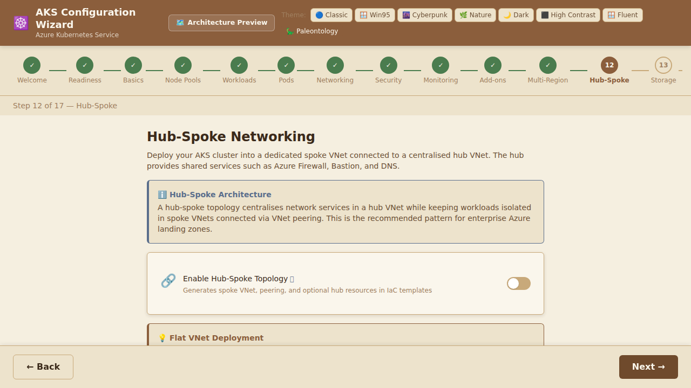

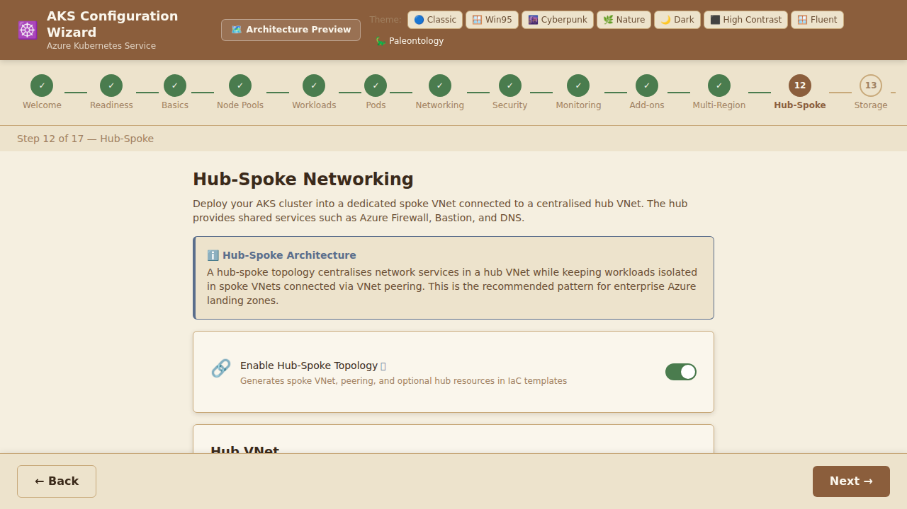

### Fields & Impact

#### Enable Hub-Spoke Topology

| Field | Default | Description | Impact |
|-------|---------|-------------|--------|
| **Enable Hub-Spoke Topology** | ❌ OFF | Deploys the AKS cluster into a spoke VNet peered to a central hub VNet containing shared services. | When enabled, the wizard generates spoke VNet, hub VNet (if creating new), VNet peering, and optional hub service resources (Azure Firewall, Bastion, VPN Gateway, Private DNS Zone) in the Bicep and Terraform templates. When disabled, the cluster is deployed without an explicit hub. |

#### Hub VNet

| Field | Default | Description | Impact |
|-------|---------|-------------|--------|
| **Hub VNet Mode** | `new` | Whether to create a new hub VNet or peer to an existing one. | **Use Existing Hub**: requires providing the full Azure resource ID of the hub VNet. No hub VNet resources are generated — only spoke VNet and peering resources are added to the templates. **Create New Hub**: generates a full hub VNet resource alongside the spoke VNet and peering. |
| **Existing Hub VNet Resource ID** | *(empty)* | The full Azure resource ID of an existing hub VNet. Only shown when Hub Mode is "Use Existing Hub". | A validation warning appears if the field is left empty. Example format: `/subscriptions/{sub-id}/resourceGroups/{rg}/providers/Microsoft.Network/virtualNetworks/{vnet-name}`. |
| **Hub VNet Address Space** | `10.0.0.0/16` | CIDR block for the new hub VNet. Only shown when Hub Mode is "Create New Hub". | Must not overlap with the spoke VNet, other spokes, or any on-premises address spaces reachable via ExpressRoute or VPN. |

#### Spoke VNet

| Field | Default | Description | Impact |
|-------|---------|-------------|--------|
| **Spoke VNet Address Space** | `10.1.0.0/16` | CIDR block for the AKS spoke VNet. | Must not overlap with the hub VNet or any other spoke. The AKS node subnet must be a sub-range of this CIDR. |
| **AKS Node Subnet CIDR** | `10.1.0.0/22` | Subnet within the spoke VNet where AKS nodes are placed. | Must be a sub-range of the spoke VNet CIDR (`/22` provides 1024 addresses, supporting ~250 nodes). For Azure CNI, allow ~30 IPs per node for pods; use a larger range for larger clusters. |

#### Hub Services

| Field | Default | Description | Impact |
|-------|---------|-------------|--------|
| **Deploy Azure Firewall in Hub** / **Hub has Azure Firewall** | ❌ OFF | When creating a new hub, provisions Azure Firewall Premium in a dedicated `AzureFirewallSubnet` (/26). When using an existing hub, indicates the hub already contains an Azure Firewall. | Enables centralised egress filtering using FQDN rules and threat intelligence. Required if you also enable **Route AKS Egress Through Firewall**. |
| **Route AKS Egress Through Firewall** | ❌ OFF | Adds a User-Defined Route (UDR) table to the AKS node subnet that sends all outbound traffic (`0.0.0.0/0`) through the hub firewall. Only visible when Azure Firewall is enabled. | All AKS egress is inspected by Azure Firewall before leaving Azure. You must configure the required AKS [outbound FQDN rules](https://learn.microsoft.com/azure/aks/outbound-rules-control-egress) in your firewall policy — without them, cluster operations such as pulling images and calling the Kubernetes API will fail. |
| **Deploy Azure Bastion in Hub** / **Hub has Azure Bastion** | ❌ OFF | When creating a new hub, provisions Azure Bastion in a dedicated `AzureBastionSubnet` (/26). When using an existing hub, indicates the hub already contains a Bastion. | Enables browser-based SSH/RDP access to VMs inside the hub or spoke VNets without exposing public IP addresses. Especially useful when the AKS cluster uses a private API server. |
| **Deploy VPN Gateway in Hub** / **Hub has VPN / ExpressRoute Gateway** | ❌ OFF | When creating a new hub, provisions a `GatewaySubnet` (/27) and a VPN Gateway (VpnGw1, RouteBased) in the hub. VNet peerings are automatically configured with `allowGatewayTransit` on the hub side and `useRemoteGateways` on the spoke side so spoke workloads can reach on-premises networks through the hub gateway. | Enables hybrid connectivity between on-premises networks and all spokes via the hub. Replace the VPN Gateway with an ExpressRoute Gateway after deployment for dedicated, private connectivity. |
| **Private AKS Cluster** | ❌ OFF | Configures the Kubernetes API server with a private endpoint inside the VNet — no public-facing endpoint is created. Generates an Azure Private DNS Zone (`privatelink.<region>.azmk8s.io`) linked to both hub and spoke VNets. | Prevents exposure of the Kubernetes API server to the public internet. `kubectl` and CI/CD pipelines must be run from within the VNet or via a VPN/ExpressRoute/Azure Bastion jump box. A warning is shown if Private Cluster is enabled without Bastion. |

### Step-by-Step: Configuring Hub-Spoke with a New Hub

1. Navigate to **Step 11: Hub-Spoke Networking**.
2. Toggle **Enable Hub-Spoke Topology** to **ON**.
3. Under **Hub VNet**, select **🆕 Create New Hub**.
4. Set the **Hub VNet Address Space** (default `10.0.0.0/16`). Ensure it does not overlap with the spoke or any on-premises ranges.
5. Under **Spoke VNet**, set the **Spoke VNet Address Space** (default `10.1.0.0/16`) and **AKS Node Subnet CIDR** (default `10.1.0.0/22`).
6. Under **Hub Services**, enable **Deploy Azure Firewall in Hub** if you want centralised outbound filtering.
   - If Azure Firewall is enabled, optionally enable **Route AKS Egress Through Firewall** to force all AKS outbound traffic through the firewall. Remember to configure AKS FQDN rules in your firewall policy after deployment.
7. Enable **Deploy Azure Bastion in Hub** for secure access to nodes without public IPs.
8. Enable **Deploy VPN Gateway in Hub** if you need site-to-site or point-to-site connectivity to on-premises networks. The wizard provisions a `GatewaySubnet` (/27) and a VPN Gateway; VNet peering is configured with gateway transit automatically.
9. Enable **Private AKS Cluster** to hide the Kubernetes API server from the public internet. A Private DNS Zone is generated and linked to both hub and spoke VNets.
10. Click **Next →** to proceed to the Multi-Region step.
11. The generated Bicep and Terraform templates will include hub VNet, spoke VNet, peering, and all selected hub service resources.

### Step-by-Step: Connecting to an Existing Hub

1. Navigate to **Step 11: Hub-Spoke Networking**.
2. Toggle **Enable Hub-Spoke Topology** to **ON**.
3. Under **Hub VNet**, select **🔗 Use Existing Hub**.
4. Paste the full **resource ID** of your existing hub VNet into the **Existing Hub VNet Resource ID** field.
   - Example: `/subscriptions/xxxxxxxx-xxxx-xxxx-xxxx-xxxxxxxxxxxx/resourceGroups/hub-rg/providers/Microsoft.Network/virtualNetworks/hub-vnet`
   - You can find this in the Azure portal under **Virtual Networks → {your-hub-vnet} → Properties → Resource ID**.
5. Configure the **Spoke VNet** address spaces.
6. Under **Hub Services**, toggle the checkboxes that reflect what is already provisioned in your hub (Azure Firewall, Bastion, VPN/ExpressRoute Gateway).
7. Proceed to the Templates step. The generated IaC will reference your existing hub VNet resource ID for the peering.

### Generated Templates

When Hub-Spoke is enabled, the wizard appends the following resources to both the Bicep and Terraform templates:

**Bicep snippet (Create New Hub)**

```bicep
// ─── Hub VNet ─────────────────────────────────────────────────────────────────
resource hubVnet 'Microsoft.Network/virtualNetworks@2023-05-01' = {
  name: '${clusterName}-hub-vnet'
  location: location
  properties: {
    addressSpace: {
      addressPrefixes: ['10.0.0.0/16']
    }
  }
}

// ─── Spoke VNet ───────────────────────────────────────────────────────────────
resource spokeVnet 'Microsoft.Network/virtualNetworks@2023-05-01' = {
  name: '${clusterName}-spoke-vnet'
  location: location
  properties: {
    addressSpace: {
      addressPrefixes: ['10.1.0.0/16']
    }
    subnets: [
      {
        name: 'aks-subnet'
        properties: {
          addressPrefix: '10.1.0.0/22'
        }
      }
    ]
  }
}

// ─── VNet Peerings ────────────────────────────────────────────────────────────
resource hubToSpokePeering 'Microsoft.Network/virtualNetworks/virtualNetworkPeerings@2023-05-01' = {
  name: 'hub-to-spoke'
  parent: hubVnet
  properties: {
    remoteVirtualNetwork: { id: spokeVnet.id }
    allowVirtualNetworkAccess: true
    allowForwardedTraffic: true
    allowGatewayTransit: false  // set to true when VPN Gateway is enabled
  }
}
```

**Terraform snippet (Create New Hub)**

```hcl
resource "azurerm_virtual_network" "hub_vnet" {
  name                = "${var.cluster_name}-hub-vnet"
  resource_group_name = azurerm_resource_group.aks_rg.name
  location            = azurerm_resource_group.aks_rg.location
  address_space       = ["10.0.0.0/16"]
}

resource "azurerm_virtual_network" "spoke_vnet" {
  name                = "${var.cluster_name}-spoke-vnet"
  resource_group_name = azurerm_resource_group.aks_rg.name
  location            = azurerm_resource_group.aks_rg.location
  address_space       = ["10.1.0.0/16"]
}

resource "azurerm_subnet" "aks_subnet" {
  name                 = "aks-subnet"
  resource_group_name  = azurerm_resource_group.aks_rg.name
  virtual_network_name = azurerm_virtual_network.spoke_vnet.name
  address_prefixes     = ["10.1.0.0/22"]
}

resource "azurerm_virtual_network_peering" "hub_to_spoke" {
  name                      = "hub-to-spoke"
  resource_group_name       = azurerm_resource_group.aks_rg.name
  virtual_network_name      = azurerm_virtual_network.hub_vnet.name
  remote_virtual_network_id = azurerm_virtual_network.spoke_vnet.id
  allow_virtual_network_access = true
  allow_forwarded_traffic      = true
  allow_gateway_transit        = false  # set to true when VPN Gateway is enabled
}
```

### Important Considerations

> **UDR + Firewall egress:** When routing AKS egress through Azure Firewall, you must configure the required AKS [outbound FQDN/IP rules](https://learn.microsoft.com/azure/aks/outbound-rules-control-egress) in the firewall policy. Missing rules will cause cluster operations (image pulls, API server communication, node registration) to fail silently.

> **Private cluster access:** With a private API server and no Azure Bastion, you will need a jump box, VPN Gateway, or ExpressRoute connection inside the hub VNet to run `kubectl` commands. Azure Bastion or a hub-resident jump box VM is the recommended solution.

> **VPN Gateway transit:** When VPN Gateway is enabled, the hub-to-spoke peering sets `allowGatewayTransit: true` and the spoke-to-hub peering sets `useRemoteGateways: true`. This lets workloads in the spoke reach on-premises networks through the hub gateway without requiring a gateway in every spoke.

> **CIDR planning:** Plan IP address spaces carefully before deployment. Changes to VNet address spaces after deployment require resource recreation. For large clusters, use `/14` or `/15` spokes rather than `/16` to accommodate future growth. The hub VNet must be large enough to hold all subnets: `AzureFirewallSubnet` (/26), `AzureBastionSubnet` (/26), and `GatewaySubnet` (/27).

> **Private DNS Zone:** When Private Cluster is enabled, the wizard generates a `privatelink.<region>.azmk8s.io` Private DNS Zone linked to both hub and spoke VNets. This ensures the private Kubernetes API endpoint is resolvable from the hub (for jump boxes, Bastion) and from the spoke (for nodes and pods).

> **Multi-Region + Hub-Spoke:** For multi-region deployments, each regional AKS cluster should reside in its own spoke VNet. Use non-overlapping CIDR ranges for each region's spoke (e.g., primary `10.1.0.0/16`, secondary `10.2.0.0/16`). Azure Front Door (Step 12) is the recommended global entry point that routes traffic across all regional clusters.

### Official References

- [Hub-spoke network topology in Azure](https://learn.microsoft.com/azure/architecture/reference-architectures/hybrid-networking/hub-spoke)
- [AKS baseline architecture with hub-spoke](https://learn.microsoft.com/azure/architecture/reference-architectures/containers/aks/baseline-aks)
- [Azure Firewall in AKS egress filtering](https://learn.microsoft.com/azure/aks/limit-egress-traffic)
- [AKS outbound FQDN rules](https://learn.microsoft.com/azure/aks/outbound-rules-control-egress)
- [Private AKS cluster](https://learn.microsoft.com/azure/aks/private-cluster)
- [Azure Bastion overview](https://learn.microsoft.com/azure/bastion/bastion-overview)
- [VPN Gateway overview](https://learn.microsoft.com/azure/vpn-gateway/vpn-gateway-about-vpngateways)
- [VNet peering and gateway transit](https://learn.microsoft.com/azure/vpn-gateway/vpn-gateway-peering-gateway-transit)
- [User-Defined Routes (UDR)](https://learn.microsoft.com/azure/virtual-network/virtual-networks-udr-overview)
- [Azure Private DNS Zones with AKS](https://learn.microsoft.com/azure/aks/private-cluster#options-for-connecting-to-the-private-cluster)
- [Azure landing zone hub-spoke topology](https://learn.microsoft.com/azure/cloud-adoption-framework/ready/azure-best-practices/hub-spoke-network-topology)

---

## Step 13: Persistent Storage

### Purpose

The Persistent Storage screen configures persistent volumes, storage classes, and backup strategies for stateful workloads running in your cluster.

### What you see

```
Persistent Storage
Configure persistent volumes, storage classes, and backup strategies for stateful workloads.

ℹ️ Storage in Kubernetes
Kubernetes Persistent Volumes (PVs) and Persistent Volume Claims (PVCs) decouple storage
from pod lifecycle. Choose a storage class that matches your performance and availability
requirements.

┌─────────────────────────────────────────────────────────────────┐
│ Enable Persistent Volumes             ⓘ  [ OFF ]               │
│ Enable Backup & Disaster Recovery     ⓘ  [ OFF ]               │
└─────────────────────────────────────────────────────────────────┘

(When Persistent Volumes is enabled, Storage Class selector appears:)

Storage Class  ⓘ
[ 💾 Default (Standard HDD)     ]  Low-cost, suitable for dev/test workloads.
[ 🗄️ Azure Disk (Standard SSD)  ]  ReadWriteOnce — best for databases.
[ 📂 Azure Files (SMB)          ]  ReadWriteMany — shared file access.
[ ⚡ Premium SSD (ZRS)           ]  High-performance, zone-redundant storage.

⚠️ Storage Best Practices
• Always define resource requests for PVCs to avoid over-provisioning.
• Use ReadWriteOnce for databases (Azure Disk) and ReadWriteMany for shared access (Azure Files).
• Enable soft-delete on storage accounts to protect against accidental deletion.
• For production, use Premium SSD with zone-redundant storage (ZRS).
```

### Screenshot

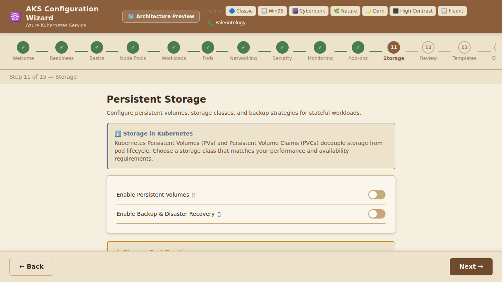

### Fields & Impact

| Field | Default | Description | Impact |
|-------|---------|-------------|--------|
| **Enable Persistent Volumes** | ❌ OFF | Provisions PersistentVolumeClaims (PVCs) for stateful workloads like databases and message queues. | When enabled, exposes the Storage Class selector. The wizard generates a `StorageClass` resource and a sample `PersistentVolumeClaim` manifest. Stateless workloads (APIs, web apps) generally do not need this. |
| **Storage Class** | `default` | The Azure storage backend used to provision PVCs. Only visible when Persistent Volumes is enabled. | See the Storage Class Reference table below. |
| **Enable Backup & Disaster Recovery** | ❌ OFF | Enables Azure Backup for AKS to snapshot persistent volumes and restore them in a disaster scenario. | Generates configuration for an Azure Backup vault targeting the AKS cluster. Strongly recommended for production stateful workloads. |

### Storage Class Reference

| Storage Class | Access Mode | Use Case | Notes |
|---------------|-------------|----------|-------|
| **Default (Standard HDD)** | ReadWriteOnce | Dev/test, low-cost storage | Lowest performance; not recommended for production databases. |
| **Azure Disk (Standard SSD)** | ReadWriteOnce | Databases, stateful apps (single node) | Block storage, one pod at a time. Higher performance than Standard HDD. |
| **Azure Files (SMB)** | ReadWriteMany | Shared file access across multiple pods | Suitable for content management, shared configs. NFS also available. |
| **Premium SSD (ZRS)** | ReadWriteOnce | Production databases, high-performance apps | Zone-redundant; highest performance and availability. Recommended for production. |

### Official References

- [Storage concepts for AKS](https://learn.microsoft.com/azure/aks/concepts-storage)
- [Dynamically create and use a persistent volume with Azure Disks](https://learn.microsoft.com/azure/aks/azure-csi-disk-storage-provision)
- [Dynamically create and use a persistent volume with Azure Files](https://learn.microsoft.com/azure/aks/azure-csi-files-storage-provision)
- [Azure Backup for AKS](https://learn.microsoft.com/azure/backup/azure-kubernetes-service-backup-overview)
- [Storage best practices for AKS](https://learn.microsoft.com/azure/aks/operator-best-practices-storage)

---

## Step 14: Review & Validate

### Purpose

The Review screen provides a pre-flight checklist, an estimated monthly cost, and a complete summary of all configuration choices made in the previous steps. The **Generate Templates** button is disabled until all validation checks pass.

### What you see

```
Review & Validate
Review your configuration and fix any issues before generating templates.

Validation Checks
────────────────────────────────────────────────
✅  Subscription ID
✅  Resource Group Name
✅  Cluster Name
✅  Cluster name format
✅  RBAC enabled
✅  Azure AD integration
✅  Standard Load Balancer
✅  Container Insights

💰 Estimated Monthly Cost
Approximate on-demand pricing (USD). Use the Azure Pricing Calculator for precise estimates.
  System Node Pool  ~$210/mo
  Monitoring        ~$30/mo
  ─────────────────────────
  Estimated Total   ~$240/month

Configuration Summary
────────────────────────
CLUSTER BASICS
  Subscription ID     12345678-1234-1234-1234-123456789012
  Resource Group      my-aks-rg
  Cluster Name        my-aks-cluster
  Region              eastus
  Kubernetes Version  1.31.x
  AKS Mode            Standard

SYSTEM NODE POOL
  VM Size     Standard_D2s_v3
  Node Count  3

WORKLOADS
  Workload Type        general
  Traffic Level        medium
  HPA                  Disabled
  VPA                  Disabled

PODS
  CPU Request / Limit    100m / 500m
  Memory Request / Limit 128Mi / 512Mi
  Node Affinity          none
  Pod Anti-Affinity      none
  DNS Policy             ClusterFirst

NETWORKING
  Network Plugin       azure
  Load Balancer SKU    Standard
  Service CIDR         10.0.0.0/16
  Network Policy       None
  Ingress Controller   none
  Service Mesh         Disabled

SECURITY
  RBAC                   ✅ Enabled
  Azure AD               Disabled
  Pod Identity           Disabled
  Image Scanning         Disabled
  Pod Security Admission baseline
  Auto-Upgrade Channel   patch

MONITORING & ADD-ONS
  Container Insights   ✅ Enabled
  Prometheus           Disabled
  Alerts               Disabled
  Diagnostic Settings  Disabled
  Key Vault Provider   Disabled
  KEDA                 Disabled
  Dapr                 Disabled
  ACR Integration      Disabled

STORAGE
  Persistent Volumes   Disabled
  Backup & DR          Disabled

DEPLOYMENT
  Deployment Strategy  rolling

[ ← Back ]  [ Looks good! Generate Templates → ]   ← disabled if checks fail
```

### Screenshot

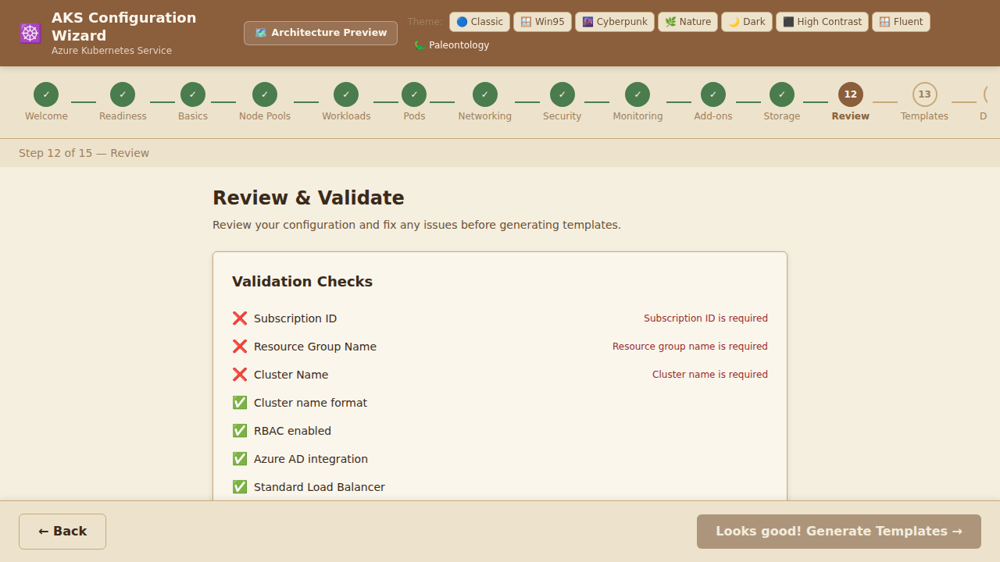

### Validation Checks

The wizard performs the following automated checks before allowing you to proceed:

| Check | Condition | Why It Matters |
|-------|-----------|----------------|
| **Subscription ID** | Must not be empty | Required to target the correct Azure subscription for deployment. |
| **Resource Group Name** | Must not be empty | Required to create or reference the resource group. |
| **Cluster Name** | Must not be empty | Required identifier for the cluster resource. |
| **Cluster name format** | 1–63 chars, alphanumeric + hyphens | AKS enforces this naming constraint. Invalid names cause deployment failures. |
| **RBAC enabled** | Should be `true` | RBAC is a security best practice; the check warns if you have disabled it. |
| **Azure AD integration** | If enabled, Tenant ID must be provided | An empty Tenant ID with Azure AD enabled will cause authentication failures. |
| **Standard Load Balancer** | Should be `Standard` | Basic SKU is deprecated and not suitable for production. |
| **Container Insights** | Should be enabled | Monitoring is strongly recommended for production clusters. |

> **Note:** Checks marked with ❌ must be resolved before proceeding. Navigate back to the relevant step using the **Back** button to correct them.

### Cost Estimator

The **Estimated Monthly Cost** section provides an approximate on-demand price (USD) based on your selected node pool VM sizes and enabled features:

- **System Node Pool**: calculated from the VM SKU (e.g., `Standard_D2s_v3`) × node count × ~730 hours/month
- **Monitoring**: approximate Log Analytics ingestion cost for a medium-traffic cluster

Actual costs vary by Azure region, reserved instance discounts, and actual usage. Use the [Azure Pricing Calculator](https://azure.microsoft.com/pricing/calculator/) for precise estimates.

### Official References

- [AKS best practices for cluster operators](https://learn.microsoft.com/azure/aks/operator-best-practices-cluster-security)
- [AKS production baseline](https://learn.microsoft.com/azure/architecture/reference-architectures/containers/aks/baseline-aks)

---

## Step 15: Generated Templates

### Purpose

The Templates screen converts your wizard configuration into Infrastructure-as-Code (IaC) files and a CI/CD pipeline workflow. You can switch between four tabs and copy or download the generated code.

### What you see

```
Generated Templates
Your AKS configuration has been converted into Infrastructure-as-Code templates
and a CI/CD pipeline workflow.

[ 🔷 Terraform (HCL) ]  [ 💠 Bicep ]  [ ⚙️ GitHub Actions ]  [ 📦 Resource Config ]

┌─ main.tf ─────────────────────────────────────────────┐  📋 Copy  ⬇️ Download
│                                                        │
│ terraform {                                            │
│   required_providers {                                 │
│     azurerm = {                                        │
│       source  = "hashicorp/azurerm"                    │
│       version = "~> 3.0"                               │
│     }                                                  │
│   }                                                    │
│ }                                                      │
│                                                        │
│ resource "azurerm_kubernetes_cluster" "aks" {          │
│   name                = "my-aks-cluster"               │
│   ...                                                  │
│ }                                                      │
└────────────────────────────────────────────────────────┘

💡 Tip: Review the generated templates before deploying.
   You can further customize them for your specific environment.
```

### Screenshot

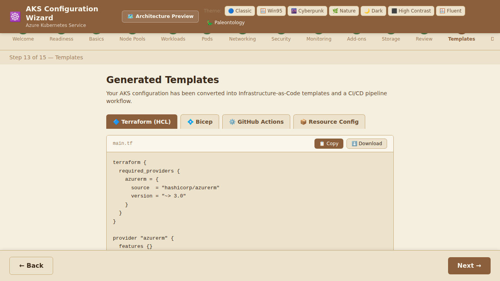

### Terraform Template

The **Terraform** tab generates a `main.tf` file that uses the [AzureRM Terraform provider](https://registry.terraform.io/providers/hashicorp/azurerm/latest). It includes:

- `terraform` block with provider version constraints
- `provider "azurerm"` configuration with feature flags
- `azurerm_resource_group` resource for the cluster's resource group
- `azurerm_kubernetes_cluster` resource with all your wizard settings

**To deploy with Terraform:**

```bash
# 1. Initialise the working directory
terraform init

# 2. Preview the execution plan
terraform plan

# 3. Apply the configuration
terraform apply
```

### Bicep Template

The **Bicep** tab generates a `main.bicep` file using Azure's native IaC language. It includes:

- `param` declarations for subscription-specific values
- `resource` declarations for the resource group and AKS cluster
- All configuration options mapped to ARM resource properties

**To deploy with Bicep:**

```bash
# Using Azure CLI
az deployment sub create \
  --location eastus \
  --template-file main.bicep \
  --parameters clusterName=my-aks-cluster
```

### Choosing Between Terraform and Bicep

| | Terraform | Bicep |
|-|-----------|-------|
| **Language** | HCL (HashiCorp Configuration Language) | Bicep (Azure-native DSL) |
| **Multi-cloud** | ✅ Yes | ❌ Azure only |
| **State management** | Requires state backend (Azure Blob, S3, etc.) | No state file needed (ARM handles it) |
| **Provider ecosystem** | Very large (Terraform Registry) | Azure-specific |
| **Azure integration** | Good | Excellent (first-class) |
| **Learning curve** | Moderate | Lower for Azure users |

### GitHub Actions Workflow

The **GitHub Actions** tab generates a `.github/workflows/deploy-aks.yml` workflow file that automates cluster deployment on push. It includes:

- Trigger on changes to `aks-configs/**`
- `azure/login` step using `AZURE_CREDENTIALS` secret
- Terraform init, plan, and apply steps

**To use the workflow:**

1. Copy the file to `.github/workflows/deploy-aks.yml` in your repository.
2. Add the `AZURE_CREDENTIALS` secret to your repository settings.
3. Push changes to trigger the deployment pipeline.

### Resource Config (Kubernetes Manifests)

The **Resource Config** tab generates a Kubernetes resource manifest (`resource-config.yaml`) including:

- `Deployment` with your pod configuration (resource requests/limits, affinity rules, DNS policy)
- `HorizontalPodAutoscaler` (if HPA is enabled)
- `PersistentVolumeClaim` (if Persistent Volumes are enabled)
- Prometheus scraping annotations (if Monitoring Integration is enabled)

**To apply the manifest:**

```bash
kubectl apply -f resource-config.yaml
```

### Official References

- [Terraform AzureRM provider – AKS](https://registry.terraform.io/providers/hashicorp/azurerm/latest/docs/resources/kubernetes_cluster)
- [Bicep documentation](https://learn.microsoft.com/azure/azure-resource-manager/bicep/overview)
- [Deploy AKS with Bicep](https://learn.microsoft.com/azure/aks/learn/quick-kubernetes-deploy-bicep)
- [Deploy AKS with Terraform](https://learn.microsoft.com/azure/aks/learn/quick-kubernetes-deploy-terraform)
- [GitHub Actions for Azure](https://learn.microsoft.com/azure/developer/github/connect-from-azure)

---

## Step 16: Deploy to Azure

### Purpose

The Deploy screen generates a ready-to-run **PowerShell deployment script** (`deploy-aks.ps1`) that uses the Azure CLI (`az`) to provision your cluster. You can copy the script to the clipboard or download it as a `.ps1` file for local execution.

### What you see

```
Deploy to Azure
Your AKS cluster configuration has been translated into a PowerShell deployment
script using the Azure CLI. Copy or download the script and run it in your local terminal.

ℹ️ Prerequisites: Azure CLI and kubectl must be installed.
   Run `az login` before executing the script, or use the -SubscriptionId parameter
   to target a specific subscription.

⚠️ Educational Disclaimer: This script is provided for educational and learning purposes
   only. Validate and tailor it for your own production environment before use.

[ 📋 Copy Script ]  [ ⬇️ Download deploy-aks.ps1 ]

┌─────────────────────────────────────────────────────────────┐
│ # AKS Deployment Script — generated by AKS-Wizard           │
│ param(                                                       │
│     [string]$SubscriptionId = "..."                         │
│ )                                                            │
│ az account set --subscription $SubscriptionId               │
│ az group create --name my-aks-rg --location eastus          │
│ az aks create \                                              │
│     --resource-group my-aks-rg \                            │
│     --name my-aks-cluster \                                  │
│     --kubernetes-version 1.31.x \                            │
│     ...                                                      │
└─────────────────────────────────────────────────────────────┘
```

### Screenshot

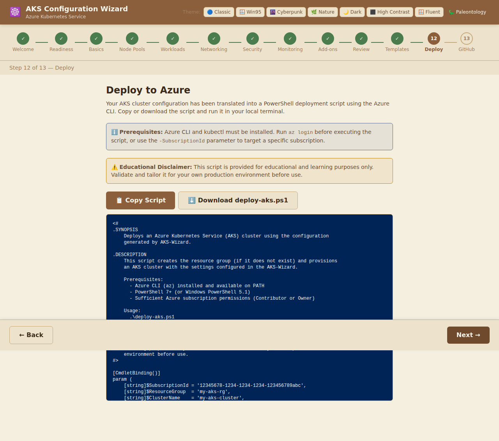

### Using the Generated Script

#### Prerequisites

Before running the script, ensure you have:

1. **Azure CLI v2.40+** — [Install guide](https://learn.microsoft.com/cli/azure/install-azure-cli)
2. **kubectl** — [Install guide](https://kubernetes.io/docs/tasks/tools/)
3. **PowerShell 7+** (or Windows PowerShell 5.1) — [Install guide](https://learn.microsoft.com/powershell/scripting/install/installing-powershell)

#### Execution Steps

```powershell
# 1. Login to Azure
az login

# 2. (Optional) Set the subscription
az account set --subscription "<your-subscription-id>"

# 3. Run the script
.\deploy-aks.ps1 -SubscriptionId '<your-subscription-id>'

# 4. Get cluster credentials
az aks get-credentials --resource-group my-aks-rg --name my-aks-cluster

# 5. Verify the cluster is running
kubectl get nodes
```

### What the Script Does

The generated script performs these operations in sequence:

| Step | Command | Description |
|------|---------|-------------|
| 1 | `az account set` | Targets the specified subscription |
| 2 | `az group create` | Creates the resource group if it does not exist |
| 3 | `az aks create` | Provisions the AKS cluster with all your wizard settings |
| 4 | `az aks get-credentials` | Downloads the kubeconfig to authenticate `kubectl` |

### Script Customisation

The generated script includes your selected options as flags to `az aks create`. Common additions you may want to make manually:

- **`--vnet-subnet-id`** — deploy into an existing VNet subnet (required for Azure CNI + pre-existing VNets)
- **`--service-principal` / `--client-secret`** — use a service principal instead of a system-assigned identity
- **`--node-osdisk-size`** — customise OS disk size
- **`--zones 1 2 3`** — spread nodes across Availability Zones

### Official References

- [az aks create reference](https://learn.microsoft.com/cli/azure/aks#az-aks-create)
- [AKS quickstart with Azure CLI](https://learn.microsoft.com/azure/aks/learn/quick-kubernetes-deploy-cli)
- [Azure CLI installation](https://learn.microsoft.com/cli/azure/install-azure-cli)
- [kubectl installation](https://kubernetes.io/docs/tasks/tools/)

---

## Step 17: Save to GitHub

### Purpose

The final screen allows you to commit the generated IaC files (`main.tf` and `main.bicep`) directly to a GitHub repository using the GitHub REST API. You can also choose a deployment strategy that affects the generated GitHub Actions workflow available in the Templates step.

### What you see

```
Save to GitHub
Save your generated templates directly to a GitHub repository using the GitHub REST API.

Deployment Strategy
  [ 🔄 Rolling Update ✓ ]  Gradually replaces old pods. Zero-downtime with minimal complexity.
  [ 🔵🟢 Blue/Green    ]  Instantly switch traffic between two identical environments.
  [ 🐦 Canary          ]  Route a small percentage of traffic to the new version first.

Files to Save
─────────────
📄 aks-configs/main.tf
📄 aks-configs/main.bicep

GitHub Settings
────────────────────────────────────────────
Personal Access Token  [ ghp_xxxxxxxxxxxx ] (password field)
  Needs `repo` scope. Create one at github.com/settings/tokens

Owner       [ your-username ]   Repository  [ my-infra ]
Branch      [ main            ]   Folder Path [ aks-configs/ ]

                                   [ 💾 Save to GitHub ]

─── After saving ────────────────────────────────────────
✅ Files saved successfully!
🔗 https://github.com/your-username/my-infra/blob/main/aks-configs/main.tf
🔗 https://github.com/your-username/my-infra/blob/main/aks-configs/main.bicep

🎉 Congratulations!
You've completed the AKS Configuration Wizard.
Your cluster configuration is ready to go!
```

### Screenshot

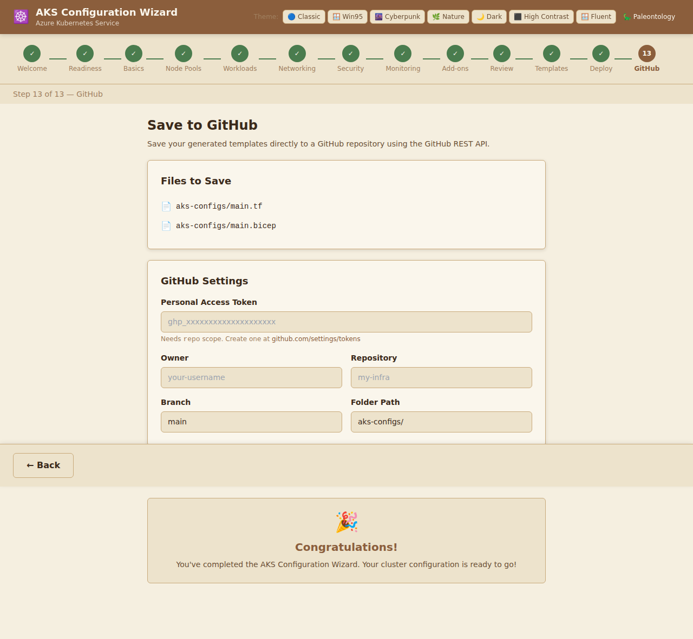

### Fields & Impact

#### Deployment Strategy

| Strategy | Description | Impact |
|----------|-------------|--------|
| **🔄 Rolling Update** (default) | Gradually replaces old pods with new ones. | Zero-downtime deployments with minimal operational complexity. Kubernetes handles the rollout incrementally. |
| **🔵🟢 Blue/Green** | Runs two identical environments simultaneously; traffic switches instantly. | Enables instant rollback by pointing traffic back to the old environment. Requires double the resources during transitions. |
| **🐦 Canary** | Routes a small percentage of traffic to the new version before full promotion. | Reduces blast radius of bad deployments. Requires additional traffic-splitting configuration. |

The selected strategy is reflected in the generated **GitHub Actions** workflow (available from the Templates step).

#### GitHub Settings

| Field | Description | Impact |
|-------|-------------|--------|
| **Personal Access Token** | A GitHub [Personal Access Token (PAT)](https://github.com/settings/tokens) with `repo` scope. The token is used to authenticate the GitHub API call. | The token is **never stored** — it is only used in-memory for the current session. Use a **fine-grained token** scoped to the specific repository and limited to `Contents: Read and Write` for minimum privilege. |
| **Owner** | Your GitHub username or organisation name that owns the target repository. | Must match exactly. Used to construct the API URL: `https://api.github.com/repos/{owner}/{repo}/contents/...` |
| **Repository** | The name of the GitHub repository where files will be saved. | The repository must already exist. If the branch and path do not exist, the API creates them automatically. |
| **Branch** | The Git branch to commit the files to (default: `main`). | If the branch does not exist, the API will return an error. Create the branch first, or use the default branch. |
| **Folder Path** | The directory path within the repository where files are written (default: `aks-configs/`). | The trailing slash indicates a directory. The wizard saves `{folder-path}main.tf` and `{folder-path}main.bicep`. If files already exist, they are updated (overwritten). The GitHub Actions workflow (available in the Templates step) must be saved separately. |

### Security Best Practices for the PAT

1. **Use fine-grained tokens** scoped to a single repository.
2. **Set an expiration date** on the token (30, 60, or 90 days).
3. **Grant only `Contents: Read & Write`** — avoid `repo` full-scope tokens if possible.
4. **Revoke the token** immediately after use if created specifically for this task.
5. **Never commit your PAT** to source control.

### GitOps Integration

Once the templates are committed to your repository, you can integrate them into a CI/CD pipeline:

```yaml
# Example GitHub Actions workflow (simplified)
on:
  push:
    paths:
      - 'aks-configs/**'

jobs:
  deploy:
    runs-on: ubuntu-latest
    steps:
      - uses: actions/checkout@v4
      - uses: azure/login@v1
        with:
          creds: ${{ secrets.AZURE_CREDENTIALS }}
      - run: |
          terraform init
          terraform apply -auto-approve
        working-directory: aks-configs/
```

### Official References

- [GitHub REST API – Create or update file contents](https://docs.github.com/en/rest/repos/contents#create-or-update-file-contents)
- [Creating a fine-grained personal access token](https://docs.github.com/en/authentication/keeping-your-account-and-data-secure/managing-your-personal-access-tokens#creating-a-fine-grained-personal-access-token)
- [GitHub Actions for Azure](https://learn.microsoft.com/azure/developer/github/connect-from-azure)
- [GitOps for AKS with Flux](https://learn.microsoft.com/azure/aks/gitops-flux2-quickstart)

---

## Appendix A: Complete Configuration Reference

The table below summarises every configurable field in the wizard, its default value, and the configuration section it belongs to.

| Field | Default | Section |
|-------|---------|---------|
| `subscriptionId` | *(empty)* | Cluster Basics |
| `resourceGroupName` | *(empty)* | Cluster Basics |
| `clusterName` | *(empty)* | Cluster Basics |
| `region` | `eastus` | Cluster Basics |
| `kubernetesVersion` | `1.31.x` | Cluster Basics |
| `aksMode` | `Standard` | Cluster Basics |
| `systemNodePool.name` | `system` | Node Pools |
| `systemNodePool.vmSize` | `Standard_D2s_v3` | Node Pools |
| `systemNodePool.nodeCount` | `3` | Node Pools |
| `systemNodePool.enableAutoScaling` | `false` | Node Pools |
| `systemNodePool.minNodes` | `1` | Node Pools |
| `systemNodePool.maxNodes` | `5` | Node Pools |
| `workloadConfig.workloadType` | `general` | Workload Requirements |
| `workloadConfig.trafficLevel` | `medium` | Workload Requirements |
| `workloadConfig.enableHpa` | `false` | Workload Requirements |
| `workloadConfig.enableVpa` | `false` | Workload Requirements |
| `workloadConfig.targetCpuUtilization` | `70` | Workload Requirements |
| `workloadConfig.targetMemoryUtilization` | `80` | Workload Requirements |
| `workloadConfig.enableMonitoringIntegration` | `false` | Workload Requirements |
| `podConfig.cpuRequest` | `100m` | Pod Configuration |
| `podConfig.cpuLimit` | `500m` | Pod Configuration |
| `podConfig.memoryRequest` | `128Mi` | Pod Configuration |
| `podConfig.memoryLimit` | `512Mi` | Pod Configuration |
| `podConfig.nodeAffinity` | `none` | Pod Configuration |
| `podConfig.podAntiAffinity` | `none` | Pod Configuration |
| `podConfig.hostNetwork` | `false` | Pod Configuration |
| `podConfig.dnsPolicy` | `ClusterFirst` | Pod Configuration |
| `networkPlugin` | `azure` | Networking |
| `dnsPrefix` | *(empty)* | Networking |
| `serviceCidr` | `10.0.0.0/16` | Networking |
| `dockerBridgeCidr` | `172.17.0.1/16` | Networking |
| `loadBalancerSku` | `Standard` | Networking |
| `ingressController` | `none` | Networking |
| `enableServiceMesh` | `false` | Networking |
| `enableRbac` | `true` | Security |
| `enableAzureAd` | `false` | Security |
| `azureAdTenantId` | *(empty)* | Security |
| `enablePodIdentity` | `false` | Security |
| `networkPolicy` | `None` | Security |
| `autoUpgradeChannel` | `patch` | Security |
| `enableImageScanning` | `false` | Security |
| `podSecurityAdmission` | `baseline` | Security |
| `enableContainerInsights` | `true` | Monitoring |
| `logAnalyticsWorkspaceId` | *(empty)* | Monitoring |
| `enablePrometheus` | `false` | Monitoring |
| `enableAzureMonitor` | `false` | Monitoring |
| `enableAlerts` | `false` | Monitoring |
| `enableDiagnosticSettings` | `false` | Monitoring |
| `enableHttpApplicationRouting` | `false` | Add-ons |
| `enableAzurePolicy` | `false` | Add-ons |
| `enableKeyVaultProvider` | `false` | Add-ons |
| `enableKeda` | `false` | Add-ons |
| `enableDapr` | `false` | Add-ons |
| `enableAcrIntegration` | `false` | Add-ons |
| `containerRegistryName` | *(empty)* | Add-ons |
| `enablePersistentVolumes` | `false` | Persistent Storage |
| `storageClass` | `default` | Persistent Storage |
| `enableStorageBackup` | `false` | Persistent Storage |
| `deploymentStrategy` | `rolling` | Deployment |
| `multiRegion.enableMultiRegion` | `false` | Multi-Region |
| `multiRegion.secondaryRegions` | `[]` | Multi-Region |
| `multiRegion.enableFrontDoor` | `true` | Multi-Region |
| `multiRegion.frontDoorSkuName` | `Standard_AzureFrontDoor` | Multi-Region |
| `multiRegion.enableWaf` | `false` | Multi-Region |
| `multiRegion.enableHealthProbes` | `true` | Multi-Region |
| `multiRegion.enableApim` | `false` | Multi-Region |
| `multiRegion.apimSkuName` | `Developer` | Multi-Region |
| `multiRegion.apimPublisherEmail` | *(empty)* | Multi-Region |
| `hubSpoke.enableHubSpoke` | `false` | Hub-Spoke Networking |
| `hubSpoke.hubMode` | `new` | Hub-Spoke Networking |
| `hubSpoke.existingHubVnetId` | *(empty)* | Hub-Spoke Networking |
| `hubSpoke.hubVnetCidr` | `10.0.0.0/16` | Hub-Spoke Networking |
| `hubSpoke.spokeVnetCidr` | `10.1.0.0/16` | Hub-Spoke Networking |
| `hubSpoke.aksSubnetCidr` | `10.1.0.0/22` | Hub-Spoke Networking |
| `hubSpoke.enableAzureFirewall` | `false` | Hub-Spoke Networking |
| `hubSpoke.enableEgressViaFirewall` | `false` | Hub-Spoke Networking |
| `hubSpoke.enableBastion` | `false` | Hub-Spoke Networking |
| `hubSpoke.enablePrivateCluster` | `false` | Hub-Spoke Networking |
| `hubSpoke.enableVpnGateway` | `false` | Hub-Spoke Networking |

---

## Appendix B: Supported Azure Regions

| Value | Display Name |
|-------|-------------|
| `eastus` | East US |
| `eastus2` | East US 2 |
| `westus2` | West US 2 |
| `westus3` | West US 3 |
| `centralus` | Central US |
| `northeurope` | North Europe |
| `westeurope` | West Europe |
| `uksouth` | UK South |
| `southeastasia` | Southeast Asia |
| `australiaeast` | Australia East |
| `japaneast` | Japan East |
| `brazilsouth` | Brazil South |

> AKS is available in many more regions. Visit [Azure Products by Region](https://azure.microsoft.com/global-infrastructure/services/?products=kubernetes-service) for a full list.

---

## Appendix C: Glossary

| Term | Definition |
|------|-----------|
| **Always-On Architecture** | A system design where the service remains available across regional failures, typically achieved by running redundant instances in multiple Azure regions behind Azure Front Door. |
| **APIM** | Azure API Management — a fully managed API gateway that provides rate limiting, authentication, versioning, and a developer portal for APIs exposed by AKS services. The Wizard uses the v2 service tiers (BasicV2, StandardV2, PremiumV2) which offer faster provisioning, zone redundancy, and VNet injection. |
| **Azure Chaos Studio** | An Azure service for fault injection and resilience testing, allowing you to simulate regional outages, VM failures, and network disruptions in a controlled way. |
| **Azure Cosmos DB** | A globally distributed, multi-model database service that supports multi-region writes, five consistency levels, and a 99.999% SLA when multi-region writes are enabled. |
| **Azure Front Door** | A global CDN and application delivery network (ADN) from Microsoft that provides intelligent traffic routing, SSL termination, WAF, and DDoS protection. |
| **Active-Active** | A multi-region topology where all regions serve live traffic simultaneously, with load distributed by Azure Front Door. |
| **Active-Passive** | A multi-region topology where the secondary region runs at reduced capacity and only receives traffic if the primary region fails. |
| **CRDT** | Conflict-free Replicated Data Type — a data structure designed to be merged across replicas without conflicts; suitable for counters, sets, and append-only logs in multi-region systems. |
| **Geo-replication** | The process of replicating data or resources to one or more secondary Azure regions to enable low-latency access and regional fault tolerance. |
| **AKS** | Azure Kubernetes Service — Microsoft's managed Kubernetes offering. |
| **AKS Automatic** | A fully managed AKS mode where Azure handles node provisioning, upgrades, and security. |
| **AKS Standard** | The standard AKS mode giving platform teams full control over cluster configuration. |
| **Bicep** | Azure's domain-specific language for deploying resources declaratively, compiles to ARM JSON. |
| **CIDR** | Classless Inter-Domain Routing — notation for specifying IP address ranges, e.g. `10.0.0.0/16`. |
| **CNI** | Container Network Interface — a standard for Kubernetes network plugins. |
| **CoreDNS** | The DNS server deployed into every Kubernetes cluster for service discovery. |
| **Dapr** | Distributed Application Runtime — a set of APIs for building microservices. |
| **FQDN** | Fully Qualified Domain Name — the complete domain name of the cluster API server. |
| **HCL** | HashiCorp Configuration Language — the language used to write Terraform configs. |
| **HPA** | Horizontal Pod Autoscaler — scales pod replica count based on CPU/memory metrics. |
| **IaC** | Infrastructure as Code — managing infrastructure using declarative configuration files. |
| **KEDA** | Kubernetes Event-Driven Autoscaling — scales pods based on event-source metrics. |
| **KQL** | Kusto Query Language — used to query Log Analytics workspaces. |
| **Kubenet** | A simpler Kubernetes network plugin that uses NAT for pod networking. |
| **kubectl** | The Kubernetes command-line tool for interacting with clusters. |
| **Managed Identity** | An Azure identity managed by the platform, eliminating the need for credentials. |
| **mTLS** | Mutual TLS — bidirectional TLS authentication between services; used by service meshes. |
| **NAT** | Network Address Translation — maps private IPs to a public IP for outbound traffic. |
| **OPA** | Open Policy Agent — a general-purpose policy engine used by Azure Policy add-on. |
| **PAT** | Personal Access Token — a token used to authenticate to GitHub's API. |
| **Pod Security Admission** | A Kubernetes built-in admission controller enforcing security standards (Privileged / Baseline / Restricted). |
| **PVC** | Persistent Volume Claim — a request for storage by a pod in Kubernetes. |
| **RBAC** | Role-Based Access Control — a security model that assigns permissions to roles. |
| **RPO** | Recovery Point Objective — the maximum acceptable amount of data loss measured in time; defines how far back in time a system can be restored after a failure. |
| **RTO** | Recovery Time Objective — the maximum acceptable duration of a service outage; defines how quickly a system must be restored after a failure. |
| **SKU** | Stock Keeping Unit — Azure's term for a pricing/capability tier. |
| **Terraform** | An open-source IaC tool by HashiCorp that supports multiple cloud providers. |
| **UDR** | User-Defined Route — a custom route table entry in Azure that overrides default system routes to direct traffic through a specific next-hop such as Azure Firewall. |
| **WAF** | Web Application Firewall — a security layer that filters and monitors HTTP traffic against common exploits (OWASP Top 10). |
| **VPA** | Vertical Pod Autoscaler — automatically adjusts CPU/memory requests for pods. |
| **VNet** | Azure Virtual Network — the fundamental building block for Azure networking. |
| **VNet Peering** | A mechanism to connect two Azure VNets so that traffic flows between them using the Microsoft backbone network without public internet exposure. Hub-spoke topologies use bidirectional VNet peering to connect spokes to the hub. |
| **Hub VNet** | In a hub-spoke topology, the central VNet that hosts shared network services such as Azure Firewall, Azure Bastion, DNS, and VPN/ExpressRoute gateways. Spokes peer to the hub to consume these services. |
| **Spoke VNet** | In a hub-spoke topology, an isolated VNet dedicated to a specific workload or application. AKS clusters are deployed into a spoke VNet and access shared services in the hub via VNet peering. |
| **Azure Bastion** | A fully managed PaaS service that provides secure and seamless RDP/SSH connectivity to VMs directly through the Azure portal over TLS, without requiring a public IP on the target VM. |
| **Hub-Spoke Topology** | A network design pattern where a central hub VNet provides shared services to multiple spoke VNets via VNet peering. The hub enforces centralised network security and connectivity policies. This is the recommended pattern for Azure enterprise landing zones. |

---

## Appendix D: Further Learning Resources

### Microsoft Learn

- [AKS learning path](https://learn.microsoft.com/training/paths/intro-to-kubernetes-on-azure/)
- [Kubernetes core concepts for AKS](https://learn.microsoft.com/azure/aks/concepts-clusters-workloads)
- [AKS baseline architecture](https://learn.microsoft.com/azure/architecture/reference-architectures/containers/aks/baseline-aks)
- [AKS baseline architecture with hub-spoke](https://learn.microsoft.com/azure/architecture/reference-architectures/containers/aks/baseline-aks)
- [Hub-spoke network topology in Azure](https://learn.microsoft.com/azure/architecture/reference-architectures/hybrid-networking/hub-spoke)
- [Azure landing zone hub-spoke topology](https://learn.microsoft.com/azure/cloud-adoption-framework/ready/azure-best-practices/hub-spoke-network-topology)
- [AKS multi-region architecture](https://learn.microsoft.com/azure/architecture/reference-architectures/containers/aks-multi-region/aks-multi-cluster)
- [AKS security best practices](https://learn.microsoft.com/azure/aks/operator-best-practices-cluster-security)
- [AKS Automatic overview](https://learn.microsoft.com/azure/aks/intro-aks-automatic)
- [AKS limit egress traffic with Azure Firewall](https://learn.microsoft.com/azure/aks/limit-egress-traffic)
- [AKS outbound FQDN rules](https://learn.microsoft.com/azure/aks/outbound-rules-control-egress)
- [Private AKS cluster](https://learn.microsoft.com/azure/aks/private-cluster)
- [Azure Bastion overview](https://learn.microsoft.com/azure/bastion/bastion-overview)
- [VNet peering overview](https://learn.microsoft.com/azure/virtual-network/virtual-network-peering-overview)
- [User-Defined Routes (UDR) overview](https://learn.microsoft.com/azure/virtual-network/virtual-networks-udr-overview)
- [Azure Private DNS Zones](https://learn.microsoft.com/azure/dns/private-dns-overview)
- [Azure Front Door overview](https://learn.microsoft.com/azure/frontdoor/front-door-overview)
- [Azure Front Door WAF](https://learn.microsoft.com/azure/web-application-firewall/afds/afds-overview)
- [Azure Front Door health probes](https://learn.microsoft.com/azure/frontdoor/health-probes)
- [Azure Front Door SKU comparison](https://learn.microsoft.com/azure/frontdoor/standard-premium/overview)
- [Azure API Management overview](https://learn.microsoft.com/azure/api-management/api-management-key-concepts)
- [APIM v2 service tiers overview](https://learn.microsoft.com/azure/api-management/v2-service-tiers-overview)
- [APIM with AKS](https://learn.microsoft.com/azure/api-management/api-management-kubernetes)
- [APIM SKU comparison](https://learn.microsoft.com/azure/api-management/api-management-features)
- [APIM multi-region deployment](https://learn.microsoft.com/azure/api-management/api-management-howto-deploy-multi-region)
- [Azure Cosmos DB global distribution](https://learn.microsoft.com/azure/cosmos-db/distribute-data-globally)
- [Azure Cosmos DB multi-region writes](https://learn.microsoft.com/azure/cosmos-db/multi-region-writes)
- [Azure Cosmos DB consistency levels](https://learn.microsoft.com/azure/cosmos-db/consistency-levels)
- [Azure Cache for Redis geo-replication](https://learn.microsoft.com/azure/azure-cache-for-redis/cache-how-to-geo-replication)
- [Azure Service Bus geo-disaster recovery](https://learn.microsoft.com/azure/service-bus-messaging/service-bus-geo-dr)
- [Azure Container Registry geo-replication](https://learn.microsoft.com/azure/container-registry/container-registry-geo-replication)
- [Azure Key Vault availability and redundancy](https://learn.microsoft.com/azure/key-vault/general/disaster-recovery-guidance)
- [Azure Traffic Manager overview](https://learn.microsoft.com/azure/traffic-manager/traffic-manager-overview)
- [Azure Chaos Studio overview](https://learn.microsoft.com/azure/chaos-studio/chaos-studio-overview)
- [Business continuity and disaster recovery for AKS](https://learn.microsoft.com/azure/aks/operator-best-practices-multi-region)
- [Azure Pricing Calculator](https://azure.microsoft.com/pricing/calculator/)

### Kubernetes Official Documentation

- [Kubernetes Concepts](https://kubernetes.io/docs/concepts/)
- [kubectl reference](https://kubernetes.io/docs/reference/kubectl/)
- [Network policies](https://kubernetes.io/docs/concepts/services-networking/network-policies/)

### Tools Referenced in this Wizard

- [Azure CLI](https://learn.microsoft.com/cli/azure/)
- [Terraform Azure Provider](https://registry.terraform.io/providers/hashicorp/azurerm/latest/docs)
- [Bicep Language](https://learn.microsoft.com/azure/azure-resource-manager/bicep/)
- [Calico](https://docs.tigera.io/calico/latest/about/)
- [KEDA scalers](https://keda.sh/docs/latest/scalers/)
- [Dapr documentation](https://docs.dapr.io/)
